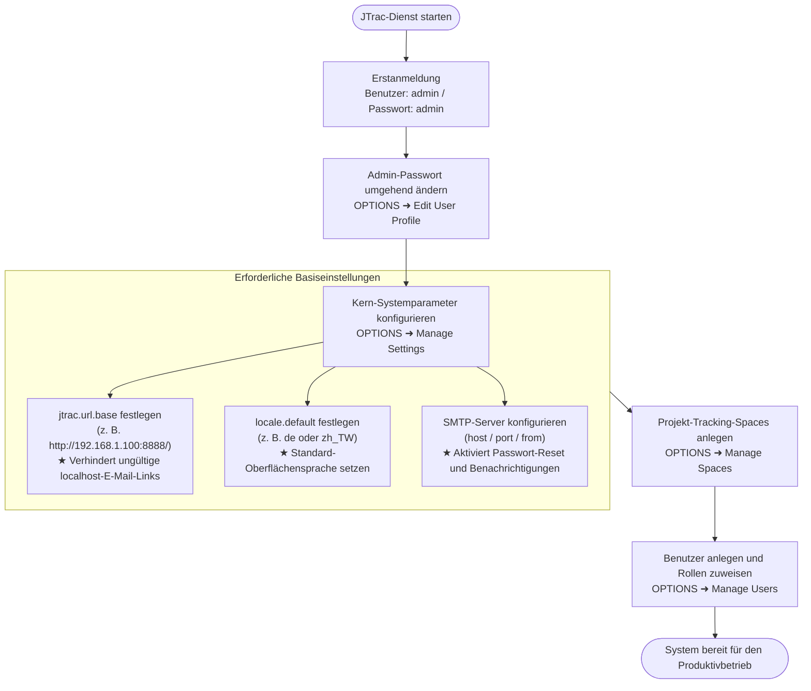
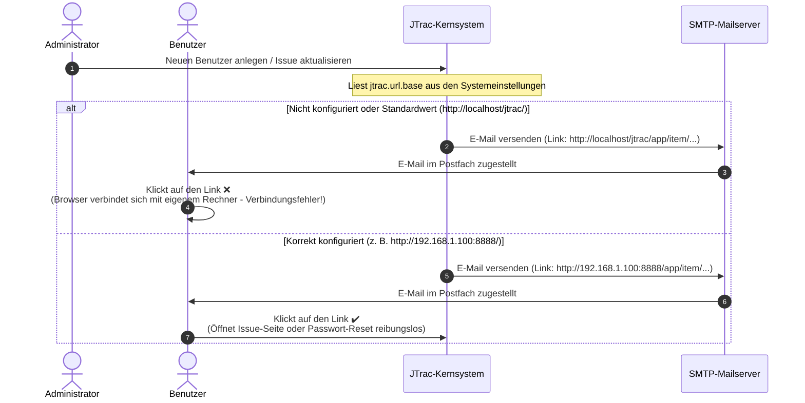

# JTrac Systemadministrator- und Konfigurationsleitfaden (Administrator Guide)

[English](ADMIN_GUIDE_en.md) | [繁體中文](ADMIN_GUIDE_zh-TW.md) | [简体中文](ADMIN_GUIDE_zh-CN.md) | [日本語](ADMIN_GUIDE_ja.md) | [Tiếng Việt](ADMIN_GUIDE_vi.md) | [Deutsch](ADMIN_GUIDE_de.md) | [Español](ADMIN_GUIDE_es.md) | [Français](ADMIN_GUIDE_fr.md)

---

## Inhaltsverzeichnis
1. [Erstanmeldung & Standard-Anmeldeinformationen](#1-erstanmeldung--standard-anmeldeinformationen)
2. [Wichtige anfängliche Systemeinstellungen (Zwingend erforderlich)](#2-wichtige-anfängliche-systemeinstellungen-zwingend-erforderlich)
3. [Systemarchitektur & E-Mail-Ablaufdiagramme (Mermaid)](#3-systemarchitektur--e-mail-ablaufdiagramme-mermaid)
4. [Übersicht der Administratorfunktionen](#4-übersicht-der-administratorfunktionen)
5. [Sicherheits- und Wartungsrichtlinien](#5-sicherheits-und-wartungsrichtlinien)

---

## 1. Erstanmeldung & Standard-Anmeldeinformationen

Beim ersten Start von JTrac und nach der Initialisierung des Datenbankschemas wird automatisch ein globales Administratorkonto mit vollen Rechten erstellt:

- **System-URL**: `http://<Server-IP-oder-Domain>:<Port>/` (z. B. lokal: `http://localhost:8888/`)
- **Standard-Benutzername**: `admin`
- **Standard-Passwort**: `admin`

> [!WARNING]
> **Wichtiger Sicherheitshinweis**:
> Navigieren Sie unmittelbar nach der ersten Anmeldung im oberen rechten Menü zu **OPTIONS** ➜ **Edit User Profile** und ändern Sie das Standardpasswort für das Konto `admin`. Betreiben Sie das System in einer Produktiv- oder öffentlichen Umgebung niemals mit den Standard-Zugangsdaten!

---

## 2. Wichtige anfängliche Systemeinstellungen (Zwingend erforderlich)

Melden Sie sich an und wählen Sie **OPTIONS** ➜ **Manage Settings**. Folgende Einstellungen wirken sich direkt auf E-Mail-Benachrichtigungen und den externen Zugriff aus und **müssen vor dem Produktivbetrieb konfiguriert werden**:

### 1. `jtrac.url.base` (Basis-System-URL - Zwingend erforderlich)
- **Standardwert**: `http://localhost/jtrac/`
- **Empfohlene Konfiguration**: Geben Sie die vollständige URL ein, unter der Endbenutzer das System tatsächlich erreichen (inklusive Protokoll `http://` oder `https://`, Hostname/IP, Portnummer und Pfad, **unbedingt mit abschließendem Schrägstrich `/`**).
  - Intranet-Beispiel: `http://192.168.1.100:8888/`
  - Produktiv-Domain-Beispiel: `https://issues.yourcompany.com/`
- **Warum ist dies zwingend erforderlich?**:
  JTrac versendet automatisch E-Mail-Benachrichtigungen:
  1. Begrüßungs-E-Mails mit Zugangsdaten bei der Erstellung neuer Benutzerkonten durch Administratoren.
  2. Selbstbedienungs-Verifizierungslinks zum Zurücksetzen von Passwörtern ("Passwort vergessen").
  3. Vorgangsverfolgungs-Benachrichtigungen bei Erstellung, Zuweisung und Statusänderung von Issues.
  
  Alle Hyperlinks in diesen E-Mails werden dynamisch mit dem Präfix `jtrac.url.base` zusammengesetzt.
- **Konsequenzen bei Nichtkonfiguration**:
  Bleibt dieser Parameter leer oder auf dem Standardwert, lauten alle Links in E-Mails `http://localhost/...`. Wenn Empfänger auf ihren eigenen Computern auf die Links klicken, verbindet sich ihr Browser mit ihrem eigenen Rechner (localhost), was zu einem **Verbindungsfehler führt und das Zurücksetzen von Passwörtern verhindert**!

---

### 2. `locale.default` (Standard-Systemsprache - Empfohlen)
- **Standardwert**: `en` (Englisch)
- **Empfohlene Werte**:
  - Deutsch: `de`
  - Traditionelles Chinesisch: `zh_TW`
  - Vereinfachtes Chinesisch: `zh_CN`
  - Japanisch: `ja`
  - Englisch: `en`
- **Warum konfigurieren?**:
  Dieser Parameter legt die standardmäßig angezeigte Sprache für anonyme Besucher, neu registrierte Benutzer und Benutzer ohne benutzerdefiniertes Sprachprofil fest.

---

### 3. SMTP-E-Mail-Server-Einstellungen (`mail.server.*`)
Um den automatischen E-Mail-Versand zu aktivieren, tragen Sie Ihre SMTP-Serverdaten unter **Manage Settings** ein:
- `mail.server.host`: Hostname oder IP-Adresse des SMTP-Servers (z. B. `smtp.yourcompany.com`).
- `mail.server.port`: SMTP-Port (`25` unverschlüsselt, `587` für STARTTLS, `465` für SSL).
- `mail.server.username`: Benutzername für SMTP-Authentifizierung.
- `mail.server.password`: Passwort für SMTP-Authentifizierung.
- `mail.server.starttls.enable`: Auf `true` setzen, falls TLS erforderlich ist.
- `mail.from`: Absender-E-Mail-Adresse (z. B. `jtrac-no-reply@yourcompany.com`).

---

### 4. Weitere Einstellungen
- `attachment.maxsize`: Maximale Dateigröße für Anhänge in MB (Standard: `10`, kann bei Bedarf auf `50` o. ä. erhöht werden).
- `session.timeout`: Web-Sitzungszeitlimit in Sekunden (Standard: `1800` = 30 Minuten).

---

## 3. Systemarchitektur & E-Mail-Ablaufdiagramme (Mermaid)

### 1. Ablauf der Ersteinrichtung für Administratoren

### 2. Vergleich der E-Mail-Link-Generierung über `jtrac.url.base`

---

## 4. Übersicht der Administratorfunktionen

Über die Menüoption **OPTIONS** in der oberen Navigationsleiste stehen folgende Verwaltungsfunktionen zur Verfügung:

| Menüpunkt | Zweck und Funktionsbeschreibung |
|---|---|
| **Edit User Profile** | E-Mail-Adresse, Anzeigename und Passwort des aktuellen Administrators ändern. |
| **Manage Users** | Benutzerverwaltung: Benutzerkonten erstellen, Passwörter zurücksetzen, Konten sperren und globale Administratorrechte vergeben. |
| **Manage Spaces** | Projekt-Spaces verwalten: Spaces anlegen, benutzerdefinierte Felder (Custom Fields) definieren, Status- und Prioritätslisten anpassen, Rollen zuweisen (Admin / Senior / Normal / Guest). |
| **Configure Links** | Globale Header-Links konfigurieren: Externe Verknüpfungen (z. B. CI/CD, Intranet) in der Kopfzeile einrichten. |
| **Manage Settings** | Globale Konfigurationsparameter (`jtrac.url.base`, `locale.default`, SMTP-Einstellungen). |
| **Rebuild Indexes** | Lucene-Suchindex neu aufbauen: Aktualisiert den Volltextsuchindex bei Bedarf vollständig. |
| **Import From Excel** | Excel-Stapelimport: Ermöglicht den Import von Vorgangslisten aus standardisierten Excel-Dateien. |
| **Export HTML** | Offline-HTML-Export & ZIP-Download: Statische HTML-Archive ganzer Spaces inklusive Anhänge über die Weboberfläche herunterladen oder per CLI über `tools/jtrac-exporter.jar` exportieren. |

---

## 5. Sicherheits- und Wartungsrichtlinien

1. **Modernes Passwort-Hashing**:
   - Diese JTrac-Version wurde auf Spring Security 5.8 mit starkem BCrypt-Hashing aktualisiert. Ältere MD5-Hashes werden bei erfolgreicher Anmeldung automatisch und transparent zu BCrypt migriert.
2. **Datensicherung**:
   - Datenbank: Standardmäßig unter `data/db/` (HSQLDB) oder über ein relationales Datenbanksystem (MySQL / PostgreSQL / MSSQL).
   - Anhänge: Gespeichert unter `data/attachments/`. Beide Verzeichnisse regelmäßig sichern.
3. **Reverse-Proxy und HTTPS**:
   - Bei Betrieb hinter Nginx, Apache oder Caddy mit SSL-Terminierung die URL `https://...` in `jtrac.url.base` eintragen und die Header `Host` sowie `X-Forwarded-Proto` weiterleiten.
