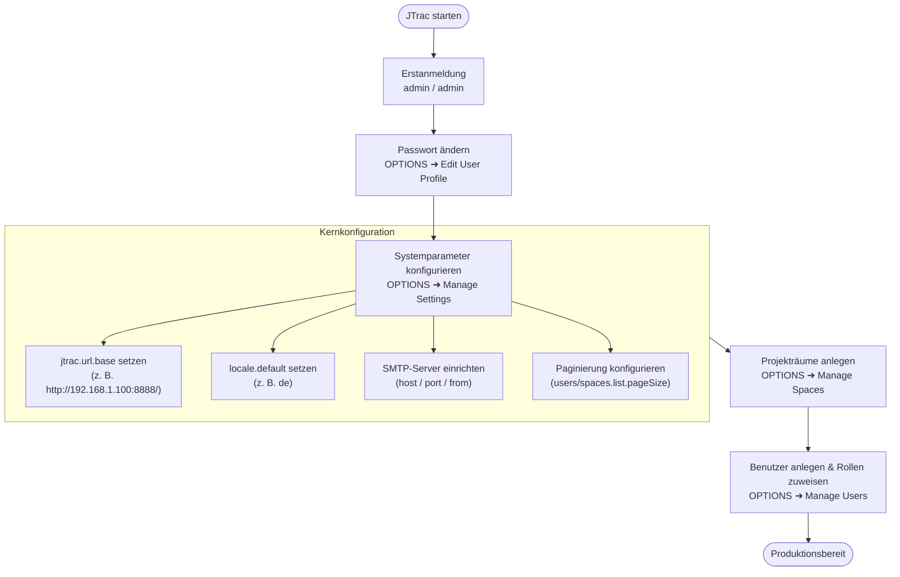

# Deutscher Systemadministrator- und Konfigurationsleitfaden (JTrac)

[English](ADMIN_GUIDE_en.md) | [繁體中文](ADMIN_GUIDE_zh-TW.md) | [简体中文](ADMIN_GUIDE_zh-CN.md) | [日本語](ADMIN_GUIDE_ja.md) | [Tiếng Việt](ADMIN_GUIDE_vi.md) | [Deutsch](ADMIN_GUIDE_de.md) | [Español](ADMIN_GUIDE_es.md) | [Français](ADMIN_GUIDE_fr.md)

---

## Inhaltsverzeichnis
1. [Erstanmeldung & Standard-Zugangsdaten](#1-erstanmeldung--standard-zugangsdaten)
2. [Erforderliche Initialkonfiguration](#2-erforderliche-initialkonfiguration)
3. [Architektur & E-Mail-Ablaufdiagramm (Mermaid)](#3-architektur--e-mail-ablaufdiagramm-mermaid)
4. [Übersicht der Administrationsfunktionen](#4-übersicht-der-administrationsfunktionen)
5. [Sicherheit, Datenbank-Upgrade & Wartung](#5-sicherheit-datenbank-upgrade--wartung)

---

## 1. Erstanmeldung & Standard-Zugangsdaten

- **System-URL**: `http://<Server-IP>:<Port>/` (z. B. `http://localhost:8888/`)
- **Standard-Benutzername**: `admin`
- **Standard-Passwort**: `admin`

> [!WARNING]
> Ändern Sie unmittelbar nach dem ersten Login das Standard-Passwort unter **OPTIONS** ➜ **Edit User Profile**.

---

## 2. Erforderliche Initialkonfiguration

Navigieren Sie zu **OPTIONS** ➜ **Manage Settings**:

### 1. `jtrac.url.base` (Basis-URL - KRITISCH)
- **Standard**: `http://localhost/jtrac/`
- **Empfohlen**: Vollständige URL für Endanwender, **mit abschließendem Schrägstrich `/`** (z. B. `http://192.168.1.100:8888/` oder `https://issues.yourcompany.com/`).
- **Bedeutung**: E-Mail-Links basieren auf diesem Präfix. Bei `localhost` können Empfänger Benachrichtigungen nicht öffnen.

---

### 2. `locale.default` (Standardsprache)
- Empfohlen: `de` oder `en`.

---

### 3. SMTP-Server-Einstellungen
- `mail.server.host`, `mail.server.port`, `mail.server.username`, `mail.server.password`, `mail.server.starttls.enable`, `mail.from`.

---

### 4. Erweiterte Einstellungen & Paginierung
- `users.list.pageSize`: Standard-Seitengröße für Benutzerlisten (Standard: `25`; Auswahl: 10, 25, 50, 100, Alle).
- `spaces.list.pageSize`: Standard-Seitengröße für Projektlisten (Standard: `25`; Auswahl: 10, 25, 50, 100, Alle).
- `attachment.maxsize`: Maximale Dateigröße in MB (Standard: `10`).

---

## 3. Architektur & E-Mail-Ablaufdiagramm (Mermaid)

---

## 4. Übersicht der Administrationsfunktionen

| Funktion | Zweck |
|---|---|
| **Edit User Profile** | E-Mail, Anzeigename und Passwort des Administrators anpassen. |
| **Manage Users** | Benutzerverwaltung, Paginierung, Passwort zurücksetzen, Admin-Rolle vergeben. |
| **Manage Spaces** | Projektverwaltung, Paginierung, benutzerdefinierte Felder, Rollenzuweisung. |
| **Configure Links** | Externe Links in der Navigationsleiste verwalten. |
| **Manage Settings** | Globale Parameter konfigurieren (Basis-URL, SMTP, Paginierung). |
| **Rebuild Indexes** | Lucene-Volltextsuchindex neu erstellen. |
| **Import From Excel** | Vorgänge per Excel importieren. |
| **Export HTML** | Web-basierter HTML-Export und ZIP-Download. |

---

## 5. Sicherheit, Datenbank-Upgrade & Wartung

1. **Passwortsicherheit (BCrypt-Migration)**:
   - Modernisiert auf Spring Security 5.8 mit BCrypt. Alte MD5-Hashes werden beim nächsten erfolgreichen Benutzer-Login automatisch konvertiert.
2. **Datenbank-Upgrade (von 2.3.3-1.0.0)**:
   - Externe Datenbanken: Führen Sie [`etc/sql/upgrade-to-2.0.0.sql`](../../etc/sql/upgrade-to-2.0.0.sql) aus.
   - Eingebettete HSQLDB: Die Migration auf Version 2.x erfolgt automatisch beim Serverstart.
3. **Datensicherung**:
   - Sichern Sie regelmäßig die Verzeichnisse `data/db/` und `data/attachments/`.
