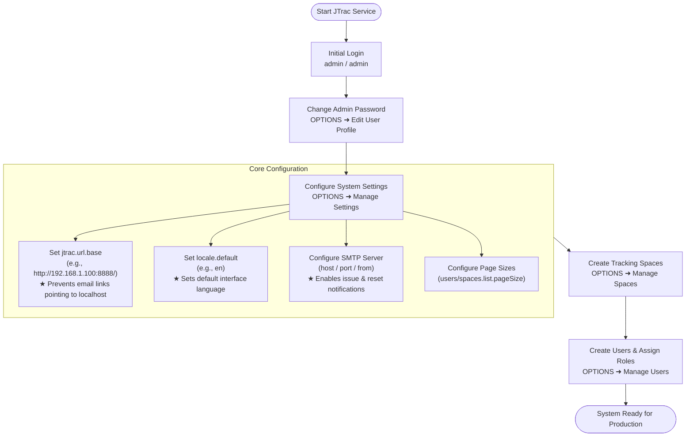

# JTrac Administrator & System Configuration Guide (English)

[English](ADMIN_GUIDE_en.md) | [繁體中文](ADMIN_GUIDE_zh-TW.md) | [简体中文](ADMIN_GUIDE_zh-CN.md) | [日本語](ADMIN_GUIDE_ja.md) | [Tiếng Việt](ADMIN_GUIDE_vi.md) | [Deutsch](ADMIN_GUIDE_de.md) | [Español](ADMIN_GUIDE_es.md) | [Français](ADMIN_GUIDE_fr.md)

---

## Table of Contents
1. [Initial Login & Default Credentials](#1-initial-login--default-credentials)
2. [Mandatory System Initialization Settings](#2-mandatory-system-initialization-settings)
3. [Architecture & Mail Flowchart (Mermaid)](#3-architecture--mail-flowchart-mermaid)
4. [Administrative Functions Overview](#4-administrative-functions-overview)
5. [Full System Backup & Restore (Anti-Lockout Shield)](#5-full-system-backup--restore-anti-lockout-shield)
6. [Security, Database Upgrade & Maintenance Recommendations](#6-security-database-upgrade--maintenance-recommendations)
7. [Docker Operations & Volume Management](#7-docker-operations--volume-management)

---

## 1. Initial Login & Default Credentials

Upon first startup and schema initialization, JTrac creates a default global administrator account:

- **System URL**: `http://<server-ip>:<port>/` (e.g. `http://localhost:8888/`)
- **Default Username**: `admin`
- **Default Password**: `admin`

> [!WARNING]
> Immediately upon your initial login, navigate to **OPTIONS** ➜ **Edit User Profile** to change the default `admin` password. Never expose default credentials to production environments.

---

## 2. Mandatory System Initialization Settings

Navigate to **OPTIONS** ➜ **Manage Settings** to configure these vital parameters:

### 1. `jtrac.url.base` (Base System URL - CRITICAL)
- **Default**: `http://localhost/jtrac/`
- **Recommended**: The public or intranet URL accessible to end users, **ending with a trailing slash `/`** (e.g., `http://192.168.1.100:8888/` or `https://issues.yourcompany.com/`).
- **Why this is critical**: All hyperlinks in notification emails (account credentials, password resets, issue updates) are built using this prefix. Leaving it as `localhost` prevents recipients from opening links from their remote machines.

---

### 2. `locale.default` (Default System Language)
- **Default**: `en`
- Options: `zh_TW`, `zh_CN`, `ja`, `en`, `vi`, `de`, `es`, `fr`.

---

### 3. SMTP Mail Server Settings
- `mail.server.host`: SMTP server host or IP.
- `mail.server.port`: SMTP port (25, 587 for TLS, 465 for SSL).
- `mail.server.username` & `mail.server.password`: Authentication credentials.
- `mail.server.starttls.enable`: Set to `true` for TLS.
- `mail.from`: Sender email address.

---

### 4. Advanced Settings & Pagination
- `users.list.pageSize`: Default page size for User Management List (default: `25`; selectable: 10, 25, 50, 100, All).
- `spaces.list.pageSize`: Default page size for Space Management List (default: `25`; selectable: 10, 25, 50, 100, All).
- `attachment.maxsize`: Maximum upload size in MB (default `10`).
- `session.timeout`: Session timeout in seconds (default `1800` / 30 mins).

---

## 3. Architecture & Mail Flowchart (Mermaid)

### Administrator Setup Flow


---

## 4. Administrative Functions Overview

| Menu Item | Purpose |
|---|---|
| **Edit User Profile** | Update current administrator email, display name, and password. |
| **Manage Users** | User management: create users, paginated browsing, reset passwords, lock accounts, assign global Admin role. |
| **Manage Spaces** | Space management: create spaces, paginated browsing, custom fields, statuses, severities, member roles. |
| **Configure Links** | Configure navigation bar external links. |
| **Manage Settings** | Configure global system parameters (base URL, SMTP, pagination). |
| **Rebuild Indexes** | Rebuild Lucene full-text search indexes. |
| **Export HTML** | Web-based batch HTML export and ZIP download. |
| **Backup & Restore** | Full system backup and restore: SuperUser exclusive feature supporting one-click ZIP bundle download of database, comprehensive SQL dump (`jtrac-dump.sql`), and attachments, with safe restore, automatic safety snapshot, and anti-lockout credential protection. |

---

## 5. Full System Backup & Restore (Anti-Lockout Shield)

JTrac provides built-in, native full-system disaster recovery and migration capabilities, accessible exclusively to SuperUsers:

1. **One-Click Full System Backup Bundle Export**:
   - Navigate to **OPTIONS** ➜ **Backup & Restore**.
   - Click **Download Backup (.zip)**. The system serializes all database entities into cross-database standard JSON format (`manifest.json` and `data/system_data.json`), generates a comprehensive standalone SQL dump (`jtrac-dump.sql` with ANSI DDL, MySQL/PostgreSQL/HSQLDB dialect notes, foreign-key ordered INSERT statements, and sequence reset hints), and compresses them along with the physical `${jtrac.home}/attachments/` directory into a single timestamped `.zip` bundle for instant browser download.
2. **Safe System Restore Engine**:
   - Choose a valid JTrac backup `.zip` file, check the confirmation checkbox, and click **Execute Restore**.
   - **Automatic Server-Side Safety Snapshot**: Prior to wiping any existing data, the system automatically creates an emergency snapshot backup in `${jtrac.home}/backups/` on the server, guaranteeing that current data can be recovered in case of an unexpected anomaly.
   - **Anti-Lockout Credential Shield**: The restore engine identifies the administrator currently performing the restore operation. Even if the backup bundle contains outdated or forgotten administrative passwords, the system **strictly preserves the current operator's active password hash and global `ROLE_ADMIN` status** (or injects the operator if absent from the backup), completely eliminating administrative lockout risks.
   - **Asynchronous Background Search Index Rebuild**: Once restore finishes, Lucene full-text indexes are automatically rebuilt in the background. The administrator's active session remains valid with zero interruption.

---

## 6. Security, Database Upgrade & Maintenance Recommendations

1. **Password Security (BCrypt & Hybrid Migration)**:
   - Upgraded to Spring Security 5.8 with BCrypt password hashing.
   - Transparent hybrid migration: legacy MD5 hashes are automatically upgraded to BCrypt upon successful user login without database disruption.
2. **Database Upgrade (Upgrading from 2.3.3-1.0.0)**:
   - External DBs (MySQL, PostgreSQL, SQL Server, Oracle): Execute [`etc/sql/upgrade-to-2.0.0.sql`](../../etc/sql/upgrade-to-2.0.0.sql).
   - Embedded HSQLDB: Automatic backup and migration to HSQLDB 2.x is handled on server startup.
3. **Data Directory (`jtrac.home`) Resolution & Backup Strategy**:
   - **`jtrac.home` 4-Tier Resolution Priority**:
     1. `jtrac.home` setting in `WEB-INF/classes/jtrac-init.properties`.
     2. JVM system property `-Djtrac.home=...` (**Recommended for Production & Containers**).
     3. Servlet Context init-parameter `jtrac.home` (in `web.xml` or Tomcat context XML).
     4. **Default Fallback**: `System.getProperty("user.home") + "/.jtrac"`.
   - **Why Did Tomcat on Linux Default to `/root/.jtrac`?**
     When running Tomcat as the `root` user on Linux without defining Priorities 1–3, Java's `user.home` resolves to `/root`. JTrac automatically creates the hidden directory `/root/.jtrac` as its fallback storage. If executed under a dedicated service account `jtrac`, it resolves to `/home/jtrac/.jtrac`.
   - **Container Customization Examples**:
     - Linux Tomcat (`bin/setenv.sh`): Add `export CATALINA_OPTS="$CATALINA_OPTS -Djtrac.home=/var/jtrac-data"`
     - Windows Tomcat (`bin/setenv.bat`): Add `set "CATALINA_OPTS=%CATALINA_OPTS% -Djtrac.home=D:/jtrac-data"`
     - Jetty: Pass `-Djtrac.home=data` in startup command (as seen in `start-jtrac.bat`).
   - **Directory Structure & Backup Schedule**:
     - `jtrac.properties`: Database connection URL, credentials, and Hibernate dialect.
     - `db/`: Embedded HSQLDB files (regularly backup if using embedded DB).
     - `attachments/`: Physical attachment files (`${jtrac.home}/attachments/`), must be included in regular backup schedules.
     - `indexes/`: Lucene full-text indexes (can be rebuilt anytime via the admin UI).
     - `backups/`: Emergency safety snapshots automatically created before system restores.
     - Regularly navigate to **OPTIONS** ➜ **Backup & Restore** to download complete `.zip` backup bundles.
4. **Reverse Proxy & HTTPS**:
   - When placing behind Nginx/Apache with HTTPS, set `jtrac.url.base` to `https://...` and preserve `Host` and `X-Forwarded-Proto` headers.
5. **Attachment Storage Partitioning & Full-Text Search**:
   - **Space-Partitioned Directory Structure (Option C)**: Attachments are organized by pure numeric Space ID (`${jtrac.home}/attachments/{spaceId}/{prefix}_{filename}`), eliminating project renaming risks.
   - **Dual-Read Fallback**: Automated fallback to flat root and orphan quarantine directory (`attachments/0_ORPHAN/`), guaranteeing 0% 404 broken download links during and after migration.
   - **Full-Text Search & Guardrails**: Whitelist text indexing for `.xlsx`, `.docx`, `.pdf`, `.txt`, `.csv`, `.md`, `.log` with configurable guardrails (`attachment.index.maxSizeMb` = 10MB, `attachment.index.maxChars` = 50,000 characters).
   - **Rebuild Indexes & Search Optimization**:
     - Powered by the enhanced `JtracAnalyzer` (integrating standard tokenization, lowercasing, and Porter English stemming), queries automatically match plural/singular forms and verb tenses (e.g. searching `window` precisely matches documents containing `Windows`; searching `test` matches `tests`/`testing`).
     - Features intelligent prefix fallback: simple words (length >= 2) with zero exact stem matches automatically expand to prefix wildcard queries (`win` falls back to `win*`). Multilingual CJK characters preserve exact unigram tokenization, and European accented characters maintain strict precision.
     - **Post-Upgrade Requirement**: Following an upgrade, administrators must navigate to **OPTIONS ➜ Rebuild Indexes** and run a full index rebuild to re-process historical items and attachments under the new stemming rules.

---

## 7. Docker Operations & Volume Management

When running JTrac in a containerized environment, system administrators should follow these operational best practices:

### 7.1 Container Data Directory & Volume Mapping
All persistent data, database files, and attachments are located at `/jtrac-data`:
- **Named Volume (Recommended)**: Use `-v jtrac_data:/jtrac-data`.
- **Host Directory Mount**: Use `-v /opt/jtrac/data:/jtrac-data`. The container entrypoint automatically adjusts directory ownership to `jetty:jetty` (UID 999) before stepping down from root. Manual host `chown` is not required.

### 7.2 Volume Backup and Restore
Administrators can back up the named volume using standard Docker operations:
```bash
# Backup jtrac_data volume to tar.gz archive
docker run --rm -v jtrac_data:/data -v $(pwd):/backup alpine tar czvf /backup/jtrac_data_backup.tar.gz -C /data .

# Restore volume
docker run --rm -v jtrac_data:/data -v $(pwd):/backup alpine sh -c "rm -rf /data/* && tar xzvf /backup/jtrac_data_backup.tar.gz -C /data"
```

### 7.3 External Database Connection (MySQL / PostgreSQL / Oracle)
To connect to an external relational database, supply connection environment variables at container startup:
```bash
docker run -d \
  -p 8888:8080 \
  -v jtrac_data:/jtrac-data \
  -e DATABASE_URL="jdbc:mysql://db-server:3306/jtrac?useUnicode=true&characterEncoding=UTF-8" \
  -e DATABASE_DRIVER="com.mysql.cj.jdbc.Driver" \
  -e DATABASE_USERNAME="jtrac" \
  -e DATABASE_PASSWORD="your_password" \
  -e HIBERNATE_DIALECT="org.hibernate.dialect.MySQL8Dialect" \
  --name jtrac \
  jtrac:latest
```
The entrypoint script automatically renders these variables into `/jtrac-data/jtrac.properties`.
