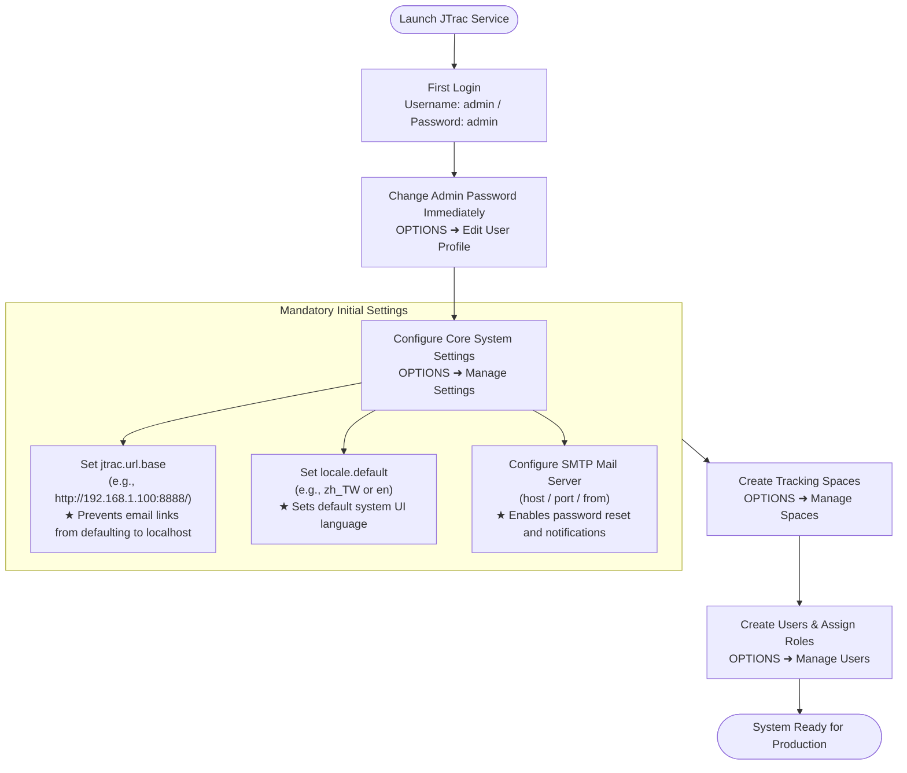
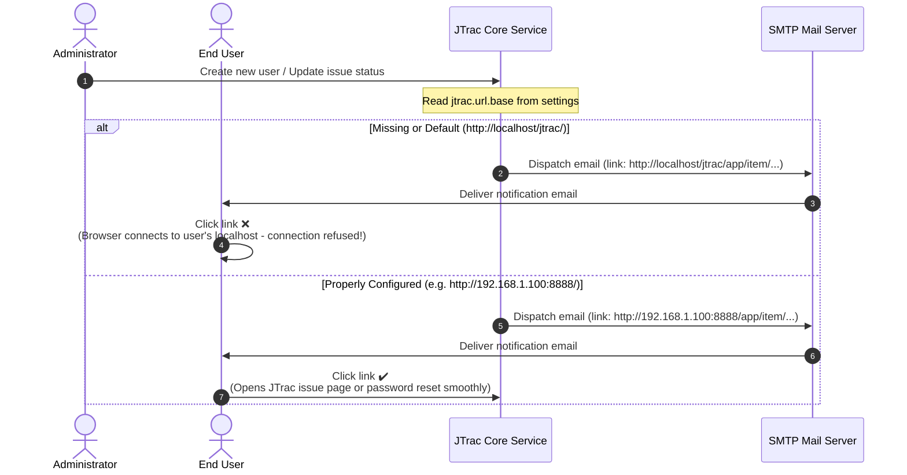

# JTrac Administrator & System Configuration Guide

[English](ADMIN_GUIDE_en.md) | [繁體中文](ADMIN_GUIDE_zh-TW.md) | [简体中文](ADMIN_GUIDE_zh-CN.md) | [日本語](ADMIN_GUIDE_ja.md) | [Tiếng Việt](ADMIN_GUIDE_vi.md) | [Deutsch](ADMIN_GUIDE_de.md) | [Español](ADMIN_GUIDE_es.md) | [Français](ADMIN_GUIDE_fr.md)

---

## Table of Contents
1. [First Login & Default Credentials](#1-first-login--default-credentials)
2. [Critical Initial System Settings (Mandatory)](#2-critical-initial-system-settings-mandatory)
3. [System Architecture & Email Flowcharts (Mermaid)](#3-system-architecture--email-flowcharts-mermaid)
4. [Administrative Functions Overview](#4-administrative-functions-overview)
5. [Security & Maintenance Best Practices](#5-security--maintenance-best-practices)

---

## 1. First Login & Default Credentials

When JTrac starts for the first time and initializes the database schema, it automatically provisions an initial global administrator account:

- **System URL**: `http://<your-server-ip-or-domain>:<port>/` (e.g. `http://localhost:8888/`)
- **Default Username**: `admin`
- **Default Password**: `admin`

> [!WARNING]
> **Security Notice**:
> Immediately after logging in for the first time, navigate to the top-right menu **OPTIONS** ➜ **Edit User Profile** and change the `admin` password. Never expose the default password in a production or public environment!

---

## 2. Critical Initial System Settings (Mandatory)

Navigate to **OPTIONS** ➜ **Manage Settings**. The following settings directly affect email notifications and external accessibility, and **must be configured before production rollout**:

### 1. `jtrac.url.base` (Base System URL - Mandatory)
- **Default Value**: `http://localhost/jtrac/`
- **Recommended Setting**: Enter the fully qualified URL accessible by your users (including protocol `http://` or `https://`, host or domain, port number, and context path, **ending with a trailing slash `/`**).
  - Internal Network Example: `http://192.168.1.100:8888/`
  - Production FQDN Example: `https://issues.yourcompany.com/`
- **Why is this mandatory?**:
  JTrac automatically generates email notifications for:
  1. Welcome emails with initial login credentials when an admin creates a new user.
  2. "Forgot Password" self-service verification and reset links.
  3. Issue tracking notifications upon creation, assignment, and status updates.
  
  All clickable hyperlinks within these emails are dynamically constructed using `jtrac.url.base` as their prefix.
- **Consequences of Not Configuring**:
  If left empty or set to the default value, all links in notification emails will point to `http://localhost/...`. When users click links from their own machines, their browsers will try to connect to their own local machine, resulting in **connection errors and inability to reset passwords**!

---

### 2. `locale.default` (Default System Locale - Recommended)
- **Default Value**: `en` (English)
- **Recommended Setting**:
  - Traditional Chinese (Taiwan): `zh_TW`
  - Simplified Chinese: `zh_CN`
  - Japanese: `ja`
  - English: `en`
- **Why configure this?**:
  This parameter determines the default language displayed to anonymous visitors, newly registered users, and users who have not specified a language preference in their profile.

---

### 3. SMTP Mail Server Settings (`mail.server.*`)
To enable outbound email notifications, configure your SMTP server under **Manage Settings**:
- `mail.server.host`: SMTP server hostname or IP address (e.g. `smtp.yourcompany.com`).
- `mail.server.port`: SMTP port (`25` unencrypted, `587` for STARTTLS, `465` for SSL).
- `mail.server.username`: SMTP authentication username.
- `mail.server.password`: SMTP authentication password.
- `mail.server.starttls.enable`: Set to `true` if your mail server requires TLS.
- `mail.from`: Sender email address (e.g. `jtrac-notifications@yourcompany.com`).

---

### 4. Advanced Settings
- `attachment.maxsize`: Maximum file upload size in megabytes (default: `10`, can be increased to `50` or higher as needed).
- `session.timeout`: HTTP session timeout in seconds (default: `1800` = 30 minutes).

---

## 3. System Architecture & Email Flowcharts (Mermaid)

### 1. First-Time Setup Workflow

### 2. `jtrac.url.base` Email Link Generation Flow

---

## 4. Administrative Functions Overview

Access the administrative panel via **OPTIONS** in the top navigation bar:

| Menu Item | Purpose & Details |
|---|---|
| **Edit User Profile** | Modify current administrator email, display name, and password. |
| **Manage Users** | User management: create accounts, reset passwords, lock users, and assign global Administrator privileges. |
| **Manage Spaces** | Space management: create spaces, define custom fields, customize status/severity options, and assign space roles (Admin / Senior / Normal / Guest). |
| **Configure Links** | Configure global navigation links in the header bar for external corporate tools. |
| **Manage Settings** | Configure global parameters (`jtrac.url.base`, `locale.default`, SMTP credentials). |
| **Rebuild Indexes** | Full-text search index rebuild: re-indexes all spaces and items with native Lucene. |
| **Import From Excel** | Batch import issues and items from standard Excel templates. |
| **Export HTML** | Batch export issue histories and attachments into static HTML/ZIP archives or run offline CLI backups via `tools/jtrac-exporter.jar`. |

---

## 5. Security & Maintenance Best Practices

1. **Modern Password Hashing**:
   - Upgraded to Spring Security 5.8 with native BCrypt password hashing. Legacy MD5 hashes are transparently upgraded upon successful login.
2. **Backups**:
   - Database: Defaults to `data/db/` (HSQLDB) or corporate RDBMS (MySQL / PostgreSQL / MSSQL).
   - Attachments: Stored under `data/attachments/`. Regularly include both in automated backup routines.
3. **Reverse Proxy & HTTPS**:
   - When deploying behind Nginx, Apache, or Caddy with SSL termination, configure `jtrac.url.base` with `https://...` and ensure `Host` and `X-Forwarded-Proto` headers are preserved.
