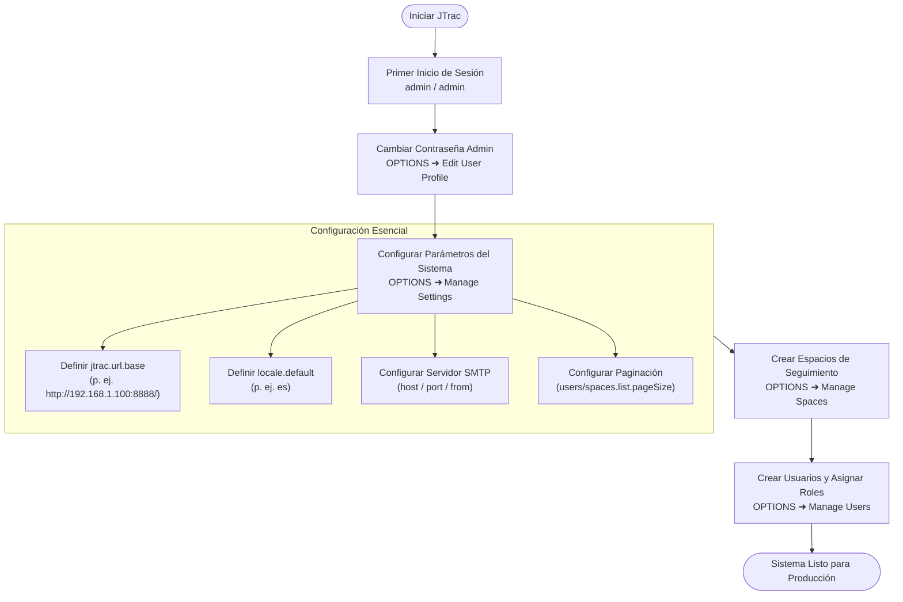

# Guía del Administrador del Sistema y Configuración (Español)

[English](ADMIN_GUIDE_en.md) | [繁體中文](ADMIN_GUIDE_zh-TW.md) | [简体中文](ADMIN_GUIDE_zh-CN.md) | [日本語](ADMIN_GUIDE_ja.md) | [Tiếng Việt](ADMIN_GUIDE_vi.md) | [Deutsch](ADMIN_GUIDE_de.md) | [Español](ADMIN_GUIDE_es.md) | [Français](ADMIN_GUIDE_fr.md)

---

## Índice
1. [Inicio de Sesión y Credenciales Predeterminadas](#1-inicio-de-sesión-y-credenciales-predeterminadas)
2. [Configuración Inicial Obligatoria](#2-configuración-inicial-obligatoria)
3. [Flujograma del Sistema y Correo (Mermaid)](#3-flujograma-del-sistema-y-correo-mermaid)
4. [Funciones Principales de Administración](#4-funciones-principales-de-administración)
5. [Seguridad, Actualización de Base de Datos y Mantenimiento](#5-seguridad-actualización-de-base-de-datos-y-mantenimiento)

---

## 1. Inicio de Sesión y Credenciales Predeterminadas

- **URL de Acceso**: `http://<IP-Servidor>:<Puerto>/` (p. ej. `http://localhost:8888/`)
- **Usuario Predeterminado**: `admin`
- **Contraseña Predeterminada**: `admin`

> [!WARNING]
> Cambie la contraseña inmediatamente tras el primer inicio de sesión en **OPTIONS** ➜ **Edit User Profile**.

---

## 2. Configuración Inicial Obligatoria

En **OPTIONS** ➜ **Manage Settings**:

### 1. `jtrac.url.base` (URL Base del Sistema - CRÍTICO)
- **Predeterminado**: `http://localhost/jtrac/`
- **Recomendado**: URL accesible por los usuarios, **terminada en barra inclinada `/`** (p. ej. `http://192.168.1.100:8888/` o `https://issues.yourcompany.com/`).
- **Importancia**: Las notificaciones por correo usan este prefijo. Si se deja en `localhost`, los usuarios remotos no podrán abrir los enlaces.

---

### 2. `locale.default` (Idioma Predeterminado)
- Recomendado: `es` o `en`.

---

### 3. Configuración del Servidor SMTP
- `mail.server.host`, `mail.server.port`, `mail.server.username`, `mail.server.password`, `mail.server.starttls.enable`, `mail.from`.

---

### 4. Ajustes Avanzados y Paginación
- `users.list.pageSize`: Tamaño de página en lista de usuarios (predeterminado: `25`; opciones: 10, 25, 50, 100, Todos).
- `spaces.list.pageSize`: Tamaño de página en lista de proyectos (predeterminado: `25`; opciones: 10, 25, 50, 100, Todos).
- `attachment.maxsize`: Tamaño máximo de archivos en MB (predeterminado `10`).

---

## 3. Flujograma del Sistema y Correo (Mermaid)

---

## 4. Funciones Principales de Administración

| Función | Propósito |
|---|---|
| **Edit User Profile** | Actualizar correo, nombre y contraseña del administrador. |
| **Manage Users** | Gestión de usuarios, paginación, restablecer contraseñas, rol Admin. |
| **Manage Spaces** | Gestión de proyectos, paginación, campos personalizados, roles. |
| **Configure Links** | Configurar enlaces externos en la barra de navegación. |
| **Manage Settings** | Parámetros globales (URL base, SMTP, paginación). |
| **Rebuild Indexes** | Reconstruir el índice de búsqueda Lucene. |
| **Import From Excel** | Importar incidencias mediante plantillas de Excel. |
| **Export HTML** | Exportación de incidencias a HTML y ZIP desde la web. |

---

## 5. Seguridad, Actualización de Base de Datos y Mantenimiento

1. **Seguridad de Contraseñas (Migración a BCrypt)**:
   - Modernizado con Spring Security 5.8 (BCrypt). Los hashes MD5 existentes se actualizan automáticamente tras el inicio de sesión.
2. **Actualización de Base de Datos (Desde 2.3.3-1.0.0)**:
   - Bases externas: Ejecute [`etc/sql/upgrade-to-2.0.0.sql`](../../etc/sql/upgrade-to-2.0.0.sql).
   - HSQLDB embebida: Se actualiza automáticamente a 2.x con respaldo al iniciar.
3. **Copias de Seguridad**:
   - Respalde periódicamente las carpetas `data/db/` y `data/attachments/`.
