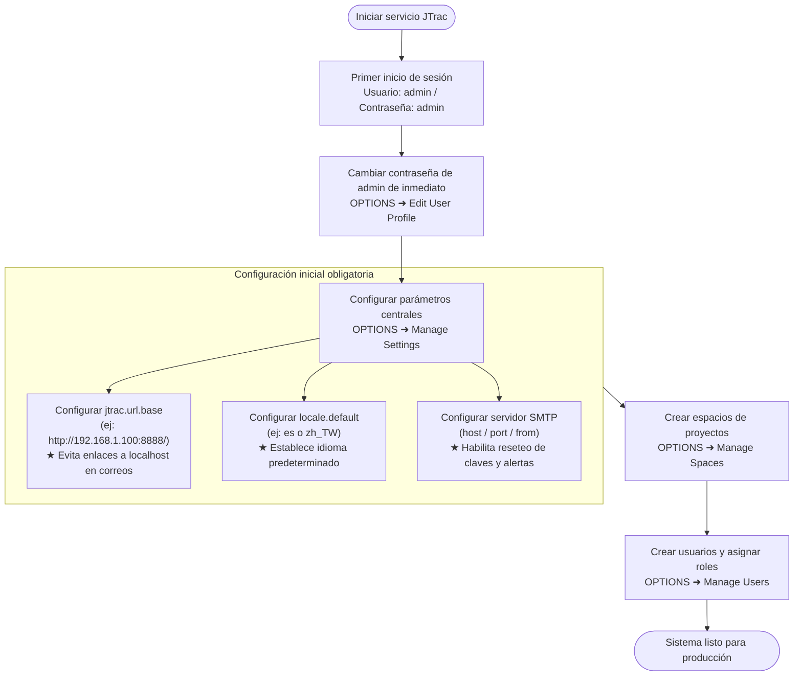
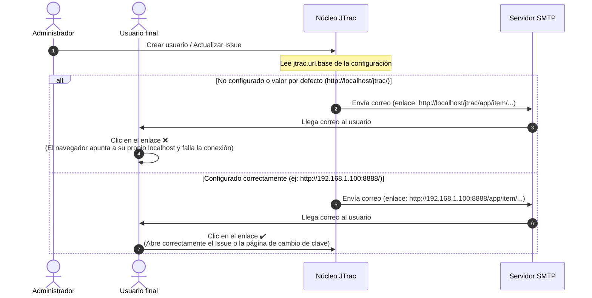

# Guía del Administrador del Sistema y Configuración de JTrac (Administrator Guide)

[English](ADMIN_GUIDE_en.md) | [繁體中文](ADMIN_GUIDE_zh-TW.md) | [简体中文](ADMIN_GUIDE_zh-CN.md) | [日本語](ADMIN_GUIDE_ja.md) | [Tiếng Việt](ADMIN_GUIDE_vi.md) | [Deutsch](ADMIN_GUIDE_de.md) | [Español](ADMIN_GUIDE_es.md) | [Français](ADMIN_GUIDE_fr.md)

---

## Índice
1. [Primer inicio de sesión y credenciales predeterminadas](#1-primer-inicio-de-sesión-y-credenciales-predeterminadas)
2. [Configuraciones iniciales críticas del sistema (Obligatorio)](#2-configuraciones-iniciales-críticas-del-sistema-obligatorio)
3. [Arquitectura del sistema y diagramas de flujo de correo (Mermaid)](#3-arquitectura-del-sistema-y-diagramas-de-flujo-de-correo-mermaid)
4. [Resumen de funciones de administración](#4-resumen-de-funciones-de-administración)
5. [Buenas prácticas de seguridad y mantenimiento](#5-buenas-prácticas-de-seguridad-y-mantenimiento)

---

## 1. Primer inicio de sesión y credenciales predeterminadas

Cuando JTrac se inicia por primera vez y completa la inicialización de la base de datos, el sistema genera automáticamente una cuenta de administrador global:

- **URL de acceso al sistema**: `http://<IP-o-dominio-del-servidor>:<puerto>/` (ejemplo local: `http://localhost:8888/`)
- **Usuario administrador predeterminado (Username)**: `admin`
- **Contraseña predeterminada (Password)**: `admin`

> [!WARNING]
> **Aviso de seguridad importante**:
> Inmediatamente después del primer inicio de sesión exitoso, diríjase al menú superior derecho **OPTIONS** ➜ **Edit User Profile** y cambie la contraseña de la cuenta `admin`. ¡No mantenga las credenciales por defecto en un entorno de producción o abierto a internet!

---

## 2. Configuraciones iniciales críticas del sistema (Obligatorio)

Inicie sesión y vaya a **OPTIONS** ➜ **Manage Settings**. Los siguientes parámetros afectan directamente el acceso externo y las notificaciones por correo electrónico, y **deben configurarse antes del uso en producción**:

### 1. `jtrac.url.base` (URL base del sistema - Obligatorio / Crítico)
- **Valor predeterminado**: `http://localhost/jtrac/`
- **Configuración recomendada obligatoria**: Ingrese la URL completa mediante la cual los usuarios finales acceden realmente al sistema (incluyendo protocolo `http://` o `https://`, host/IP, puerto y contexto, **terminando siempre con una barra diagonal `/`**).
  - Ejemplo en red local: `http://192.168.1.100:8888/`
  - Ejemplo en dominio de producción: `https://issues.yourcompany.com/`
- **¿Por qué es obligatorio configurarlo?**:
  JTrac genera automáticamente notificaciones por correo electrónico:
  1. Correo de bienvenida con credenciales cuando el administrador crea nuevos usuarios.
  2. Enlaces de verificación para el restablecimiento de contraseñas olvidadas ("Forgot Password").
  3. Notificaciones de seguimiento tras la creación, asignación y actualización de estados de Issues.
  
  Todos los enlaces e hipervínculos dentro de estos correos se construyen dinámicamente con el prefijo `jtrac.url.base`.
- **Consecuencias de no configurarlo**:
  Si se deja vacío o con el valor por defecto, todos los enlaces de los correos tendrán la forma `http://localhost/...`. Cuando los usuarios hagan clic en el enlace desde sus propios ordenadores, su navegador intentará conectarse a su propia máquina local (localhost), lo que causará un **error de conexión e impedirá restablecer contraseñas**!

---

### 2. `locale.default` (Idioma predeterminado del sistema - Recomendado)
- **Valor predeterminado**: `en` (Inglés)
- **Valores recomendados**:
  - Español: `es`
  - Chino tradicional: `zh_TW`
  - Chino simplificado: `zh_CN`
  - Japonés: `ja`
  - Inglés: `en`
- **¿Por qué configurarlo?**:
  Este parámetro determina el idioma que verán los visitantes no autenticados, los usuarios recién registrados y aquellos que no hayan configurado un idioma preferido en su perfil.

---

### 3. Configuración del servidor de correo SMTP (`mail.server.*`)
Para habilitar el envío automático de correos, configure los datos del servidor SMTP en **Manage Settings**:
- `mail.server.host`: Nombre de host o IP del servidor SMTP (ejemplo: `smtp.yourcompany.com`).
- `mail.server.port`: Puerto SMTP (`25` sin cifrar, `587` para STARTTLS, `465` para SSL).
- `mail.server.username`: Usuario de autenticación SMTP.
- `mail.server.password`: Contraseña de autenticación SMTP.
- `mail.server.starttls.enable`: Establecer en `true` si el servidor requiere TLS.
- `mail.from`: Dirección de correo del remitente (ejemplo: `jtrac-no-reply@yourcompany.com`).

---

### 4. Otras configuraciones avanzadas
- `attachment.maxsize`: Tamaño máximo por archivo adjunto en MB (por defecto `10`, ampliable a `50` según necesidad).
- `session.timeout`: Tiempo de expiración de sesión web en segundos (por defecto `1800` = 30 minutos).

---

## 3. Arquitectura del sistema y diagramas de flujo de correo (Mermaid)

### 1. Flujo de configuración inicial del administrador

### 2. Comparación de generación de enlaces con `jtrac.url.base`

---

## 4. Resumen de funciones de administración

Acceda al menú de administración mediante la opción **OPTIONS** en la barra superior:

| Elemento de menú | Propósito y descripción |
|---|---|
| **Edit User Profile** | Modificar correo electrónico, nombre para mostrar y contraseña del administrador actual. |
| **Manage Users** | Gestión de usuarios: crear cuentas, restablecer contraseñas, bloquear usuarios y asignar permisos de Administrador global. |
| **Manage Spaces** | Gestión de espacios de proyectos: crear espacios, configurar campos personalizados (Custom Fields), personalizar estados y severidades, asignar roles (Admin / Senior / Normal / Guest). |
| **Configure Links** | Enlaces de navegación global: agregar accesos directos en el encabezado hacia herramientas corporativas externas. |
| **Manage Settings** | Configuración general del sistema (`jtrac.url.base`, `locale.default`, credenciales SMTP). |
| **Rebuild Indexes** | Reconstruir índice Lucene: regenera el índice de búsqueda de texto completo cuando sea necesario. |
| **Import From Excel** | Importación masiva desde Excel: permite cargar listados de Issues desde plantillas de Excel normalizadas. |
| **Export HTML** | Exportación HTML y descarga ZIP: genera respaldos estáticos completos de espacios con adjuntos desde la interfaz web o mediante la utilidad de consola `tools/jtrac-exporter.jar`. |

---

## 5. Buenas prácticas de seguridad y mantenimiento

1. **Hash de contraseñas moderno**:
   - Actualizado a Spring Security 5.8 con soporte para BCrypt nativo. Los hashes heredados en MD5 se actualizan automáticamente a BCrypt tras el inicio de sesión exitoso.
2. **Copias de seguridad**:
   - Base de datos: ubicada por defecto en `data/db/` (HSQLDB) o motor relacional externo (MySQL / PostgreSQL / MSSQL).
   - Adjuntos: ubicados en `data/attachments/`. Asegure ambas carpetas en sus respaldos periódicos.
3. **Proxy inverso y HTTPS**:
   - Al desplegar tras Nginx, Apache o Caddy con terminación SSL, configure `jtrac.url.base` con `https://...` y asegúrese de preservar los encabezados `Host` y `X-Forwarded-Proto`.
