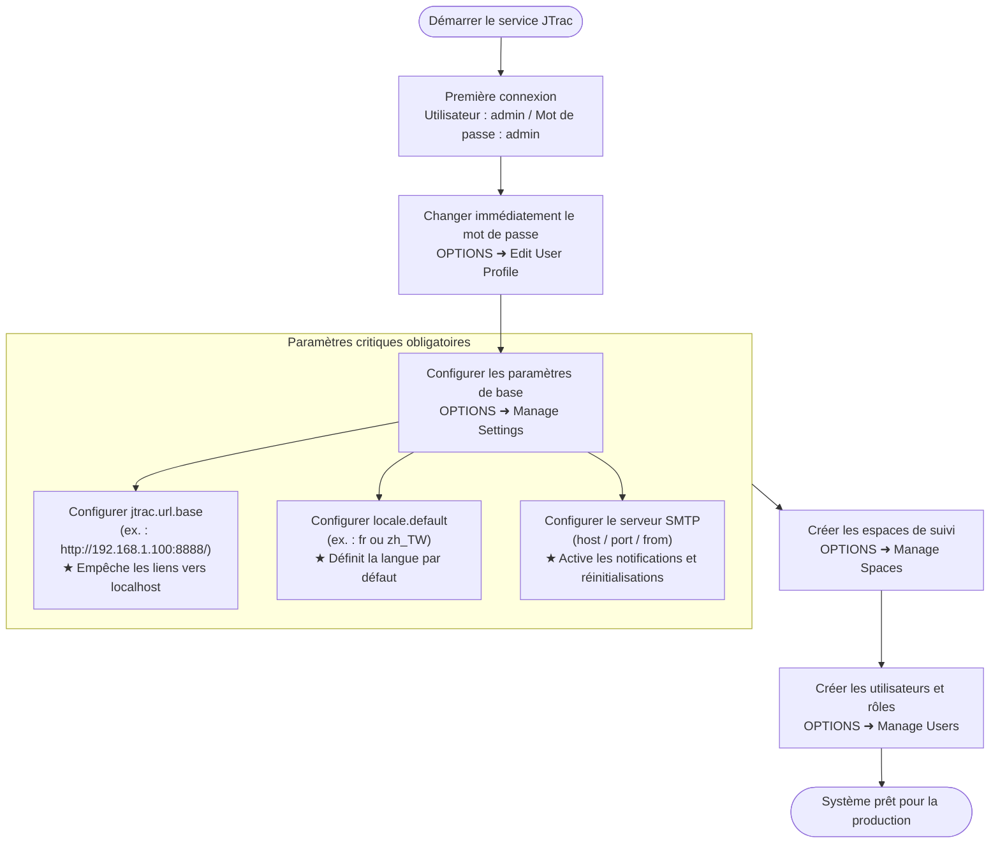
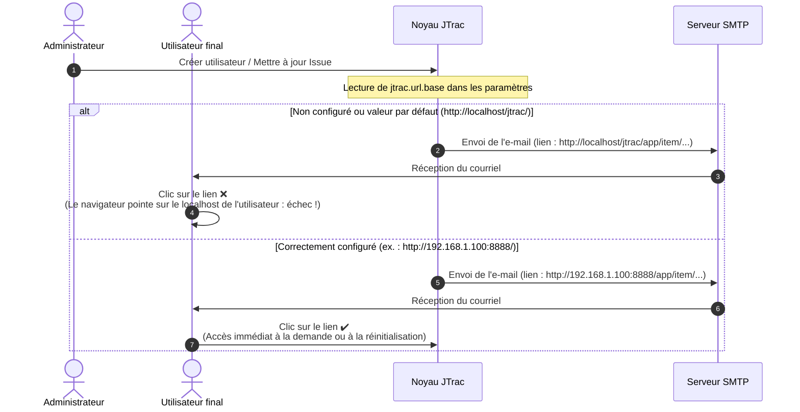

# Guide d'administration et de configuration du système JTrac (Administrator Guide)

[English](ADMIN_GUIDE_en.md) | [繁體中文](ADMIN_GUIDE_zh-TW.md) | [简体中文](ADMIN_GUIDE_zh-CN.md) | [日本語](ADMIN_GUIDE_ja.md) | [Tiếng Việt](ADMIN_GUIDE_vi.md) | [Deutsch](ADMIN_GUIDE_de.md) | [Español](ADMIN_GUIDE_es.md) | [Français](ADMIN_GUIDE_fr.md)

---

## Sommaire
1. [Première connexion et identifiants par défaut](#1-première-connexion-et-identifiants-par-défaut)
2. [Paramètres système initiaux critiques (Obligatoire)](#2-paramètres-système-initiaux-critiques-obligatoire)
3. [Architecture du système et organigrammes d'e-mail (Mermaid)](#3-architecture-du-système-et-organigrammes-de-mail-mermaid)
4. [Aperçu des fonctionnalités d'administration](#4-aperçu-des-fonctionnalités-dadministration)
5. [Bonnes pratiques de sécurité et de maintenance](#5-bonnes-pratiques-de-sécurité-et-de-maintenance)

---

## 1. Première connexion et identifiants par défaut

Lorsque JTrac démarre pour la première fois et initialise la base de données, un compte administrateur global par défaut est créé automatiquement :

- **URL d'accès au système** : `http://<IP-ou-domaine-du-serveur>:<port>/` (exemple local : `http://localhost:8888/`)
- **Nom d'utilisateur par défaut (Username)** : `admin`
- **Mot de passe par défaut (Password)** : `admin`

> [!WARNING]
> **Avertissement de sécurité important** :
> Dès votre première connexion réussie, accédez sans tarder au menu situé en haut à droite **OPTIONS** ➜ **Edit User Profile** pour modifier le mot de passe du compte `admin`. Ne laissez jamais les identifiants par défaut sur un environnement de production ou public !

---

## 2. Paramètres système initiaux critiques (Obligatoire)

Connectez-vous et rendez-vous dans **OPTIONS** ➜ **Manage Settings**. Les paramètres suivants conditionnent l'accès externe et l'envoi des notifications par e-mail, et **doivent impérativement être configurés avant toute mise en production** :

### 1. `jtrac.url.base` (URL de base du système - Obligatoire / Critique)
- **Valeur par défaut** : `http://localhost/jtrac/`
- **Configuration recommandée obligatoire** : Indiquez l'URL complète par laquelle les utilisateurs finaux accèdent réellement au service (incluant le protocole `http://` ou `https://`, l'adresse IP ou le nom de domaine, le port et le chemin de contexte, **et se terminant impérativement par une barre oblique `/`**).
  - Exemple réseau d'entreprise : `http://192.168.1.100:8888/`
  - Exemple domaine de production : `https://issues.yourcompany.com/`
- **Pourquoi cette configuration est-elle obligatoire ?** :
  JTrac envoie automatiquement des notifications par e-mail :
  1. Courriels de bienvenue contenant les identifiants initiaux lors de la création d'un utilisateur par un administrateur.
  2. Liens de réinitialisation sécurisés en cas d'oubli de mot de passe ("Forgot Password").
  3. Notifications de suivi lors de la création, de l'assignation et des changements de statut des demandes (Issues).
  
  L'ensemble des hyperliens de ces courriels est généré dynamiquement à partir du préfixe `jtrac.url.base`.
- **Conséquences d'un défaut de configuration** :
  Si ce champ reste vide ou conserve la valeur par défaut, tous les liens des e-mails pointeront vers `http://localhost/...`. Lorsque les destinataires cliqueront sur un lien depuis leur propre poste, leur navigateur tentera de se connecter à leur propre machine (localhost), ce qui provoquera une **erreur de connexion et l'impossibilité totale de réinitialiser leur mot de passe** !

---

### 2. `locale.default` (Langue par défaut du système - Recommandé)
- **Valeur par défaut** : `en` (Anglais)
- **Valeurs recommandées** :
  - Français : `fr`
  - Chinois traditionnel : `zh_TW`
  - Chinois simplifié : `zh_CN`
  - Japonais : `ja`
  - Anglais : `en`
- **Pourquoi renseigner ce paramètre ?** :
  Ce paramètre définit la langue de l'interface affichée aux visiteurs anonymes, aux nouveaux utilisateurs et à ceux n'ayant pas encore configuré de préférence linguistique dans leur profil.

---

### 3. Paramètres du serveur de messagerie SMTP (`mail.server.*`)
Pour activer l'envoi de courriels, configurez les informations SMTP dans **Manage Settings** :
- `mail.server.host` : Nom d'hôte ou adresse IP du serveur SMTP (ex. : `smtp.yourcompany.com`).
- `mail.server.port` : Port SMTP (`25` non chiffré, `587` pour STARTTLS, `465` pour SSL).
- `mail.server.username` : Nom d'utilisateur pour l'authentification SMTP.
- `mail.server.password` : Mot de passe d'authentification SMTP.
- `mail.server.starttls.enable` : Définir sur `true` si le serveur requiert le chiffrement TLS.
- `mail.from` : Adresse e-mail d'expédition (ex. : `jtrac-no-reply@yourcompany.com`).

---

### 4. Autres paramètres avancés
- `attachment.maxsize` : Taille maximale par pièce jointe en Mo (par défaut `10`, ajustable à `50` selon les besoins).
- `session.timeout` : Délai d'expiration de session Web en secondes (par défaut `1800` = 30 minutes).

---

## 3. Architecture du système et organigrammes d'e-mail (Mermaid)

### 1. Procédure d'installation initiale de l'administrateur

### 2. Comparaison du mécanisme de génération de lien par `jtrac.url.base`

---

## 4. Aperçu des fonctionnalités d'administration

Accédez au menu d'administration via le bouton **OPTIONS** situé sur la barre de navigation :

| Élément de menu | Usage et description |
|---|---|
| **Edit User Profile** | Modifier l'e-mail, le nom complet et le mot de passe de l'administrateur connecté. |
| **Manage Users** | Gestion des utilisateurs : création de comptes, réinitialisation de mots de passe, verrouillage de comptes et attribution des droits Administrateur global. |
| **Manage Spaces** | Gestion des espaces projets : création d'espaces, configuration des champs personnalisés (Custom Fields), personnalisation des listes de statuts et de sévérité, attribution des rôles (Admin / Senior / Normal / Guest). |
| **Configure Links** | Liens de navigation globaux : ajout de raccourcis externes dans l'en-tête (vers votre CI/CD, documentation interne, etc.). |
| **Manage Settings** | Paramètres généraux du système (`jtrac.url.base`, `locale.default`, identifiants SMTP). |
| **Rebuild Indexes** | Reconstruction des index Lucene : regénère intégralement l'index de recherche textuelle en cas de besoin. |
| **Import From Excel** | Importation Excel par lot : permet d'importer des demandes depuis une feuille Excel standardisée. |
| **Export HTML** | Exportation HTML et téléchargement ZIP : archive statique complète d'un ou plusieurs espaces avec pièces jointes via le Web ou l'outil en ligne de commande `tools/jtrac-exporter.jar`. |

---

## 5. Bonnes pratiques de sécurité et de maintenance

1. **Hachage moderne des mots de passe** :
   - Migration complète vers Spring Security 5.8 avec hachage BCrypt. Les anciens hachages MD5 sont automatiquement et de manière transparente convertis en BCrypt lors de la connexion des utilisateurs.
2. **Sauvegardes périodiques** :
   - Base de données : située par défaut sous `data/db/` (HSQLDB) ou sur un SGBDR externe (MySQL / PostgreSQL / MSSQL).
   - Pièces jointes : stockées sous `data/attachments/`. Intégrez ces deux répertoires dans vos sauvegardes régulières.
3. **Proxy inverse et HTTPS** :
   - En cas de déploiement derrière Nginx, Apache ou Caddy avec certificat SSL, configurez `jtrac.url.base` avec `https://...` et assurez-vous de transmettre les en-têtes `Host` et `X-Forwarded-Proto`.
