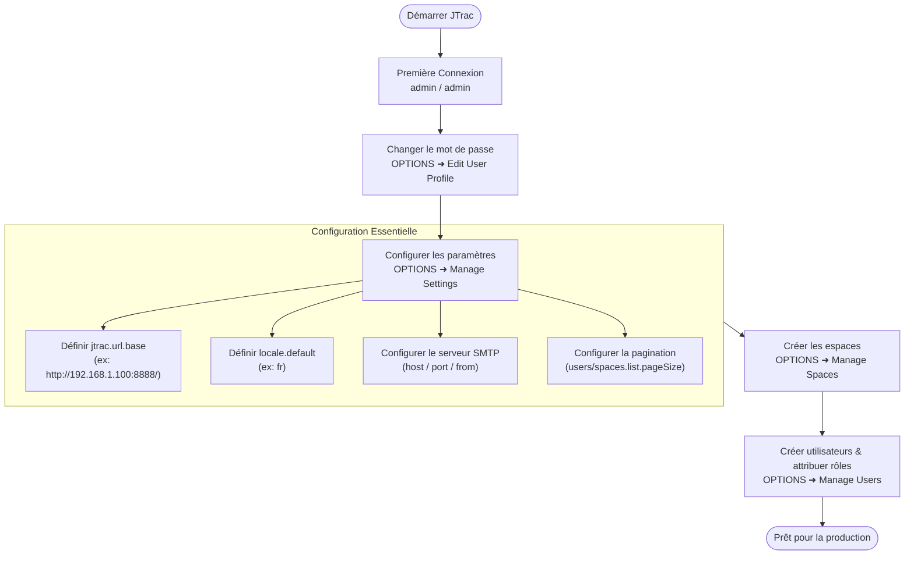

# Guide d'Administration et de Configuration Système (Français)

[English](ADMIN_GUIDE_en.md) | [繁體中文](ADMIN_GUIDE_zh-TW.md) | [简体中文](ADMIN_GUIDE_zh-CN.md) | [日本語](ADMIN_GUIDE_ja.md) | [Tiếng Việt](ADMIN_GUIDE_vi.md) | [Deutsch](ADMIN_GUIDE_de.md) | [Español](ADMIN_GUIDE_es.md) | [Français](ADMIN_GUIDE_fr.md)

---

## Sommaire
1. [Première Connexion & Identifiants par Défaut](#1-première-connexion--identifiants-par-défaut)
2. [Paramètres d'Initialisation Obligatoires](#2-paramètres-dinitialisation-obligatoires)
3. [Architecture et Flux E-mail (Mermaid)](#3-architecture-et-flux-e-mail-mermaid)
4. [Fonctions d'Administration Principales](#4-fonctions-dadministration-principales)
5. [Sauvegarde et Restauration Complète du Système (Bouclier Anti-Verrouillage)](#5-sauvegarde-et-restauration-complète-du-système-bouclier-anti-verrouillage)
6. [Sécurité, Mise à Niveau de la Base de Données et Maintenance](#6-sécurité-mise-à-niveau-de-la-base-de-données-et-maintenance)

---

## 1. Première Connexion & Identifiants par Défaut

- **URL du système** : `http://<IP-Serveur>:<Port>/` (ex: `http://localhost:8888/`)
- **Nom d'utilisateur par défaut** : `admin`
- **Mot de passe par défaut** : `admin`

> [!WARNING]
> Changez immédiatement le mot de passe après votre première connexion via **OPTIONS** ➜ **Edit User Profile**.

---

## 2. Paramètres d'Initialisation Obligatoires

Accédez à **OPTIONS** ➜ **Manage Settings** :

### 1. `jtrac.url.base` (URL de base du système - CRITIQUE)
- **Valeur par défaut** : `http://localhost/jtrac/`
- **Recommandation** : URL accessible aux utilisateurs finaux, **terminée par un slash `/`** (ex: `http://192.168.1.100:8888/` ou `https://issues.yourcompany.com/`).
- **Importance** : Tous les liens des e-mails s'appuient sur ce préfixe. S'il reste sur `localhost`, les destinataires distants ne pourront pas ouvrir les liens.

---

### 2. `locale.default` (Langue par défaut)
- Recommandé : `fr` ou `en`.

---

### 3. Paramètres du Serveur SMTP
- `mail.server.host`, `mail.server.port`, `mail.server.username`, `mail.server.password`, `mail.server.starttls.enable`, `mail.from`.

---

### 4. Paramètres Avancés & Pagination
- `users.list.pageSize` : Nombre d'éléments par page pour la liste des utilisateurs (défaut : `25` ; choix : 10, 25, 50, 100, Tout).
- `spaces.list.pageSize` : Nombre d'éléments par page pour la liste des espaces (défaut : `25` ; choix : 10, 25, 50, 100, Tout).
- `attachment.maxsize` : Taille maximale des pièces jointes en Mo (défaut `10`).

---

## 3. Architecture et Flux E-mail (Mermaid)

---

## 4. Fonctions d'Administration Principales

| Fonction | Description |
|---|---|
| **Edit User Profile** | Modifier e-mail, nom d'affichage et mot de passe de l'administrateur. |
| **Manage Users** | Gestion des utilisateurs, pagination, réinitialisation mot de passe, rôle Admin. |
| **Manage Spaces** | Gestion des espaces, pagination, champs personnalisés, rôles des membres. |
| **Configure Links** | Configurer des liens externes dans la barre de navigation. |
| **Manage Settings** | Paramètres globaux (URL de base, SMTP, pagination). |
| **Rebuild Indexes** | Reconstruire l'index de recherche plein texte Lucene. |
| **Export HTML** | Exportation HTML et téléchargement ZIP directement depuis le Web. |
| **Backup & Restore** | Sauvegarde et restauration complète du système : Réservé aux SuperUsers. Permet le téléchargement en 1 clic d'une archive ZIP regroupant la base de données JSON, le script SQL de vidage complet (`jtrac-dump.sql`) et les pièces jointes, ainsi qu'une restauration sécurisée avec instantané automatique et bouclier anti-verrouillage. |

---

## 5. Sauvegarde et Restauration Complète du Système (Bouclier Anti-Verrouillage)

JTrac propose des fonctionnalités natives de reprise après sinistre et de migration de données pour l'ensemble du système, exclusivement accessibles aux utilisateurs disposant des privilèges SuperUser :

1. **Exportation Complète de la Sauvegarde en Un Clic** :
   - Accédez à **OPTIONS** ➜ **Backup & Restore**.
   - Cliquez sur **Télécharger la sauvegarde (.zip)**. L'ensemble des entités de la base de données est sérialisé au format JSON standard (`manifest.json` et `data/system_data.json`), un fichier de vidage SQL complet et autonome `jtrac-dump.sql` (contenant le DDL ANSI, les annotations de dialectes MySQL/PostgreSQL/HSQLDB, les ordres ANSI INSERT ordonnés par dépendances de clés étrangères et les instructions de réinitialisation de séquences) est généré, puis compressé avec le répertoire physique `${jtrac.home}/attachments/` dans une unique archive `.zip` horodatée prête au téléchargement.
2. **Moteur de Restauration Sécurisée (Safe Restore Engine)** :
   - Sélectionnez un fichier ZIP de sauvegarde JTrac valide, cochez la case de confirmation d'écrasement et cliquez sur **Exécuter la restauration**.
   - **Instantané d'Urgence Automatique sur le Serveur (Safety Snapshot)** : Avant d'écraser les données existantes, le système crée automatiquement une sauvegarde instantanée dans `${jtrac.home}/backups/` sur le serveur, garantissant un retour en arrière immédiat en cas d'imprévu.
   - **Bouclier Anti-Verrouillage des Identifiants Administrateur (Anti-Lockout Credential Shield)** : Le moteur identifie l'administrateur en train de procéder à la restauration. Même si l'archive de sauvegarde contient des mots de passe administrateur oubliés ou obsolètes, le système **préserve obligatoirement le hachage du mot de passe actif et les privilèges `ROLE_ADMIN` de l'opérateur en cours** (ou l'injecte s'il est absent), éliminant tout risque de verrouillage hors du système.
   - **Reconstruction Asynchrone des Index de Recherche en Arrière-Plan** : Une fois la restauration terminée, les index de recherche plein texte Lucene sont automatiquement reconstruits en tâche de fond. La session administrateur reste active sans la moindre interruption.

---

## 6. Sécurité, Mise à Niveau de la Base de Données et Maintenance

1. **Sécurité des Mots de Passe (Migration BCrypt)** :
   - Migration vers Spring Security 5.8 avec hachage BCrypt. Les anciens hachages MD5 sont automatiquement convertis en BCrypt lors de la connexion réussie.
2. **Mise à Niveau de la Base de Données (Depuis 2.3.3-1.0.0)** :
   - Bases externes : Exécutez [`etc/sql/upgrade-to-2.0.0.sql`](../../etc/sql/upgrade-to-2.0.0.sql).
   - HSQLDB intégrée : Sauvegarde et mise à niveau automatiques vers 2.x au démarrage du serveur.
3. **Répertoire de Données (`jtrac.home`) : Priorité de Résolution et Stratégie de Sauvegarde** :
   - **Priorité de Résolution à 4 Niveaux de `jtrac.home`** :
     1. Propriété `jtrac.home` dans `WEB-INF/classes/jtrac-init.properties`.
     2. Propriété système JVM `-Djtrac.home=...` (**Recommandé pour la Production & Conteneurs**).
     3. Paramètre d'initialisation de Servlet Context `jtrac.home` (dans `web.xml` ou contexte Tomcat).
     4. **Repli par Défaut (Default Fallback)** : `System.getProperty("user.home") + "/.jtrac"`.
   - **Question Fréquente : Pourquoi Tomcat sous Linux enregistrait-il par défaut dans `/root/.jtrac` ?**
     Lorsque Tomcat s'exécute sous Linux avec l'utilisateur `root` sans spécifier les priorités 1 à 3, Java renvoie `/root` pour `user.home`. JTrac crée alors automatiquement le dossier masqué `/root/.jtrac` pour stocker toutes ses données. S'il est exécuté sous un compte de service dédié `jtrac`, le chemin sera `/home/jtrac/.jtrac`.
   - **Exemples de Configuration dans les Conteneurs** :
     - Linux Tomcat (`bin/setenv.sh`) : Ajouter `export CATALINA_OPTS="$CATALINA_OPTS -Djtrac.home=/var/jtrac-data"`
     - Windows Tomcat (`bin/setenv.bat`) : Ajouter `set "CATALINA_OPTS=%CATALINA_OPTS% -Djtrac.home=D:/jtrac-data"`
     - Jetty : Passer `-Djtrac.home=data` dans la commande de lancement (ex. `start-jtrac.bat`).
   - **Structure et Plan de Sauvegarde** :
     - `jtrac.properties` : Paramètres de connexion base de données, identifiants et dialecte.
     - `db/` : Fichiers de base HSQLDB intégrée (sauvegarder selon les plannings réguliers si base externe).
     - `attachments/` : Répertoire physique des pièces jointes (`${jtrac.home}/attachments/`), à inclure impérativement dans les sauvegardes.
     - `indexes/` : Index de recherche plein texte Lucene (reconstructibles à tout moment depuis l'interface d'administration).
     - `backups/` : Instantanés d'urgence de sécurité créés automatiquement avant toute restauration.
     - Il est fortement recommandé d'utiliser régulièrement **OPTIONS** ➜ **Backup & Restore** pour télécharger une archive de sauvegarde complète (base de données et pièces jointes).
4. **Partitionnement des Pièces Jointes et Recherche Plein Texte** :
   - **Structure Partitionnée par ID de Projet (Option C)** : Fichiers organisés sous `${jtrac.home}/attachments/{spaceId}/{prefix}_{filename}`, insensibles aux renommages.
   - **Filet de Sécurité à Double Lecture (Dual-Read Fallback)** : Repli automatique vers le dossier racine et la zone orpheline (`attachments/0_ORPHAN/`), assurant 0% d'erreurs 404.
   - **Recherche Plein Texte & Gardes-Fous** : Indexation plein texte pour `.xlsx`, `.docx`, `.pdf`, `.txt`, `.csv`, `.md`, `.log` avec seuils de 10 Mo par fichier et 50 000 caractères (configurables dans `config`).
   - **Reconstruction des Index et Optimisation de la Recherche** :
     - Grâce à l'analyseur amélioré `JtracAnalyzer` (tokenisation standard, minuscules et racinisation Porter), les requêtes font correspondre automatiquement le singulier/pluriel et les temps verbaux (ex. rechercher `window` correspond exactement aux documents contenant `Windows` ; rechercher `test` correspond à `tests`/`testing`).
     - Comprend un repli automatique par préfixe intelligent : les mots simples (longueur >= 2) sans correspondance exacte sont automatiquement étendus en requêtes avec astérisque (`win` vers `win*`). Les caractères CJK conservent leur tokenisation unigramme exacte, et les caractères accentués préservent leur précision.
     - **Action Requise Après Mise à Niveau** : Après une mise à niveau, les administrateurs doivent se rendre dans **OPTIONS ➜ Rebuild Indexes** et lancer une reconstruction complète pour réindexer les tickets et pièces jointes historiques selon les nouvelles règles.

