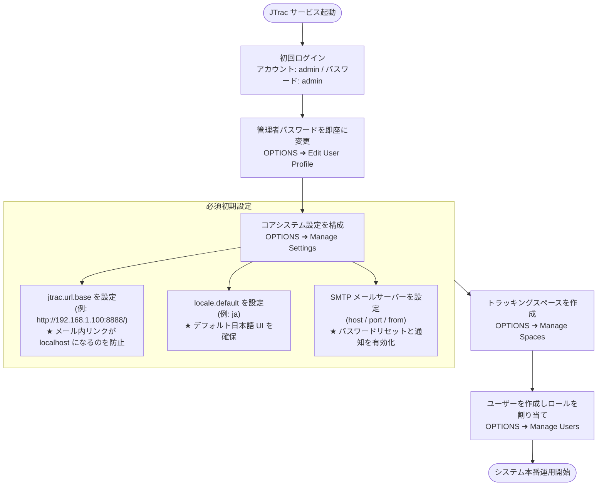
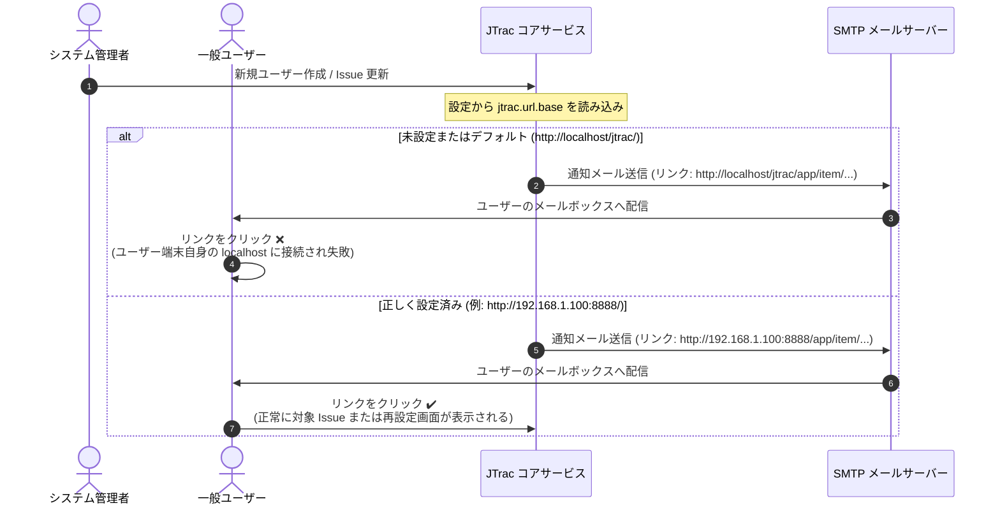

# JTrac システム管理者総合ガイド (Administrator Guide)

[English](ADMIN_GUIDE_en.md) | [繁體中文](ADMIN_GUIDE_zh-TW.md) | [简体中文](ADMIN_GUIDE_zh-CN.md) | [日本語](ADMIN_GUIDE_ja.md) | [Tiếng Việt](ADMIN_GUIDE_vi.md) | [Deutsch](ADMIN_GUIDE_de.md) | [Español](ADMIN_GUIDE_es.md) | [Français](ADMIN_GUIDE_fr.md)

---

## 目次
1. [初回ログインと初期認証情報](#1-初回ログインと初期認証情報)
2. [システム初期必須設定-最重要](#2-システム初期必須設定-最重要)
3. [システム設計およびメール通知フローチャート-mermaid](#3-システム設計およびメール通知フローチャート-mermaid)
4. [管理者機能概要一覧](#4-管理者機能概要一覧)
5. [セキュリティと運用保守のベストプラクティス](#5-セキュリティと運用保守のベストプラクティス)

---

## 1. 初回ログインと初期認証情報

JTrac の初回起動およびデータベース初期化完了時、システムには最高権限を持つ初期管理者アカウントが自動生成されます：

- **アクセス URL**: `http://<サーバーIPまたはドメイン>:<ポート>/`（ローカル環境例：`http://localhost:8888/`）
- **初期管理者ユーザー名 (Username)**: `admin`
- **初期管理者パスワード (Password)**: `admin`

> [!WARNING]
> **重要なセキュリティ警告**:
> 初回ログイン完了後、速やかに画面右上の **OPTIONS** ➜ **Edit User Profile (プロファイル編集)** へ移動し、`admin` の初期パスワードを変更してください。本番環境でデフォルトパスワードのまま運用しないでください！

---

## 2. システム初期必須設定 (最重要)

ログイン後、右上メニューの **OPTIONS** ➜ **Manage Settings (設定管理)** を開きます。以下の設定項目は外部アクセスおよびメール通知に直結するため、**本番運用開始前に必ず設定してください**：

### 1. `jtrac.url.base`（システムベースURL - 必須設定）
- **デフォルト値**: `http://localhost/jtrac/`
- **推奨設定値**: エンドユーザーが実際にアクセスする完全な URL（プロトコル `http://` または `https://`、ホスト名/IP、ポート番号、コンテキストパスを含め、**末尾にスラッシュ `/` を必ず付与してください**）。
  - 社内 LAN 例: `http://192.168.1.100:8888/`
  - 本番ドメイン例: `https://issues.yourcompany.com/`
- **なぜ必須なのか？**:
  JTrac は以下の自動メール通知を送信します：
  1. 管理者が新規ユーザーを作成した際の「**初期アカウント・パスワード通知**」。
  2. パスワード紛失時の「**パスワード再発行・リセットリンク**」。
  3. 課題起票・アサイン・ステータス更新時の「**Issue 追跡更新通知**」。
  
  これらのメール本文内のハイパーリンクおよび遷移ボタンは、すべて `jtrac.url.base` を接頭辞として生成されます。
- **設定しなかった場合の影響**:
  未設定またはデフォルト値のままの場合、すべてのメール内リンクが `http://localhost/...` となります。ユーザーが自身の PC でメール内のリンクをクリックすると、ユーザー自身のローカルマシンに接続を試みるため、**ページが開けず、パスワード再発行も完了できません**！

---

### 2. `locale.default`（デフォルト表示言語 - 必須/推奨）
- **デフォルト値**: `en`（英語）
- **推奨設定値**:
  - 日本語環境: `ja`
  - 繁体字中国語環境: `zh_TW`
  - 簡体字中国語環境: `zh_CN`
  - 英語環境: `en`
- **なぜ設定が必要なのか？**:
  未ログインの訪問者、新規登録ユーザー、およびプロファイルで個別言語を指定していないユーザーのデフォルト表示言語を決定します。未設定の場合は英語にフォールバックします。

---

### 3. SMTP メールサーバー設定 (`mail.server.*`)
自動メール送信機能を有効にするため、**Manage Settings** で SMTP サーバー情報を設定します：
- `mail.server.host`: SMTP サーバーのホスト名または IP アドレス（例：`smtp.yourcompany.com`）。
- `mail.server.port`: SMTP ポート番号（非暗号化：`25`、TLS/STARTTLS：`587`、SSL：`465`）。
- `mail.server.username`: SMTP 認証ユーザー名。
- `mail.server.password`: SMTP 認証パスワード。
- `mail.server.starttls.enable`: TLS 暗号化を使用する場合は `true`。
- `mail.from`: 送信元メールアドレス（例：`jtrac-no-reply@yourcompany.com`）。

---

### 4. その他の詳細設定
- `attachment.maxsize`: 単一添付ファイルの最大容量（MB単位、デフォルト `10`、必要に応じて `50` 等へ変更可能）。
- `session.timeout`: Web セッションタイムアウト時間（秒単位、デフォルト `1800` = 30分）。

---

## 3. システム設計およびメール通知フローチャート (Mermaid)

### 1. 管理者初回セットアップ手順

### 2. `jtrac.url.base` メール内リンク生成の比較

---

## 4. 管理者機能概要一覧

画面右上の **OPTIONS** から管理者メニューにアクセスできます：

| メニュー項目 | 用途と機能説明 |
|---|---|
| **Edit User Profile** | 現在ログイン中の管理者のメールアドレス、表示名、パスワードを変更します。 |
| **Manage Users** | ユーザー管理：アカウント新規作成、パスワード再発行、アカウント凍結、全域管理者権限の付与。 |
| **Manage Spaces** | スペース管理：トラッキング空間の作成、カスタムフィールド設定、ステータス/重大度設定、各スペースでのロール割り当て (Admin / Senior / Normal / Guest)。 |
| **Configure Links** | グローバルナビゲーションリンク設定：ヘッダーに社内ポータルや CI ツールへの外部リンクを追加。 |
| **Manage Settings** | システム設定：`jtrac.url.base`、`locale.default`、SMTP 設定等の構成。 |
| **Rebuild Indexes** | 全文検索インデックス再構築：手動データ変更時などに Lucene インデックスを再構築。 |
| **Import From Excel** | Excel 一括インポート：所定の Excel シートから Issue を一括取り込み。 |
| **Export HTML** | オフライン HTML / ZIP バックアップ：Web 画面から複数スペースの静的アーカイブを一括ダウンロード、または `tools/jtrac-exporter.jar` で CLI エクスポート。 |

---

## 5. セキュリティと運用保守のベストプラクティス

1. **最新のパスワードハッシュ対応**：
   - 本 Fork 版は Spring Security 5.8 に全面移行し、標準で強固な BCrypt ハッシュを採用しています。従来の MD5 ハッシュも認証時に自動的に BCrypt へアップグレードされます。
2. **定期バックアップ**：
   - データベース：デフォルトは `data/db/`（HSQLDB）、または外部 RDBMS（MySQL / PostgreSQL）。
   - 添付ファイル：`data/attachments/` に保存されます。両方をバックアップ対象に含めてください。
3. **リバースプロキシおよび HTTPS**：
   - Nginx や Apache 等で SSL 終端を行う場合、`jtrac.url.base` を `https://...` に指定し、`Host` および `X-Forwarded-Proto` ヘッダーを正しく転送してください。
