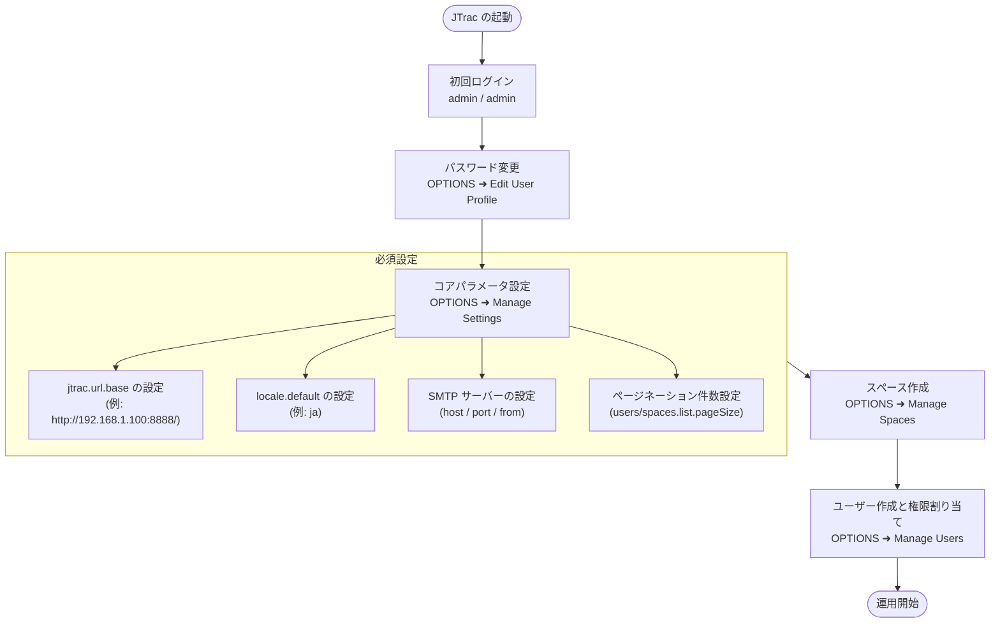

# JTrac システム管理者総合ガイド (日本語)

[English](ADMIN_GUIDE_en.md) | [繁體中文](ADMIN_GUIDE_zh-TW.md) | [简体中文](ADMIN_GUIDE_zh-CN.md) | [日本語](ADMIN_GUIDE_ja.md) | [Tiếng Việt](ADMIN_GUIDE_vi.md) | [Deutsch](ADMIN_GUIDE_de.md) | [Español](ADMIN_GUIDE_es.md) | [Français](ADMIN_GUIDE_fr.md)

---

## 目次
1. [初回ログインと初期資格情報](#1-初回ログインと初期資格情報)
2. [必須のシステム初期設定](#2-必須のシステム初期設定)
3. [システムアーキテクチャとメールフロー図 (Mermaid)](#3-システムアーキテクチャとメールフロー図-mermaid)
4. [管理者機能一覧](#4-管理者機能一覧)
5. [完全システムバックアップと復元・ロックアウト防止機構 (System Backup & Restore)](#5-完全システムバックアップと復元ロックアウト防止機構-system-backup--restore)
6. [セキュリティ、DB移行および日常保守](#6-セキュリティdb移行および日常保守)
7. [Docker コンテナ運用とデータバックアップ指針 (Docker Operations & Volume Management)](#7-docker-コンテナ運用とデータバックアップ指針-docker-operations--volume-management)

---

## 1. 初回ログインと初期資格情報

- **システム URL**：`http://<サーバーIP>:<ポート>/`（例: `http://localhost:8888/`）
- **初期管理者アカウント**：`admin`
- **初期管理者パスワード**：`admin`

> [!WARNING]
> 初回ログイン後は直ちに画面右上の **OPTIONS** ➜ **Edit User Profile** よりパスワードを変更してください。

---

## 2. 必須のシステム初期設定

画面右上の **OPTIONS** ➜ **Manage Settings** にて以下を設定します：

### 1. `jtrac.url.base`（基準 URL - 最重要）
- **デフォルト**：`http://localhost/jtrac/`
- **推奨設定**：利用者がアクセスする正規の URL（末尾に必ずスラッシュ `/` を付与、例: `http://192.168.1.100:8888/` または `https://issues.yourcompany.com/`）。
- **理由**：通知メールのリンク生成のベースとなります。`localhost` のままでは外部端末からリンクを開くことができません。

---

### 2. `locale.default`（デフォルト言語）
- 推奨設定：`ja`（日本語）。

---

### 3. SMTP メールサーバー設定
- `mail.server.host`、`mail.server.port`、`mail.server.username`、`mail.server.password`、`mail.server.starttls.enable`、`mail.from`。

---

### 4. 詳細設定とページネーション
- `users.list.pageSize`：ユーザー一覧の1ページあたりの件数（デフォルト: `25`、選択肢: 10, 25, 50, 100, 全件）。
- `spaces.list.pageSize`：スペース一覧の1ページあたりの件数（デフォルト: `25`、選択肢: 10, 25, 50, 100, 全件）。
- `attachment.maxsize`：添付ファイル上限（MB、デフォルト `10`）。

---

## 3. システムアーキテクチャとメールフロー図 (Mermaid)



---

## 4. 管理者機能一覧

| 項目 | 説明 |
|---|---|
| **Edit User Profile** | 管理者のメールアドレス、氏名、パスワードの変更。 |
| **Manage Users** | ユーザーの追加、ページネーション表示、パスワード初期化、権限設定。 |
| **Manage Spaces** | スペースの追加、ページネーション表示、カスタム項目、ロール設定。 |
| **Configure Links** | ナビゲーションバーへの外部リンク設定。 |
| **Manage Settings** | 基準 URL、SMTP、ページネーション等のグローバル設定。 |
| **Rebuild Indexes** | Lucene 全文検索インデックスの再構築。 |
| **Export HTML** | Web からの HTML 一括エクスポートと ZIP ダウンロード。 |
| **Backup & Restore** | 完全システムバックアップと復元：最高管理者専用。DB JSON、統合SQLダンプ (`jtrac-dump.sql`)、および添付ファイルをまとめた単一ZIPバックアップのダウンロードと、安全な復元（自動スナップショット作成およびロックアウト防止シールド付き）を提供。 |

---

## 5. 完全システムバックアップと復元・ロックアウト防止機構 (System Backup & Restore)

最高管理者（SuperUser）向けに、ネイティブな全システム災害復旧およびデータ移行機能を提供します：

1. **ワンクリック完全システムバックアップのエクスポート**:
   - **OPTIONS** ➜ **Backup & Restore** にアクセスします。
   - 「**バックアップをダウンロード (.zip)**」をクリックすると、すべてのDBエンティティがクロスDB標準JSON（`manifest.json` と `data/system_data.json`）にシリアライズされ、汎用 ANSI DDL、MySQL/PostgreSQL/HSQLDB 方言注釈、外部キー依存順 ANSI INSERT 文およびシーケンス再設定ヒントを含む統合 SQL ダンプ `jtrac-dump.sql` が生成され、実体添付ファイル（`${jtrac.home}/attachments/`）とともに単一のタイムスタンプ付き `.zip` アーカイブとしてブラウザからダウンロードされます。
2. **安全なシステム復元エンジン (Safe Restore Engine)**:
   - 正しい JTrac バックアップ `.zip` ファイルを選択し、上書き確認チェックボックスをオンにして「**復元を実行**」をクリックします。
   - **サーバー側自動緊急スナップショット (Safety Snapshot)**: 既存データを上書き・消去する直前に、サーバー上の `${jtrac.home}/backups/` 配下に現行システムの完全スナップショットが自動生成され、万一のトラブル時にも確実に復旧可能です。
   - **管理者アカウント・ロックアウト防止シールド (Anti-Lockout Credential Shield)**: 復元処理を実行している現在の管理者を自動識別します。バックアップ内の管理者パスワードが紛失または古い場合でも、**現在の操作者のアクティブなパスワードハッシュと最高管理権限 (`ROLE_ADMIN`) を強制的に保持**（バックアップに含まれない場合は新規注入）し、管理者が締め出されるリスクを完全に排除します。
   - **バックグラウンドでの非同期インデックス再構築**: 復元完了後、Lucene 全文検索インデックスがバックグラウンドで自動再構築されます。管理者のセッションは中断されることなく有効に維持されます。

---

## 6. セキュリティ、DB移行および日常保守

1. **パスワードセキュリティ (BCrypt 自動移行)**：
   - Spring Security 5.8 (BCrypt) に対応。旧 MD5 パスワードはログイン時に自動で BCrypt へ安全に変換されます。
2. **データベースのアップグレード (2.3.3-1.0.0 からの移行)**：
   - 外部 DB：[`etc/sql/upgrade-to-2.0.0.sql`](../../etc/sql/upgrade-to-2.0.0.sql) を実行。
   - 内蔵 HSQLDB：起動時に自動バックアップおよび 2.x へ無停止移行。
3. **データディレクトリ (`jtrac.home`) の判定優先順位と定期バックアップ**：
   - **`jtrac.home` の判定優先順位 (4 段階)**：
     1. `WEB-INF/classes/jtrac-init.properties` 内の `jtrac.home`
     2. JVM システムプロパティ `-Djtrac.home=...`（**本番環境・推奨**）
     3. Servlet Context 初期化パラメータ（`web.xml` または Tomcat Context XML 内の `jtrac.home`）
     4. **デフォルト・フォールバック (Default Fallback)**：`System.getProperty("user.home") + "/.jtrac"`
   - **よくある質問：Linux 上の Tomcat でなぜ `/root/.jtrac` に保存されていたのか？**
     Linux 環境で Tomcat を `root` ユーザー権限で起動し、かつ優先度 1〜3 の指定を行っていない場合、Java の `user.home` は `/root` と判定されるため、システムは自動的に `/root/.jtrac` 隠しディレクトリを作成してデータを保存します。一般ユーザー `jtrac` で起動した場合は `/home/jtrac/.jtrac` になります。
   - **コンテナ別パス指定例**：
     - Linux Tomcat (`bin/setenv.sh`)：`export CATALINA_OPTS="$CATALINA_OPTS -Djtrac.home=/var/jtrac-data"` を追加
     - Windows Tomcat (`bin/setenv.bat`)：`set "CATALINA_OPTS=%CATALINA_OPTS% -Djtrac.home=D:/jtrac-data"` を追加
     - Jetty：起動コマンドに `-Djtrac.home=data` を指定（ローカルの `start-jtrac.bat` など）
   - **ディレクトリ構成とバックアップ方針**：
     - `jtrac.properties`：データベース接続設定、URL、資格情報および Hibernate 方言。
     - `db/`：内蔵 HSQLDB ファイル（外部 DB 使用時は DBA スケジュールでバックアップ）。
     - `attachments/`：実体添付ファイル（`${jtrac.home}/attachments/`）、定期バックアップ必須。
     - `indexes/`：Lucene 全文検索インデックス（管理画面からいつでも再構築可能）。
     - `backups/`：リストア実行前に自動生成される安全スナップショット（Safety Snapshot）。
     - 定期的に **OPTIONS** ➜ **Backup & Restore** より完全バックアップ ZIP をダウンロードすることを推奨します。
4. **プロジェクト ID 別添付ファイル分割保存と全文検索**：
   - **数値プロジェクト ID ディレクトリ構造 (オプション C)**：添付ファイルは `${jtrac.home}/attachments/{spaceId}/{prefix}_{filename}` 配下に保存され、プロジェクト名変更の影響を完全に排除。
   - **二重読み取りフォールバック (Dual-Read Fallback)**：ルートおよび孤児隔離ディレクトリ（`attachments/0_ORPHAN/`）への自動フォールバックにより、ダウンロード 404 リンク切れを 0% 保証。
   - **全文検索と安全制限パラメータ**：`.xlsx`、`.docx`、`.pdf`、`.txt`、`.csv`、`.md`、`.log` の全文インデックスに対応。1ファイル最大 10MB・50,000 文字制限（`config` テーブルで調整可能）。
   - **インデックス再構築とステミング・前方一致検索の最適化**：
     - 強化された `JtracAnalyzer`（標準分詞、小文字化、Porter 英語ステミングの統合）により、単複や動詞の活用形が自動的に一致します（例：`window` の検索で `Windows` を含む添付ファイルや課題を正確にヒット；`test` で `tests`/`testing` をヒット）。
     - インテリジェント前方一致フォールバックを搭載：完全一致が 0 件の単純な単語（文字数 >= 2）は自動的にワイルドカードクエリ（`win` ➜ `win*`）へフォールバックします。日本語・中国語などの CJK 文字列は標準 Unigram 分詞を維持し、ウムラウト等の特殊記号も高精度に保持されます。
     - **アップグレード後の必須対応**：システムを本バージョンにアップグレードした後、管理者は必ず **OPTIONS ➜ Rebuild Indexes** よりインデックス全量再構築を 1 回実行し、既存データと添付ファイルを新しいステミング規則で再インデックスしてください。

---

## 7. Docker コンテナ運用とデータバックアップ指針 (Docker Operations & Volume Management)

JTrac を Docker コンテナ環境で運用する場合、以下のガイドラインに従うことを推奨します：

### 7.1 コンテナデータディレクトリと Volume マッピング
すべてのデータベース、添付ファイル、設定はコンテナ内の `/jtrac-data` に保持されます：
- **名前付き Volume モード (推奨)**：`-v jtrac_data:/jtrac-data` を使用。
- **ホストディレクトリマウントモード**：`-v /opt/jtrac/data:/jtrac-data` を使用。コンテナ Entrypoint が起動時に root 権限でディレクトリ所有者を `jetty:jetty` (UID 999) に自動修正し、その後に一般ユーザーへ権限降格して起動するため、ホスト上での手動 `chown` は不要です。

### 7.2 Volume の定期バックアップとリストア
管理者は標準の Docker コマンドで Volume のバックアップを簡単に取得できます：
```bash
# jtrac_data Volume を tar.gz 形式でバックアップ
docker run --rm -v jtrac_data:/data -v $(pwd):/backup alpine tar czvf /backup/jtrac_data_backup.tar.gz -C /data .

# Volume の復元
docker run --rm -v jtrac_data:/data -v $(pwd):/backup alpine sh -c "rm -rf /data/* && tar xzvf /backup/jtrac_data_backup.tar.gz -C /data"
```

### 7.3 外部リレーショナルデータベース接続 (MySQL / PostgreSQL / Oracle)
内蔵 HSQLDB ではなく外部データベースを使用する場合、コンテナ起動時に環境変数を渡します：
```bash
docker run -d \
  -p 8888:8080 \
  -v jtrac_data:/jtrac-data \
  -e DATABASE_URL="jdbc:mysql://db-server:3306/jtrac?useUnicode=true&characterEncoding=UTF-8" \
  -e DATABASE_DRIVER="com.mysql.cj.jdbc.Driver" \
  -e DATABASE_USERNAME="jtrac" \
  -e DATABASE_PASSWORD="your_password" \
  -e HIBERNATE_DIALECT="org.hibernate.dialect.MySQL8Dialect" \
  --name jtrac \
  jtrac:latest
```
コンテナ起動時に自動的に `/jtrac-data/jtrac.properties` へ接続設定が反映されます。
