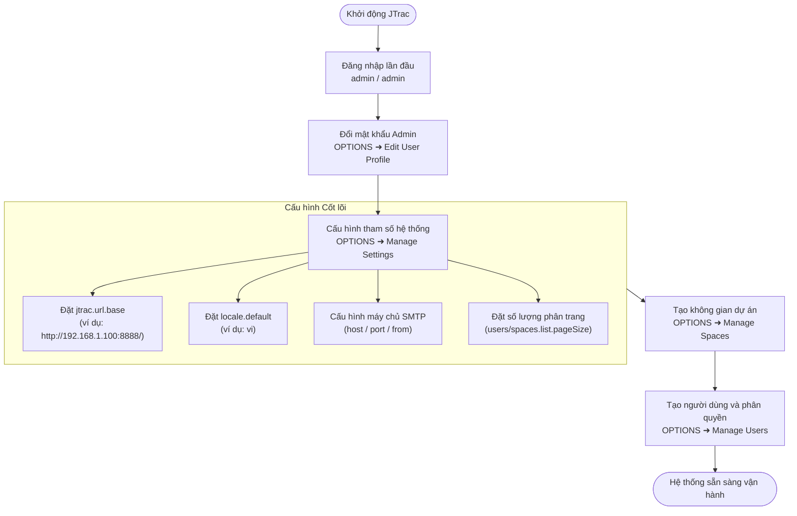

# Hướng dẫn Quản trị viên và Cấu hình Hệ thống JTrac (Tiếng Việt)

[English](ADMIN_GUIDE_en.md) | [繁體中文](ADMIN_GUIDE_zh-TW.md) | [简体中文](ADMIN_GUIDE_zh-CN.md) | [日本語](ADMIN_GUIDE_ja.md) | [Tiếng Việt](ADMIN_GUIDE_vi.md) | [Deutsch](ADMIN_GUIDE_de.md) | [Español](ADMIN_GUIDE_es.md) | [Français](ADMIN_GUIDE_fr.md)

---

## Mục lục
1. [Đăng nhập lần đầu & Thông tin mặc định](#1-đăng-nhập-lần-đầu--thông-tin-mặc-định)
2. [Cấu hình Khởi tạo Bắt buộc](#2-cấu-hình-khởi-tạo-bắt-buộc)
3. [Sơ đồ Luồng Cấu hình (Mermaid)](#3-sơ-đồ-luồng-cấu-hình-mermaid)
4. [Các Chức năng Quản trị Chính](#4-các-chức-năng-quản-trị-chính)
5. [Sao lưu & Phục hồi Toàn bộ Hệ thống (Chống Khóa Tài khoản)](#5-sao-lưu--phục-hồi-toàn-bộ-hệ-thống-chống-khóa-tài-khoản)
6. [Bảo mật, Nâng cấp Cơ sở Dữ liệu & Bảo trì](#6-bảo-mật-nâng-cấp-cơ-sở-dữ-liệu--bảo-trì)

---

## 1. Đăng nhập lần đầu & Thông tin mặc định

- **Địa chỉ truy cập**: `http://<IP-máy-chủ>:<Cổng>/` (ví dụ: `http://localhost:8888/`)
- **Tài khoản**: `admin`
- **Mật khẩu**: `admin`

> [!WARNING]
> Đổi mật khẩu ngay lập tức tại **OPTIONS** ➜ **Edit User Profile** sau khi đăng nhập thành công.

---

## 2. Cấu hình Khởi tạo Bắt buộc

Truy cập **OPTIONS** ➜ **Manage Settings**:

### 1. `jtrac.url.base` (Địa chỉ gốc của hệ thống - BẮT BUỘC)
- **Mặc định**: `http://localhost/jtrac/`
- **Khuyến nghị**: Địa chỉ mạng nội bộ hoặc tên miền thực tế, **kết thúc bằng dấu gạch chéo `/`** (ví dụ: `http://192.168.1.100:8888/` hoặc `https://issues.yourcompany.com/`).
- **Tầm quan trọng**: Các liên kết trong email thông báo đều dùng tiền tố này. Nếu để `localhost`, người dùng khác sẽ không thể mở được liên kết.

---

### 2. `locale.default` (Ngôn ngữ mặc định)
- Khuyến nghị: `vi` (Tiếng Việt) hoặc `en`.

---

### 3. Cấu hình Máy chủ Email SMTP
- `mail.server.host`, `mail.server.port`, `mail.server.username`, `mail.server.password`, `mail.server.starttls.enable`, `mail.from`.

---

### 4. Cấu hình Nâng cao & Phân trang
- `users.list.pageSize`: Số mục mỗi trang cho danh sách người dùng (mặc định: `25`; tùy chọn: 10, 25, 50, 100, Tất cả).
- `spaces.list.pageSize`: Số mục mỗi trang cho danh sách dự án (mặc định: `25`; tùy chọn: 10, 25, 50, 100, Tất cả).
- `attachment.maxsize`: Kích thước tệp tải lên tối đa (MB, mặc định `10`).

---

## 3. Sơ đồ Luồng Cấu hình (Mermaid)

---

## 4. Các Chức năng Quản trị Chính

| Chức năng | Mục đích |
|---|---|
| **Edit User Profile** | Cập nhật email, tên hiển thị và mật khẩu quản trị viên. |
| **Manage Users** | Quản lý người dùng, phân trang, đặt lại mật khẩu, cấp quyền Admin. |
| **Manage Spaces** | Quản lý dự án, phân trang, trường tùy chỉnh, vai trò thành viên. |
| **Configure Links** | Thêm liên kết ngoài trên thanh điều hướng. |
| **Manage Settings** | Thiết lập URL gốc, SMTP, phân trang toàn cục. |
| **Rebuild Indexes** | Tạo lại chỉ mục tìm kiếm toàn văn Lucene. |
| **Export HTML** | Xuất dữ liệu HTML và tệp đính kèm ZIP trực tiếp từ Web. |
| **Backup & Restore** | Sao lưu & Phục hồi toàn bộ hệ thống: Tính năng dành riêng cho SuperUser, hỗ trợ tải gói ZIP sao lưu cơ sở dữ liệu JSON, tệp kết xuất SQL toàn diện (`jtrac-dump.sql`) và tệp đính kèm, cùng cơ chế phục hồi an toàn (tự động tạo ảnh chụp khẩn cấp và bảo vệ chống khóa tài khoản). |

---

## 5. Sao lưu & Phục hồi Toàn bộ Hệ thống (Chống Khóa Tài khoản)

JTrac cung cấp cơ chế khôi phục sau thảm họa và di chuyển dữ liệu toàn diện tích hợp sẵn, chỉ dành riêng cho SuperUser:

1. **Xuất gói sao lưu toàn bộ hệ thống bằng một cú nhấp**:
   - Truy cập **OPTIONS** ➜ **Backup & Restore**.
   - Nhấp vào **Tải xuống bản sao lưu (.zip)**. Hệ thống tuần tự hóa toàn bộ thực thể cơ sở dữ liệu sang định dạng JSON chuẩn (`manifest.json` và `data/system_data.json`), tạo tệp kết xuất SQL hoàn chỉnh `jtrac-dump.sql` (bao gồm ANSI DDL, ghi chú cú pháp MySQL/PostgreSQL/HSQLDB, các câu lệnh ANSI INSERT theo thứ tự khóa ngoại và gợi ý đặt lại sequence), đồng thời nén cùng thư mục tệp đính kèm vật lý (`${jtrac.home}/attachments/`) thành một tệp `.zip` duy nhất để tải xuống ngay qua trình duyệt.
2. **Động cơ phục hồi an toàn**:
   - Chọn tệp `.zip` sao lưu JTrac hợp lệ, đánh dấu vào ô xác nhận ghi đè và nhấn **Thực hiện phục hồi**.
   - **Tự động chụp ảnh an toàn khẩn cấp trên máy chủ (Safety Snapshot)**: Trước khi xóa dữ liệu cũ, hệ thống tự động lưu bản sao lưu khẩn cấp vào `${jtrac.home}/backups/` trên máy chủ, đảm bảo có thể khôi phục nếu xảy ra sự cố.
   - **Lá chắn bảo vệ chống khóa tài khoản quản trị (Anti-Lockout Credential Shield)**: Động cơ phục hồi tự động nhận diện quản trị viên đang thực hiện thao tác. Ngay cả khi mật khẩu quản trị trong bản sao lưu đã mất hoặc là mật khẩu cũ, hệ thống vẫn **bảo lưu nghiêm ngặt băm mật khẩu hiện tại và quyền quản trị cao nhất (`ROLE_ADMIN`) của người đang thao tác**, loại bỏ hoàn toàn nguy cơ quản trị viên bị khóa khỏi hệ thống.
   - **Tự động xây dựng lại chỉ mục tìm kiếm nền**: Sau khi phục hồi xong, chỉ mục toàn văn Lucene được tự động xây dựng lại trong nền, phiên làm việc (Session) của quản trị viên vẫn duy trì liên tục không bị gián đoạn.

---

## 6. Bảo mật, Nâng cấp Cơ sở Dữ liệu & Bảo trì

1. **Bảo mật Mật khẩu (BCrypt)**:
   - Hệ thống tự động chuyển đổi mật khẩu MD5 cũ sang BCrypt khi người dùng đăng nhập thành công.
2. **Nâng cấp Cơ sở Dữ liệu (Từ 2.3.3-1.0.0)**:
   - Cơ sở dữ liệu bên ngoài: Thực thi [`etc/sql/upgrade-to-2.0.0.sql`](../../etc/sql/upgrade-to-2.0.0.sql).
   - HSQLDB nhúng: Tự động sao lưu và nâng cấp lên 2.x khi khởi động máy chủ.
3. **Sao lưu**:
   - Khuyến nghị định kỳ sử dụng **OPTIONS** ➜ **Backup & Restore** để tải bản sao lưu hoàn chỉnh (bao gồm DB và tệp đính kèm).
   - Định kỳ sao lưu thư mục `data/db/` và `data/attachments/`.

