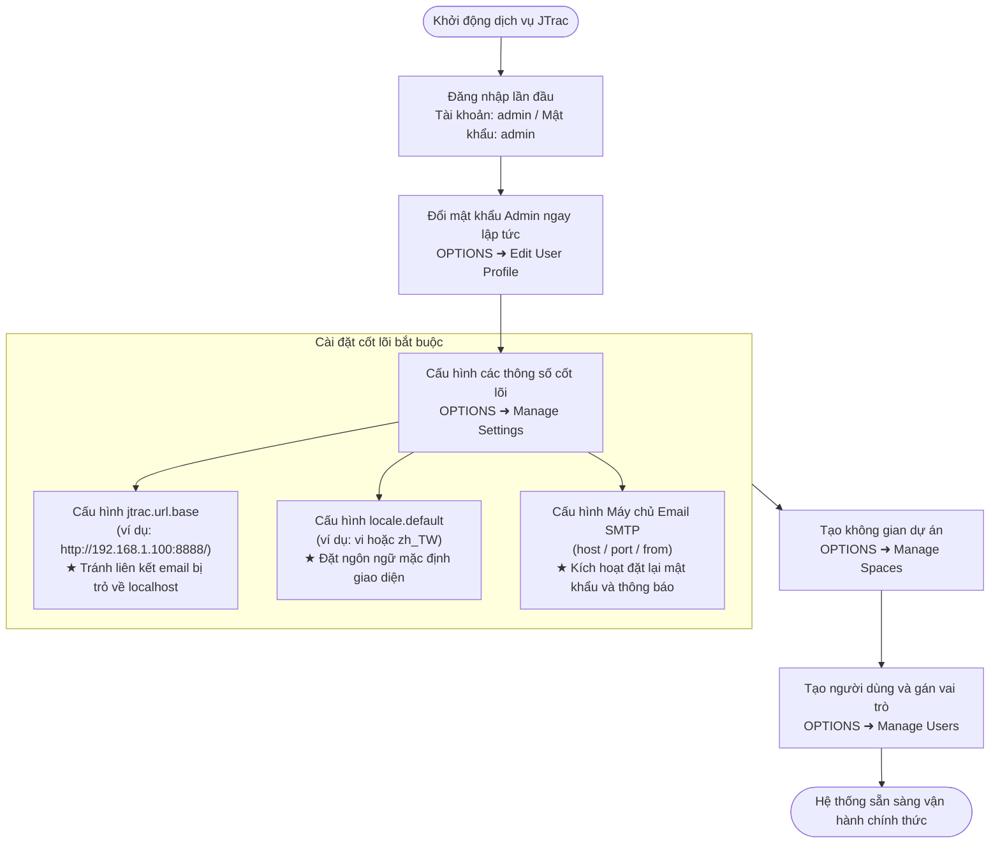
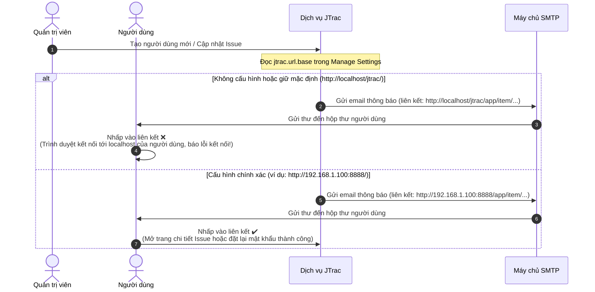

# Hướng dẫn Quản trị viên và Cấu hình Hệ thống JTrac

[English](ADMIN_GUIDE_en.md) | [繁體中文](ADMIN_GUIDE_zh-TW.md) | [简体中文](ADMIN_GUIDE_zh-CN.md) | [日本語](ADMIN_GUIDE_ja.md) | [Tiếng Việt](ADMIN_GUIDE_vi.md) | [Deutsch](ADMIN_GUIDE_de.md) | [Español](ADMIN_GUIDE_es.md) | [Français](ADMIN_GUIDE_fr.md)

---

## Mục lục
1. [Đăng nhập lần đầu & Thông tin xác thực mặc định](#1-đăng-nhập-lần-đầu--thông-tin-xác-thực-mặc-định)
2. [Cài đặt cấu hình hệ thống ban đầu (Cực kỳ quan trọng)](#2-cài-đặt-cấu-hình-hệ-thống-ban-đầu-cực-kỳ-quan-trọng)
3. [Kiến trúc hệ thống & Sơ đồ luồng gửi Email (Mermaid)](#3-kiến-trúc-hệ-thống--sơ-đồ-luồng-gửi-email-mermaid)
4. [Tổng quan các chức năng quản trị](#4-tổng-quan-các-chức-năng-quản-trị)
5. [Thực tiễn tốt nhất về Bảo mật và Vận hành](#5-thực-tiễn-tốt-nhất-về-bảo-mật-và-vận-hành)

---

## 1. Đăng nhập lần đầu & Thông tin xác thực mặc định

Khi JTrac khởi động lần đầu tiên và khởi tạo cơ sở dữ liệu, hệ thống sẽ tự động cung cấp một tài khoản quản trị viên toàn cầu ban đầu:

- **Đường dẫn truy cập hệ thống**: `http://<IP-hoặc-tên-miền-máy-chủ>:<cổng>/` (ví dụ trên máy cục bộ: `http://localhost:8888/`)
- **Tên đăng nhập mặc định (Username)**: `admin`
- **Mật khẩu mặc định (Password)**: `admin`

> [!WARNING]
> **Cảnh báo bảo mật quan trọng**:
> Ngay sau khi đăng nhập thành công lần đầu tiên, hãy điều hướng đến menu góc trên bên phải **OPTIONS** ➜ **Edit User Profile (Chỉnh sửa hồ sơ người dùng)** và đổi mật khẩu cho tài khoản `admin`. Tuyệt đối không để mật khẩu mặc định trên môi trường thực tế!

---

## 2. Cài đặt cấu hình hệ thống ban đầu (Cực kỳ quan trọng)

Đăng nhập vào hệ thống, sau đó chọn menu góc trên bên phải **OPTIONS** ➜ **Manage Settings (Quản lý cài đặt)**. Các tham số sau đây có tác động quyết định đến việc truy cập từ bên ngoài và thông báo email, **bắt buộc phải được cấu hình trước khi vận hành chính thức**:

### 1. `jtrac.url.base` (Đường dẫn cơ sở của hệ thống - BẮT BUỘC)
- **Giá trị mặc định**: `http://localhost/jtrac/`
- **Cấu hình khuyến nghị bắt buộc**: Nhập URL hoàn chỉnh mà người dùng cuối thực tế có thể truy cập (bao gồm giao thức `http://` hoặc `https://`, tên miền hoặc địa chỉ IP máy chủ, số cổng và đường dẫn context, **và bắt buộc phải có dấu gạch chéo `/` ở cuối**).
  - Ví dụ mạng nội bộ: `http://192.168.1.100:8888/`
  - Ví dụ tên miền doanh nghiệp: `https://issues.yourcompany.com/`
- **Tại sao bắt buộc phải cấu hình?**:
  JTrac có cơ chế tự động gửi thông báo qua email, bao gồm:
  1. Thư thông báo tài khoản và mật khẩu khởi tạo khi người quản trị tạo người dùng mới.
  2. Liên kết xác thực đặt lại mật khẩu khi người dùng quên mật khẩu ("Forgot Password").
  3. Thông báo theo dõi cập nhật khi tạo mới, phân công hoặc thay đổi trạng thái Issue.
  
  Tất cả các siêu liên kết (hyperlink) bên trong các email này đều được hệ thống ghép dựa trên tiền tố `jtrac.url.base`.
- **Hậu quả nếu không cấu hình**:
  Nếu để trống hoặc giữ nguyên giá trị mặc định, tất cả các liên kết trong email thông báo sẽ là `http://localhost/...`. Khi đồng nghiệp nhận được thư và nhấp vào liên kết trên máy tính của họ, trình duyệt sẽ cố kết nối vào chính máy tính của họ (localhost), dẫn đến **lỗi không thể truy cập trang và không thể đặt lại mật khẩu**!

---

### 2. `locale.default` (Ngôn ngữ mặc định của hệ thống - Khuyến nghị)
- **Giá trị mặc định**: `en` (Tiếng Anh)
- **Giá trị khuyến nghị**:
  - Tiếng Việt: `vi`
  - Tiếng Trung phồn thể: `zh_TW`
  - Tiếng Trung giản thể: `zh_CN`
  - Tiếng Nhật: `ja`
  - Tiếng Anh: `en`
- **Tại sao cần cấu hình?**:
  Tham số này quyết định ngôn ngữ hiển thị mặc định cho khách truy cập ẩn danh, người dùng mới đăng ký và những người chưa chọn ngôn ngữ yêu thích trong hồ sơ cá nhân.

---

### 3. Cài đặt Máy chủ Email SMTP (`mail.server.*`)
Để kích hoạt tính năng gửi email tự động, hãy cấu hình máy chủ SMTP trong **Manage Settings**:
- `mail.server.host`: Tên máy chủ hoặc IP của SMTP server (ví dụ: `smtp.yourcompany.com` hoặc `smtp.gmail.com`).
- `mail.server.port`: Cổng SMTP (`25` không mã hóa, `587` cho TLS/STARTTLS, `465` cho SSL).
- `mail.server.username`: Tên người dùng xác thực SMTP.
- `mail.server.password`: Mật khẩu xác thực SMTP.
- `mail.server.starttls.enable`: Đặt là `true` nếu máy chủ email yêu cầu mã hóa TLS.
- `mail.from`: Địa chỉ email người gửi (ví dụ: `jtrac-no-reply@yourcompany.com`).

---

### 4. Các cấu hình nâng cao khác
- `attachment.maxsize`: Dung lượng tối đa cho mỗi tệp đính kèm (đơn vị MB, mặc định `10`, có thể tăng lên `50` tùy nhu cầu).
- `session.timeout`: Thời gian hết hạn phiên làm việc Web (đơn vị giây, mặc định `1800` = 30 phút).

---

## 3. Kiến trúc hệ thống & Sơ đồ luồng gửi Email (Mermaid)

### 1. Quy trình thiết lập lần đầu cho Quản trị viên

### 2. So sánh cơ chế tạo liên kết Email của `jtrac.url.base`

---

## 4. Tổng quan các chức năng quản trị

Truy cập menu quản trị qua nút **OPTIONS** ở thanh điều hướng trên cùng:

| Mục Menu | Mục đích & Chi tiết sử dụng |
|---|---|
| **Edit User Profile** | Chỉnh sửa email, tên hiển thị và mật khẩu của quản trị viên hiện tại. |
| **Manage Users** | Quản lý người dùng: tạo tài khoản mới, đặt lại mật khẩu, khóa tài khoản, phân quyền Quản trị viên (Admin) toàn cầu. |
| **Manage Spaces** | Quản lý không gian theo dõi: tạo không gian mới, định cấu hình trường tùy chỉnh (Custom Fields), tùy biến trạng thái/mức độ nghiêm trọng, phân quyền vai trò (Admin / Senior / Normal / Guest). |
| **Configure Links** | Cấu hình liên kết thanh điều hướng: thêm liên kết ngoài đến hệ thống nội bộ doanh nghiệp (như CI/CD, tài liệu nội bộ). |
| **Manage Settings** | Cấu hình tham số toàn hệ thống (`jtrac.url.base`, `locale.default`, thông tin xác thực SMTP). |
| **Rebuild Indexes** | Xây dựng lại chỉ mục tìm kiếm Lucene: cập nhật lại toàn bộ chỉ mục tìm kiếm văn bản toàn diện khi cần. |
| **Import From Excel** | Nhập dữ liệu hàng loạt từ Excel: hỗ trợ nhập danh sách Issue từ biểu mẫu Excel chuẩn. |
| **Export HTML** | Xuất HTML ngoại tuyến & Tải ZIP: đóng gói xuất dữ liệu tĩnh các không gian kèm tệp đính kèm trên giao diện web hoặc chạy công cụ dòng lệnh `tools/jtrac-exporter.jar`. |

---

## 5. Thực tiễn tốt nhất về Bảo mật và Vận hành

1. **Nâng cấp mã hóa mật khẩu hiện đại**:
   - Phiên bản JTrac này đã được hiện đại hóa với Spring Security 5.8, sử dụng thuật toán băm BCrypt an toàn. Mật khẩu MD5 cũ sẽ được tự động nâng cấp sang BCrypt khi người dùng đăng nhập thành công.
2. **Sao lưu dữ liệu định kỳ**:
   - Cơ sở dữ liệu: mặc định lưu tại `data/db/` (HSQLDB) hoặc CSDL quan hệ bên ngoài (MySQL/PostgreSQL/MSSQL).
   - Tệp đính kèm: lưu tại `data/attachments/`. Hãy đưa cả hai thư mục này vào lịch sao lưu tự động định kỳ.
3. **Cấu hình Reverse Proxy & HTTPS**:
   - Khi triển khai phía sau Nginx, Apache hoặc Caddy có kích hoạt SSL, hãy đặt `jtrac.url.base` bắt đầu bằng `https://...` và đảm bảo chuyển tiếp đầy đủ tiêu đề `Host` và `X-Forwarded-Proto`.
