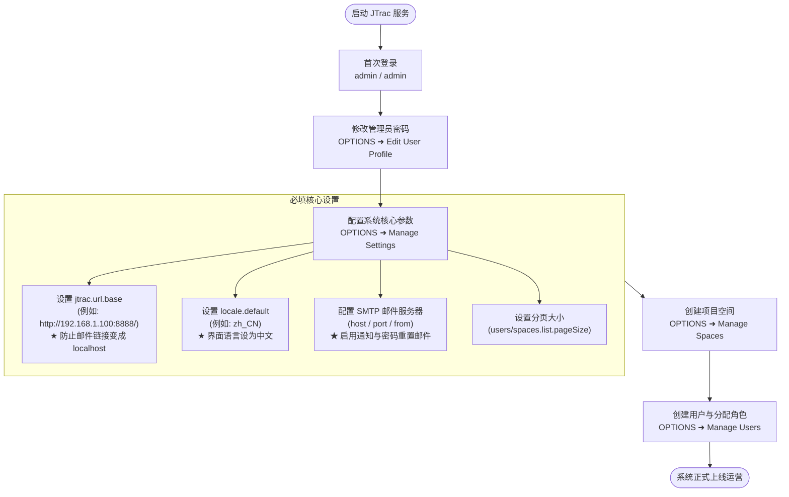

# JTrac 系统管理员完整指南 (Administrator Guide)

[English](ADMIN_GUIDE_en.md) | [繁體中文](ADMIN_GUIDE_zh-TW.md) | [简体中文](ADMIN_GUIDE_zh-CN.md) | [日本語](ADMIN_GUIDE_ja.md) | [Tiếng Việt](ADMIN_GUIDE_vi.md) | [Deutsch](ADMIN_GUIDE_de.md) | [Español](ADMIN_GUIDE_es.md) | [Français](ADMIN_GUIDE_fr.md)

---

## 目录
1. [首次登录与默认凭证](#一首次登录与默认凭证)
2. [系统初始化必填关键设置 (极重要)](#二系统初始化必填关键设置-极重要)
3. [系统架构与邮件流程图 (Mermaid)](#三系统架构与邮件流程图-mermaid)
4. [常用系统管理功能指引](#四常用系统管理功能指引)
5. [全系统备份、还原与防锁死机制 (System Backup & Restore)](#五全系统备份还原与防锁死机制-system-backup--restore)
6. [安全维护、数据库升级与日常运维建议](#六安全维护数据库升级与日常运维建议)

---

## 一、首次登录与默认凭证

- **系统访问地址**：`http://<服务器IP>:<端口>/`（例如本地默认：`http://localhost:8888/`）
- **默认管理员账号 (Username)**：`admin`
- **默认管理员密码 (Password)**：`admin`

> [!WARNING]
> 首次登录成功后，请务必前往页面右上角点击 **OPTIONS** ➜ **Edit User Profile** 修改 `admin` 密码，切勿将默认凭证暴露在生产环境！

---

## 二、系统初始化必填关键设置 (极重要)

点击右上角 **OPTIONS** ➜ **Manage Settings**：

### 1. `jtrac.url.base`（系统基准网址 - 必填/极重要）
- **系统默认值**：`http://localhost/jtrac/`
- **必填推荐设置**：必须填入终端用户实际能访问的完整网址，**且结尾必须带有斜杠 `/`**（例如：`http://192.168.1.100:8888/` 或 `https://issues.yourcompany.com/`）。
- **重要说明**：所有通知信（新账号通知、重置密码链接、工单更新）的超链接均依赖此基准网址。若保持 `localhost`，外部收件人点击时将无法打开页面。

---

### 2. `locale.default`（默认系统语言）
- **系统默认值**：`en`（英文）
- 推荐设置：`zh_CN`、`zh_TW`、`ja`、`en`。

---

### 3. SMTP 邮件服务器设置
- `mail.server.host`：SMTP 服务器地址。
- `mail.server.port`：端口号（25、TLS 587、SSL 465）。
- `mail.server.username` 与 `mail.server.password`：认证账号密码。
- `mail.server.starttls.enable`：启用 TLS 请设为 `true`。
- `mail.from`：发件人邮箱。

---

### 4. 高级设置与分页配置
- `users.list.pageSize`：用户列表默认每页显示条数（默认 `25`，可选 10, 25, 50, 100, 全部）。
- `spaces.list.pageSize`：空间列表默认每页显示条数（默认 `25`，可选 10, 25, 50, 100, 全部）。
- `attachment.maxsize`：附件大小上限（MB，默认 `10`）。
- `session.timeout`：会话超时时间（秒，默认 `1800`）。

---

## 三、系统架构与邮件流程图 (Mermaid)

---

## 四、常用系统管理功能指引

| 功能项目 | 说明 |
|---|---|
| **Edit User Profile** | 修改当前管理员邮箱、显示名称与密码。 |
| **Manage Users** | 用户账号管理：创建用户、分页浏览、重设密码、账号锁定与分配全局管理员权限。 |
| **Manage Spaces** | 项目空间管理：创建空间、分页浏览、自定义字段、状态与角色分配。 |
| **Configure Links** | 配置导航栏外部链接。 |
| **Manage Settings** | 配置核心参数（基础网址、SMTP、分页参数等）。 |
| **Rebuild Indexes** | 重建全文检索索引。 |
| **Export HTML** | 批量离线 HTML 导出与 ZIP 下载。 |
| **Backup & Restore** | 全系统备份与还原：超级管理员专属功能，支持一键下载数据库 JSON、整合 SQL 转储文件 (`jtrac-dump.sql`) 与附件之单文件 ZIP 备份包，并提供安全还原（具备自动安全快照与防锁死保护）。 |

---

## 五、全系统备份、还原与防锁死机制 (System Backup & Restore)

系统提供原生全系统灾难恢复与数据迁移机制，仅供最高管理员（SuperUser）使用：

1. **一键导出全系统备份包**：
   - 前往 **OPTIONS** ➜ **Backup & Restore (系统备份与还原)**。
   - 点击「**下载备份 (.zip)**」，系统将所有数据库实体序列化为跨数据库标准 JSON (`manifest.json` 与 `data/system_data.json`)，并同步生成包含通用 ANSI DDL、MySQL/PostgreSQL/HSQLDB 方言建表注释、14 张表外键拓扑排序 INSERT 语句与 Sequence 重置校准提示的独立 SQL 转储文件 `jtrac-dump.sql`，与物理附件目录（`${jtrac.home}/attachments/`）打包压缩为单个 `.zip` 文件供浏览器下载。
2. **安全还原引擎**：
   - 上传合法的 JTrac 备份 `.zip` 文件，勾选确认覆盖复选框，点击「**执行还原**」。
   - **自动创建服务端紧急快照 (Safety Snapshot)**：在清空任何现有数据前，系统自动在服务端 `${jtrac.home}/backups/` 目录创建当前系统完整快照，确保任何异常均可回退。
   - **操作者凭据防锁死保护 (Anti-Lockout Credential Shield)**：系统识别当前执行还原的管理员。即使备份包中管理员密码遗失或过旧，系统仍**强制保留当前操作者的活动密码哈希与最高管理员权限 (`ROLE_ADMIN`)**（若备份中无该用户则主动注入），彻底消除管理员被反锁在系统外的隐患。
   - **后台异步重建检索索引**：还原完成后，系统自动在后台触发 Lucene 全文检索全量重建，管理员 Session 保持有效无中断。

---

## 六、安全维护、数据库升级与日常运维建议

1. **密码安全性升级 (BCrypt & 混合迁移)**：
   - 升级至 Spring Security 5.8 与 BCrypt 散列算法。旧版 MD5 哈希在用户成功登录时自动升级为 BCrypt，无需手动重置密码。
2. **数据库升级 (从 2.3.3-1.0.0 升级)**：
   - 外部数据库（MySQL、PostgreSQL 等）：执行脚本 [`etc/sql/upgrade-to-2.0.0.sql`](../../etc/sql/upgrade-to-2.0.0.sql)。
   - 内置 HSQLDB：启动时自动备份并迁移至 HSQLDB 2.x。
3. **备份机制**：
   - 推荐定期通过 **OPTIONS** ➜ **Backup & Restore** 下载完整备份包（涵盖数据库与附件）。
   - 定期备份 `data/db/`（或外部数据库）与 `data/attachments/` 附件目录。
4. **附件纯项目 ID 分区存储与全文检索运维**：
   - **纯项目 ID 目录结构 (选项 C)**：附件全面存放于 `${jtrac.home}/attachments/{spaceId}/{prefix}_{filename}`，项目更名或变更代码完全不受影响。
   - **双轨查档安全网 (Dual-Read Fallback)**：读取文件时自动 Fallback 至根目录与孤儿隔离目录（`attachments/0_ORPHAN/`），确保升级过渡期 0% 下载断链 404。
   - **全文检索与安全防护参数**：系统支持 `.xlsx`、`.docx`、`.pdf`、`.txt`、`.csv`、`.md`、`.log` 全文索引，默认单文件上限 10MB、抽取上限 50,000 字符（可在 `config` 表调节）。
   - **重建索引功能**：可随时通过 **OPTIONS ➜ Rebuild Indexes** 重建全文索引，系统将重新抽取所有附件文本纳入 Lucene 索引库。

