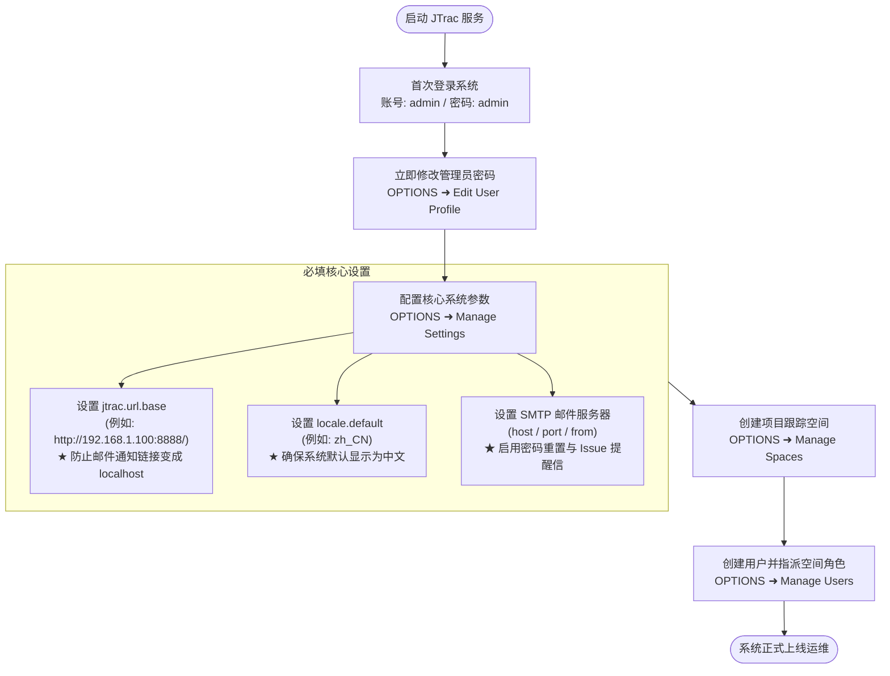
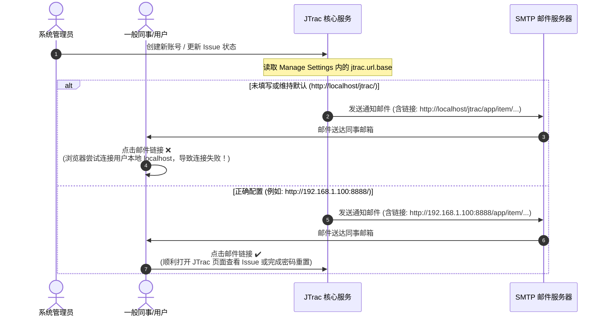

# JTrac 系统管理员完整指南 (Administrator Guide)

[English](ADMIN_GUIDE_en.md) | [繁體中文](ADMIN_GUIDE_zh-TW.md) | [简体中文](ADMIN_GUIDE_zh-CN.md) | [日本語](ADMIN_GUIDE_ja.md) | [Tiếng Việt](ADMIN_GUIDE_vi.md) | [Deutsch](ADMIN_GUIDE_de.md) | [Español](ADMIN_GUIDE_es.md) | [Français](ADMIN_GUIDE_fr.md)

---

## 目录
1. [首次登录与默认凭证](#一首次登录与默认凭证)
2. [系统初始化必填关键设置 (极重要)](#二系统初始化必填关键设置-极重要)
3. [系统架构与邮件流程图 (Mermaid)](#三系统架构与邮件流程图-mermaid)
4. [常用系统管理功能指引](#四常用系统管理功能指引)
5. [安全维护与日常运维建议](#五安全维护与日常运维建议)

---

## 一、首次登录与默认凭证

当 JTrac 首次启动并完成数据库初始化后，系统会自动创建一组具备全局最高权限的管理员账号：

- **系统访问地址**：`http://<服务器地址或IP>:<端口>/`（例如本地默认：`http://localhost:8888/`）
- **默认管理员账号 (Username)**：`admin`
- **默认管理员密码 (Password)**：`admin`

> [!WARNING]
> **重要安全警示**：
> 首次登录成功后，请务必第一时间前往页面右上角点击 **OPTIONS (选项)** ➜ **Edit User Profile (编辑个人资料)** 修改 `admin` 的默认密码，切勿将默认密码暴露在生产或公网环境中！

---

## 二、系统初始化必填关键设置 (极重要)

登录系统后，请点击右上角 **OPTIONS** ➜ **Manage Settings (管理系统设置)**。在此设置管理页中，以下参数直接影响系统对外服务与电子邮件通知功能，**务必在正式上线前完成配置**：

### 1. `jtrac.url.base`（系统基准网址 - 必填/极重要）
- **系统默认值**：`http://localhost/jtrac/`
- **必填推荐设置**：请填入终端用户实际能连接的完整网址（需包含协议 `http://` 或 `https://`、服务器 IP 或域名、端口号及路径，**且结尾必须带有斜杠 `/`**）。
  - 本地/内网示例：`http://192.168.1.100:8888/`
  - 企业正式域名示例：`https://issues.yourcompany.com/`
- **为什么一定要填写？**：
  JTrac 具备自动发送电子邮件通知机制，包含：
  1. 管理员创建新用户时发送的“**初始账号密码通知信**”。
  2. 用户忘记密码时发送的“**密码重置认证链接**”。
  3. 问题单新建、指派与状态变更时的“**Issue 跟踪更新通知**”。
  
  以上所有邮件正文中的超链接与跳转按钮，**全部依赖 `jtrac.url.base` 作为前缀进行拼接**。
- **未填写之后果**：
  若保持空白或默认值，所有通知信内的超链接都会是 `http://localhost/...`。外部同仁在自己电脑收信后点击链接，浏览器会直接向他们自己的本地连接，导致**完全无法打开页面，也无法完成密码重置**！

---

### 2. `locale.default`（默认系统语言 - 必填/建议）
- **系统默认值**：`en`（英文）
- **建议设置值**：
  - 简体中文环境：`zh_CN`
  - 繁体中文环境：`zh_TW`
  - 日本语环境：`ja`
  - 英文环境：`en`
- **为什么需要填写？**：
  此参数决定未登录访客、新注册用户以及个人资料中尚未指定偏好语言的同事所看到的界面语言。若未配置，系统一律默认退回为英文界面。

---

### 3. 电子邮件 SMTP 服务器配置 (Mail Settings)
若要让系统自动发信功能生效，必须在 **Manage Settings** 中正确配置邮件服务器：
- `mail.server.host`：SMTP 服务器主机名或 IP（例如：`smtp.yourcompany.com` 或 `smtp.gmail.com`）。
- `mail.server.port`：SMTP 端口（无加密常见为 `25`，TLS/STARTTLS 常见为 `587`，SSL 常见为 `465`）。
- `mail.server.username`：SMTP 认证账号。
- `mail.server.password`：SMTP 认证密码。
- `mail.server.starttls.enable`：若使用 TLS 加密请设为 `true`。
- `mail.from`：发件人显示邮箱（例如：`jtrac-no-reply@yourcompany.com`）。

---

### 4. 其他常用高级配置
- `attachment.maxsize`：单附件上传大小上限（单位为 MB，默认 `10`，可依需求调整为如 `50`）。
- `session.timeout`：Web 会话超时时间（单位为秒，默认 `1800` 即 30 分钟）。

---

## 三、系统架构与邮件流程图 (Mermaid)

### 1. 管理员首次上线初始化流程

### 2. `jtrac.url.base` 邮件链接生成机制对比

---

## 四、常用系统管理功能指引

在系统右上角点击 **OPTIONS**，可进入管理员专属后台菜单：

| 功能项目 (Menu Item) | 说明与用途 |
|---|---|
| **Edit User Profile** | 修改当前登录管理员之电子邮箱、显示名称与登录密码。 |
| **Manage Users** | 用户账号管理：新增用户、重置用户密码、锁定账号、以及在全局层级赋予管理员 (Admin) 权限。 |
| **Manage Spaces** | 项目跟踪空间管理：新增项目空间、自定义项目字段 (Custom Fields)、自定义状态与严重度菜单、设置用户在各项目中的角色 (Admin / Senior / Normal / Guest)。 |
| **Configure Links** | 配置全局导航栏超链接：可在顶部导航栏新增企业内部系统链接（如 CI/CD 平台、知识库等）。 |
| **Manage Settings** | 系统全局核心参数配置（如前述 `jtrac.url.base`、`locale.default` 与 SMTP 邮件设置）。 |
| **Rebuild Indexes** | Lucene 全文检索索引重建：当手动操作数据库或检索结果异常时，可一键重新建立全文检索索引库。 |
| **Import From Excel** | Excel 批量导入：支持通过制式 Excel 电子表格批量导入项目历史与 Issue 列表。 |
| **Export HTML (导航栏)** | 离线 HTML 导出与 ZIP 下载：可在网页直接勾选多个空间打包下载完整静态讨论历史与附件；亦可使用命令行工具 `tools/jtrac-exporter.jar` 进行数据库离线归档。 |

---

## 五、安全维护与日常运维建议

1. **密码安全性升级**：
   - 本增强版 JTrac 已全面现代化升级至 Spring Security 5.8，支持高强度的 BCrypt 密码散列，并兼容旧版 MD5 散列无感自动升级。建议所有用户在登录后重新保存密码以启用 BCrypt 加密。
2. **定期数据备份**：
   - 数据库文件：默认位于 `data/db/`（HSQLDB），若使用外部关系型数据库（如 MySQL/PostgreSQL）请依照企业数据库常规计划进行备份。
   - 附件目录：默认位于 `data/attachments/`，请定期纳入备份计划。
3. **反向代理与 HTTPS 配置**：
   - 若生产环境通过 Nginx、Apache 或 Caddy 进行反向代理并启用 HTTPS，请将 `jtrac.url.base` 设置为对应的 `https://...` 网址，并确认反向代理配置中保留 `Host` 与 `X-Forwarded-Proto` 请求头。
