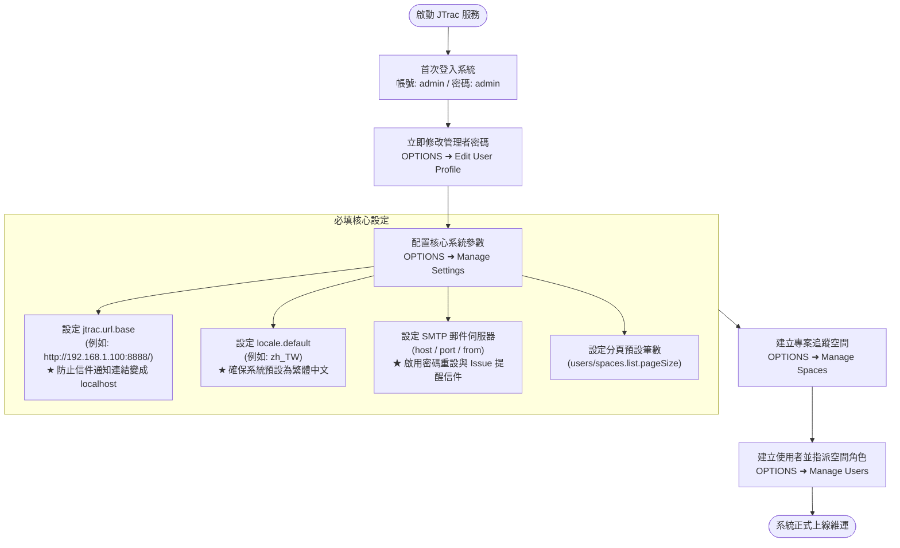
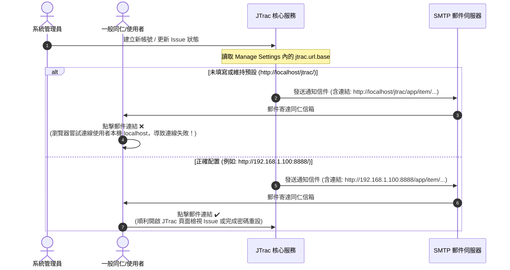

# JTrac 系統管理者完整指南 (Administrator Guide)

[English](ADMIN_GUIDE_en.md) | [繁體中文](ADMIN_GUIDE_zh-TW.md) | [简体中文](ADMIN_GUIDE_zh-CN.md) | [日本語](ADMIN_GUIDE_ja.md) | [Tiếng Việt](ADMIN_GUIDE_vi.md) | [Deutsch](ADMIN_GUIDE_de.md) | [Español](ADMIN_GUIDE_es.md) | [Français](ADMIN_GUIDE_fr.md)

---

## 目錄
1. [首次登入與預設憑證](#一首次登入與預設憑證)
2. [系統初始化必填關鍵設定 (極重要)](#二系統初始化必填關鍵設定-極重要)
3. [系統架構與郵件流程圖 (Mermaid)](#三系統架構與郵件流程圖-mermaid)
4. [常用系統管理功能指引](#四常用系統管理功能指引)
5. [全系統備份、還原與防鎖死機制 (System Backup & Restore)](#五全系統備份還原與防鎖死機制-system-backup--restore)
6. [安全維護、資料庫升級與日常運維建議](#六安全維護資料庫升級與日常運維建議)
7. [Docker 容器化運維與資料備份指引 (Docker Operations & Volume Management)](#七docker-容器化運維與資料備份指引-docker-operations--volume-management)

---

## 一、首次登入與預設憑證

當 JTrac 首次啟動並完成資料庫初始化後，系統會自動建立一組具備全域最高權限的管理員帳號：

- **系統存取網址**：`http://<伺服器位址或IP>:<通訊埠>/`（例如本地預設：`http://localhost:8888/`）
- **預設管理員帳號 (Username)**：`admin`
- **預設管理員密碼 (Password)**：`admin`

> [!WARNING]
> **重要安全警示**：
> 首次登入成功後，請務必第一時間前往頁面右上角點擊 **OPTIONS (選項)** ➜ **Edit User Profile (編輯個人資料)** 修改 `admin` 之預設密碼，切勿將預設密碼暴露於生產或公網環境中！

---

## 二、系統初始化必填關鍵設定 (極重要)

登入系統後，請點選右上角 **OPTIONS** ➜ **Manage Settings (管理系統設定)**。在此設定管理頁中，以下參數直接影響系統對外服務與電子郵件通知功能，**務必於正式上線前完成設定**：

### 1. `jtrac.url.base`（系統基準網址 - 必填/極重要）
- **系統預設值**：`http://localhost/jtrac/`
- **必填推薦設定**：請填入終端使用者實際能連線之完整網址（需包含通訊協定 `http://` 或 `https://`、伺服器 IP 或網域名稱、通訊埠號及路徑，**且結尾必須帶有斜線 `/`**）。
  - 本地/內部網路範例：`http://192.168.1.100:8888/`
  - 企業正式域名範例：`https://issues.yourcompany.com/`
- **為什麼一定要填寫？**：
  JTrac 具備自動發送電子郵件通知機制，包含：
  1. 管理員建立新使用者時寄發的「**初始帳號密碼通知信**」。
  2. 使用者忘記密碼時寄發的「**密碼重設認證連結**」。
  3. 問題單新建、指派與狀態變更時的「**Issue 追蹤更新通知**」。
  
  以上所有郵件內文中的超連結與跳轉按鈕，**全數依賴 `jtrac.url.base` 作為前綴進行拼接**。
- **未填寫之後果**：
  若維持空白或預設值，所有通知信內的超連結都會是 `http://localhost/...`。外部同仁在自己電腦收信後點擊連結，瀏覽器會直接向他們自己的本機連線，導致**完全無法開啟頁面、亦無法完成密碼重設**！

---

### 2. `locale.default`（預設系統語系 - 必填/建議）
- **系統預設值**：`en`（英文）
- **建議設定值**：
  - 台灣繁體中文環境：`zh_TW`
  - 大陸簡體中文環境：`zh_CN`
  - 日本語環境：`ja`
  - 英文環境：`en`
- **為什麼要填寫？**：
  此參數決定未登入訪客、新註冊使用者以及個人資料中尚未指定偏好語系之同仁所看到的介面語言。若未設定，系統一律預設為全英文介面。

---

### 3. 電子郵件 SMTP 伺服器設定 (Mail Settings)
若要讓系統自動寄信功能生效，必須在 **Manage Settings** 中正確配置郵件伺服器：
- `mail.server.host`：SMTP 伺服器主機名稱或 IP（例如：`smtp.yourcompany.com` 或 `smtp.gmail.com`）。
- `mail.server.port`：SMTP 連線埠號（無加密常見為 `25`，TLS/STARTTLS 常見為 `587`，SSL 常見為 `465`）。
- `mail.server.username`：SMTP 認證帳號。
- `mail.server.password`：SMTP 認證密碼。
- `mail.server.starttls.enable`：若使用 TLS 加密請設為 `true`。
- `mail.from`：寄件者顯示信箱（例如：`jtrac-no-reply@yourcompany.com`）。

---

### 4. 其他常用進階設定與分頁配置
- `users.list.pageSize`：使用者列表 (`UserListPage`) 預設每頁顯示筆數（系統預設 `25`，介面提供 10, 25, 50, 100 或全部）。
- `spaces.list.pageSize`：專案空間列表 (`SpaceListPage`) 預設每頁顯示筆數（系統預設 `25`，介面提供 10, 25, 50, 100 或全部）。
- `attachment.maxsize`：單一附件上傳大小上限（單位為 MB，預設 `10`，可依需求調整為例如 `50`）。
- `session.timeout`：Web 會話逾時時間（單位為秒，預設 `1800` 即 30 分鐘）。

---

## 三、系統架構與郵件流程圖 (Mermaid)

### 1. 管理者首次上線初始化流程


### 2. `jtrac.url.base` 郵件連結產生機制比較


---

## 四、常用系統管理功能指引

在系統右上角點選 **OPTIONS**，可進入管理者專屬後台選單：

| 功能項目 (Menu Item) | 說明與用途 |
|---|---|
| **Edit User Profile** | 修改目前登入管理員之電子郵件、顯示名稱與登入密碼。 |
| **Manage Users** | 使用者帳號管理：新增使用者、分頁瀏覽、重設密碼、鎖定帳號、以及在全域層級賦予管理者 (Admin) 權限。 |
| **Manage Spaces** | 專案追蹤空間管理：新增專案空間、分頁瀏覽、自訂專案欄位 (Custom Fields)、自訂狀態與嚴重度、設定使用者空間角色。 |
| **Configure Links** | 配置全域導航列超連結：可在頂部導航列新增企業內部系統連結（如 CI/CD 平台、文件庫等）。 |
| **Manage Settings** | 系統全域核心參數配置（包含 `jtrac.url.base`、`locale.default`、SMTP 設定與分頁大小）。 |
| **Rebuild Indexes** | Lucene 全文檢索索引重建：手動操作資料庫或檢索結果異常時，一鍵重新建立全文檢索索引庫。 |
| **Export HTML (導航列)** | 離線 HTML 匯出與 ZIP 下載：可於網頁直接勾選複數空間打包下載完整靜態討論串與附件。 |
| **Backup & Restore** | 全系統備份與還原：最高管理員專屬功能，支援一鍵下載資料庫 JSON、整合 SQL 傾印檔 (`jtrac-dump.sql`) 與實體附件之單一備份 ZIP，並提供安全還原（具備自動快照與防鎖死保護）。 |

---

## 五、全系統備份、還原與防鎖死機制 (System Backup & Restore)

本系統具備原生之全系統災難復原與資料遷移機制，僅限最高管理員（SuperUser）操作：

1. **一鍵匯出全系統備份包 (Full Backup Bundle)**：
   - 前往 **OPTIONS** ➜ **Backup & Restore (系統備份與還原)**。
   - 點擊「**下載備份 (.zip)**」按鈕，系統會將 Config、Users、Spaces、Items、History、Attachments 等所有資料庫實體序列化為跨資料庫通用標準 JSON (`manifest.json` 與 `data/system_data.json`)，並同步產生單一整合 SQL 傾印檔 `jtrac-dump.sql`（包含通用 ANSI DDL、MySQL/PostgreSQL/HSQLDB 方言註解、14 張資料表依外鍵相依拓撲排序產出之 ANSI INSERT 敘述與 Sequence 自增重置指令），連同實體附件目錄（`${jtrac.home}/attachments/`）合併壓縮為單一 `.zip` 檔案供即時下載。
2. **安全系統還原 (Safe Restore Engine)**：
   - 選擇合法的 JTrac 備份 `.zip` 檔案並勾選確認覆蓋方塊，點擊「**執行還原**」。
   - **自動建立伺服器端緊急快照 (Safety Snapshot)**：在執行任何覆寫前，系統會自動在伺服器端 `${jtrac.home}/backups/` 產生一份當前系統的完整快照，確保任何意外皆可回復。
   - **最高管理員防鎖死保護 (Anti-Lockout Credential Shield)**：還原時系統會自動辨識目前正在操作還原的管理者帳號。即使備份檔中的管理者密碼已遺失或為舊密碼，系統仍會**強制保留當前登入者之密碼雜湊與最高管理權限 (`ROLE_ADMIN`)**，若備份中無該帳號則主動注入，徹底杜絕管理員遭反鎖於系統外的風險。
   - **背景非同步重建搜尋索引**：還原完成後，系統自動於背景重建 Lucene 全量全文檢索索引，且管理員 Session 保持有效無中斷，可立即繼續瀏覽與操作工單。

---

## 六、安全維護、資料庫升級與日常運維建議

1. **密碼安全性升級 (BCrypt & Hybrid Migration)**：
   - 本增強版 JTrac 已全面升級至 Spring Security 5.8，支援強安全的 BCrypt 密碼雜湊。
   - 系統相容舊版 MD5 密碼雜湊，使用者於下次登入時會自動、平滑無感地重新雜湊為 BCrypt，管理員無需手動介入修改資料庫。
2. **資料庫版本升級 (從 2.3.3-1.0.0 升級)**：
   - 若使用外部關聯式資料庫（MySQL、PostgreSQL、SQL Server、Oracle），請執行腳本：[`etc/sql/upgrade-to-2.0.0.sql`](../../etc/sql/upgrade-to-2.0.0.sql)。
   - 若使用內建 HSQLDB，系統啟動時由 `HsqldbDatabaseMigrator` 自動建立備份並無縫遷移至 HSQLDB 2.x，無需手動執行 SQL。
3. **資料目錄 (`jtrac.home`) 判定機制與定期備份**：
   - **`jtrac.home` 判定優先順序 (4-Tier Priority)**：
     1. `WEB-INF/classes/jtrac-init.properties` 內之 `jtrac.home` 設定
     2. JVM 啟動參數 `-Djtrac.home=...`（**生產環境推薦首選**）
     3. Servlet Context Init 參數（`web.xml` 或 Tomcat Context XML 中的 `jtrac.home`）
     4. **預設保底 (Default Fallback)**：`System.getProperty("user.home") + "/.jtrac"`
   - **常見疑難解答：為什麼以前 Tomcat 運行於 Linux 會預設在 `/root/.jtrac`？**
     當在 Linux 下以 `root` 帳號執行 Tomcat 且未顯式配置前 1~3 項參數時，Java 取得的 `user.home` 即為 `/root`，因此系統自動降級建立隱藏目錄 `/root/.jtrac`。若以專用服務帳號 `jtrac` 啟動，則自動對應為 `/home/jtrac/.jtrac`。
   - **容器自訂資料路徑範例**：
     - Linux Tomcat (`bin/setenv.sh`)：加入 `export CATALINA_OPTS="$CATALINA_OPTS -Djtrac.home=/var/jtrac-data"`
     - Windows Tomcat (`bin/setenv.bat`)：加入 `set "CATALINA_OPTS=%CATALINA_OPTS% -Djtrac.home=D:/jtrac-data"`
     - Jetty：啟動指令加上 `-Djtrac.home=data`（如本地 `start-jtrac.bat`）
   - **目錄結構與備份策略**：
     - `jtrac.properties`：資料庫連線驅動、帳密與 Hibernate 方言設定檔。
     - `db/`：內建 HSQLDB 資料庫檔案（若使用外部關聯資料庫請依常規排程備份）。
     - `attachments/`：實體附件目錄（`${jtrac.home}/attachments/`），請務必定期備份。
     - `indexes/`：Lucene 全文檢索索引（若損毀可隨時由管理介面重建）。
     - `backups/`：全系統還原前自動建立之緊急安全快照（Safety Snapshot）。
     - 推薦定期前往 **OPTIONS** ➜ **Backup & Restore** 下載包含完整資料庫與附件的備份 ZIP 包。
4. **反向代理與 HTTPS 配置**：
   - 若生產環境透過 Nginx、Apache 或 Caddy 進行反向代理並啟用 HTTPS，請將 `jtrac.url.base` 設定為對應的 `https://...` 網址，並確認反向代理設定中保留 `Host` 與 `X-Forwarded-Proto` 標頭。
5. **附件純專案 ID 分區儲存與全文檢索運維**：
   - **純專案 ID 目錄結構 (選項 C)**：附件全面存放於 `${jtrac.home}/attachments/{spaceId}/{prefix}_{filename}`，專案更名或變更代碼完全不受影響。
   - **雙軌查檔安全網 (Dual-Read Fallback)**：讀取檔案時自動 Fallback 至根目錄與孤兒隔離目錄（`attachments/0_ORPHAN/`），確保升級與歷史附件 0% 斷鏈 404。
   - **全文檢索與安全防護參數**：系統支援 `.xlsx`、`.docx`、`.pdf`、`.txt`、`.csv`、`.md`、`.log` 全文索引，預設單檔上限 10MB、抽取上限 50,000 字元（可於 `config` 表調節）。
   - **重建索引與詞幹/前綴檢索維護 (Rebuild Indexes & Search Optimization)**：
     - 系統採用強化型 `JtracAnalyzer`（整合標準分詞、小寫轉換與 Porter 英文詞幹分析），自動對齊英文單複數與時態（例如輸入 `window` 可精確命中包含 `Windows` 的附件與工單；輸入 `test` 命中 `tests`/`testing`）。
     - 具備智慧前綴備援機制（長度 >= 2 個字元之單純單詞在查無精確結果時自動擴展為 `prefix*`，例如輸入 `win` 自動比對 `win*`）。中文/CJK 字符維持標準 Unigram 切詞，音標與全形字元維持原始精準度。
     - **升級後必要操作**：系統升級後，請務必由管理員前往 **OPTIONS ➜ Rebuild Indexes** 執行一次索引重建，將現存工單與歷史附件以新詞幹規則重新納入 Lucene 索引庫。

---

## 七、Docker 容器化運維與資料備份指引 (Docker Operations & Volume Management)

當 JTrac 運行於 Docker 容器環境時，建議系統管理者遵循以下維運準則：

### 1. 容器資料目錄與 Volume 映射
所有資料庫、附件與全域設定均持久化於容器內的 `/jtrac-data`：
- **命名 Volume 模式 (建議)**：使用 `-v jtrac_data:/jtrac-data`。
- **本機目錄映射模式**：使用 `-v /opt/jtrac/data:/jtrac-data`。容器 Entrypoint 在開機時會自動以 root 身分將目錄擁有人修正為 `jetty:jetty` (UID 999)，隨後降權執行，無須在宿主機手動 `chown`。

### 2. Volume 定期冷熱備份
管理者可直接對 Docker Volume 進行快速打包備份：
```bash
# 將 jtrac_data Volume 備份為 tar.gz 封裝檔
docker run --rm -v jtrac_data:/data -v $(pwd):/backup alpine tar czvf /backup/jtrac_data_backup.tar.gz -C /data .

# 還原 Volume
docker run --rm -v jtrac_data:/data -v $(pwd):/backup alpine sh -c "rm -rf /data/* && tar xzvf /backup/jtrac_data_backup.tar.gz -C /data"
```

### 3. 連接外部關聯式資料庫 (MySQL / PostgreSQL / Oracle)
若不使用內建 HSQLDB，可於啟動容器時注入資料庫連線環境變數：
```bash
docker run -d \
  -p 8888:8080 \
  -v jtrac_data:/jtrac-data \
  -e DATABASE_URL="jdbc:mysql://db-server:3306/jtrac?useUnicode=true&characterEncoding=UTF-8" \
  -e DATABASE_DRIVER="com.mysql.cj.jdbc.Driver" \
  -e DATABASE_USERNAME="jtrac" \
  -e DATABASE_PASSWORD="your_password" \
  -e HIBERNATE_DIALECT="org.hibernate.dialect.MySQL8Dialect" \
  --name jtrac \
  jtrac:latest
```
容器開機時會自動將連線資訊寫入 `/jtrac-data/jtrac.properties`。
