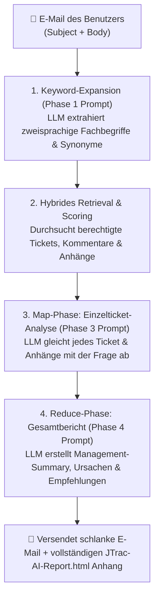

# JTrac AI E-Mail-Abfragen & Prompt-Leitfaden für die Praxis

[English](PROMPT_EXAMPLES_en.md) | [繁體中文](PROMPT_EXAMPLES_zh-TW.md) | [简体中文](PROMPT_EXAMPLES_zh-CN.md) | [日本語](PROMPT_EXAMPLES_ja.md) | [Tiếng Việt](PROMPT_EXAMPLES_vi.md) | [Deutsch](PROMPT_EXAMPLES_de.md) | [Español](PROMPT_EXAMPLES_es.md) | [Français](PROMPT_EXAMPLES_fr.md)

---

## Inhaltsverzeichnis
1. [Funktionsweise von JTrac AI E-Mail-Abfragen und Prompts](#1-funktionsweise-von-jtrac-ai-e-mail-abfragen-und-prompts)
2. [Vier praxisnahe Beispiele für E-Mail-Anfragen](#2-vier-praxisnahe-beispiele-für-e-mail-anfragen)
   - [Beispiel 1: Technische Fehleranalyse und Ursachendiagnose](#beispiel-1-technische-fehleranalyse-und-ursachendiagnose)
   - [Beispiel 2: Statusverfolgung bestimmter Tickets und Anhangsanalyse](#beispiel-2-statusverfolgung-bestimmter-tickets-und-anhangsanalyse)
   - [Beispiel 3: Projektübergreifende Architekturrichtlinien und Best Practices](#beispiel-3-projektübergreifende-architekturrichtlinien-und-best-practices)
   - [Beispiel 4: Upgrade-Bewertung und Kompatibilitätsanalyse](#beispiel-4-upgrade-bewertung-und-kompatibilitätsanalyse)
3. [Goldene Regeln für JTrac AI Prompts (Golden Rules)](#3-goldene-regeln-für-jtrac-ai-prompts-golden-rules)
4. [Anleitung zum Offline-HTML-Bericht](#4-anleitung-zum-offline-html-bericht)

---

## 1. Funktionsweise von JTrac AI E-Mail-Abfragen und Prompts

Wenn Sie eine E-Mail an das JTrac-Systempostfach senden (z. B. `jtrac@yourcompany.com`), erfasst das System automatisch sowohl den **Betreff (Subject)** als auch den **Inhalt (Body)** und packt diese sicher in Prompt-Tags:

```xml
<untrusted_user_query>
Subject: Ihr E-Mail-Betreff
Body: Ihr E-Mail-Text
</untrusted_user_query>
```

### Dreistufiger Verarbeitungsablauf (Mermaid)



- **Betreff (Subject)**: Fungiert als **zentraler Suchanker**, der die Richtung für die Stichwortextraktion und die Gewichtung bestimmt.
- **Inhalt (Body)**: Fungiert als **Kontext- und Instruktions-Prompt**, der das LLM anweist, worauf bei der Analyse von Verlauf und Anhängen besonders geachtet werden soll.

---

## 2. Vier praxisnahe Beispiele für E-Mail-Anfragen

### Beispiel 1: Technische Fehleranalyse und Ursachendiagnose

#### Anwendungsfall
In der Produktionsdatenbank treten Verbindungsabbrüche auf. Das Team muss dringend prüfen, ob ähnliche Vorfälle in der Vergangenheit aufgetreten sind und wie sie behoben wurden.

#### Empfohlener Betreff
```text
[PostgreSQL] Analyse von Connection Pool Timeouts und Deadlocks
```

#### Empfohlener Inhalt
```text
Hallo JTrac Copilot,

in unserer Produktionsumgebung kommt es in Spitzenzeiten zu HikariCP-Verbindungsengpässen (Fehler: Connection is not available, request timed out after 30000ms).

Bitte durchsuche die berechtigten Bereiche nach:
1. Früheren Tickets zu Datenbank-Verbindungslecks (Connection Leak) oder Deadlocks.
2. In Protokolldateien oder Kommentaren dokumentierten langsamen SQL-Abfragen (Slow Queries).
3. Damals vorgenommenen Parameteranpassungen (z. B. max_connections, leakDetectionThreshold) oder Codekorrekturen.
4. Einer zusammenfassenden Handlungsempfehlung zur Behebung.

Vielen Dank!
```

---

### Beispiel 2: Statusverfolgung bestimmter Tickets und Anhangsanalyse

#### Anwendungsfall
Eine Ticketnummer (z. B. DEV-402) ist bekannt, aber der Verlauf ist lang und enthält XML-Spezifikationen. Es wird eine schnelle Übersicht über Status und Konfigurationskonsistenz benötigt.

#### Empfohlener Betreff
```text
[DEV-402] Status Single Sign-On (SSO) SAML 2.0 Integrationstest und Konfigurationsanhänge
```

#### Empfohlener Inhalt
```text
Hallo JTrac Copilot,

bitte gib mir ein Update zu Ticket [DEV-402]:
1. Welcher Status und Bearbeiter liegt aktuell vor? Gibt es Blockaden bei Sicherheitsfreigaben oder Firewall-Regeln?
2. Was waren die Kernpunkte der jüngsten Diskussionsbeiträge?
3. Enthalten die beigefügten Dateien metadata.xml und Zertifikate Hinweise auf inkompatible Endpunkte?

Bitte in Stichpunkten zusammenfassen. Danke!
```

---

### Beispiel 3: Projektübergreifende Architekturrichtlinien und Best Practices

#### Anwendungsfall
Ein neues Projekt plant den Einsatz von Message Queues und möchte auf Erfahrungen und Best Practices anderer Teams zurückgreifen.

#### Empfohlener Betreff
```text
[Architektur] Richtlinien für Kafka Event Bus Retry-Mechanismen und Dead Letter Queue (DLQ)
```

#### Empfohlener Inhalt
```text
Guten Tag JTrac Assistenz,

unser Team plant die Einführung von Apache Kafka als Event Bus. Wir möchten auf frühere Erfahrungen im Unternehmen zurückgreifen:
1. Suche nach Architekturvorgaben oder Tickets bezüglich Consumer-Retries und Dead Letter Queue (DLQ).
2. Gab es Vorfälle bezüglich Consumer Lag oder doppelter Nachrichtenverarbeitung? Wie sahen die Lösungen aus?
3. Welche Empfehlungen gibt es für Retry-Limits, Backoff-Strategien und Metriken?

Bitte erstelle eine strukturierte Empfehlungsliste.
```

---

### Beispiel 4: Upgrade-Bewertung und Kompatibilitätsanalyse

#### Anwendungsfall
Upgrade der Laufzeitumgebung (Java 11 / Tomcat 9) steht an. Es soll geprüft werden, welche Kompatibilitätsprobleme früher aufgetreten sind.

#### Empfohlener Betreff
```text
[Tomcat/Java11] Kompatibilitätsanpassungen und bekannte Probleme beim Upgrade auf Tomcat 9 & JDK 11
```

#### Empfohlener Inhalt
```text
Hallo JTrac Assistenz,

wir planen ein Upgrade der Server von Java 8 / Tomcat 8.5 auf Java 11 und Tomcat 9:
1. Gibt es Aufzeichnungen über Bibliotheksupdates zur Behebung von Warnungen bezüglich 'Illegal reflective access' unter Java 11 (z. B. dom4j)?
2. Wurden Startprobleme, Spring-Konflikte oder Wicket-Inkompatibilitäten dokumentiert?
3. Bitte erstelle eine Vorab-Checkliste und weise auf bekannte Risiken hin.

Besten Dank!
```

---

## 3. Goldene Regeln für JTrac AI Prompts (Golden Rules)

| Prinzip | Beschreibung | Gutes Beispiel | Zu vermeiden |
| :--- | :--- | :--- | :--- |
| **1. Konkrete Fachbegriffe im Betreff** | Betreff sollte stets Modul, Technologie, Fehlercode oder Ticketnummer nennen | `[Redis] Cache-Penetration & Timeout-Analyse` | `System kaputt Hilfe` |
| **2. Gewünschten Fokus vorgeben** | Im Text genau angeben, ob Kommentare, Anhänge oder Parameter analysiert werden sollen | `Bitte Logdateien in Anhängen abgleichen` | `Irgendwas Passendes suchen` |
| **3. Englische Fachbegriffe einstreuen** | Führt zum zweisprachigen Bonus (+5 Punkte) und höherer Treffergenauigkeit | `Verbindungs-Timeout (Connection Pool Timeout)` | Nur vage Umgangssprache |
| **4. Ausgabeformat steuern** | Gewünschtes Format im Text anfordern (z. B. Checkliste, Vergleichstabelle) | `Lösung als tabellarische Checkliste darstellen` | Keine Formatangabe |

---

## 4. Anleitung zum Offline-HTML-Bericht

Wenn Sie eine Antwort von JTrac AI erhalten:
1. **E-Mail-Text**: Bleibt auf das Wesentliche beschränkt (Ticketliste mit Links), um Darstellungsprobleme in Mail-Clients zu vermeiden.
2. **Beigefügter Bericht (`JTrac-AI-Report-[yyyyMMdd-HHmm].html`)**:
   - Direkt im Browser öffnen (funktioniert vollständig offline).
   - Klare Tabellenrahmen und Zebra-Streifenmuster.
   - Jedes Ticket als aufklappbare `<details>`-Karte mit KI-Zusammenfassung, Beschreibung, Historie und Anhängen.
   - Unterstützt automatischen Dark Mode und Druckoptimierung.
