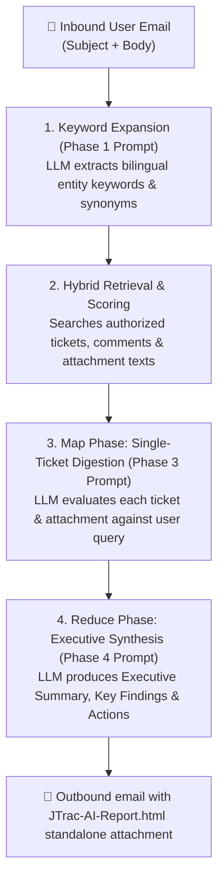

# JTrac AI Email Query & Prompt Writing Practical Guide

[English](PROMPT_EXAMPLES_en.md) | [繁體中文](PROMPT_EXAMPLES_zh-TW.md) | [简体中文](PROMPT_EXAMPLES_zh-CN.md) | [日本語](PROMPT_EXAMPLES_ja.md) | [Tiếng Việt](PROMPT_EXAMPLES_vi.md) | [Deutsch](PROMPT_EXAMPLES_de.md) | [Español](PROMPT_EXAMPLES_es.md) | [Français](PROMPT_EXAMPLES_fr.md)

---

## Table of Contents
1. [How JTrac AI Email Inquiries and Prompts Work](#1-how-jtrac-ai-email-inquiries-and-prompts-work)
2. [Four Practical Email Query Examples](#2-four-practical-email-query-examples)
   - [Example 1: Technical Troubleshooting & Root Cause Analysis](#example-1-technical-troubleshooting--root-cause-analysis)
   - [Example 2: Specific Ticket Progress & Attachment Verification](#example-2-specific-ticket-progress--attachment-verification)
   - [Example 3: Cross-Project Architecture & Best Practice Query](#example-3-cross-project-architecture--best-practice-query)
   - [Example 4: System Upgrade & Compatibility Impact Assessment](#example-4-system-upgrade--compatibility-impact-assessment)
3. [Golden Rules for JTrac AI Prompts](#3-golden-rules-for-jtrac-ai-prompts)
4. [Viewing the Offline Standalone HTML Report](#4-viewing-the-offline-standalone-html-report)

---

## 1. How JTrac AI Email Inquiries and Prompts Work

When you send an email to the JTrac system mailbox (e.g., `jtrac@yourcompany.com`), the system automatically extracts both your **email Subject** and **email Body**, securely packaging them into prompt tags:

```xml
<untrusted_user_query>
Subject: Your Email Subject
Body: Your Email Body
</untrusted_user_query>
```

### Three-Phase Processing Workflow (Mermaid)



- **Subject**: Acts as the **core retrieval anchor**, dictating the initial direction for keyword expansion and search weighting.
- **Body**: Acts as the **context and instruction prompt**, directing the LLM to focus on specific aspects (e.g., specific error codes, past assignees, or configuration parameters in attachments).

---

## 2. Four Practical Email Query Examples

### Example 1: Technical Troubleshooting & Root Cause Analysis

#### Scenario
A production database or service timeout occurred. The engineering team urgently needs to know if similar incidents happened in the past, how they were resolved, and what logs or SQL queries were recorded.

#### Recommended Subject
```text
[PostgreSQL] Connection Pool Timeout and Deadlock Troubleshooting
```

#### Recommended Body
```text
Hello JTrac Copilot,

Our production environment has encountered frequent HikariCP connection pool exhaustion during peak hours (Error: Connection is not available, request timed out after 30000ms).

Please search authorized spaces for:
1. Past tickets related to database connection pool leaks or deadlocks.
2. Specific slow SQL queries or stack traces recorded in attachment logs or comment histories.
3. How those issues were resolved (e.g., tuning max_connections, leakDetectionThreshold, or fixing connection leaks in code).
4. A summarized action plan and recommended configuration checklist.

Thank you!
```

#### Prompt Breakdown & Expected Result
- **Entity Anchors**: Keywords like `PostgreSQL`, `HikariCP`, `Deadlock`, and `Connection Pool` trigger cross-lingual bonus scoring (+5 points).
- **Targeted Instruction**: Instructs the LLM to analyze attachment logs and discussion comments rather than just ticket titles.
- **Output**: The attached `JTrac-AI-Report.html` will contain detailed extracts of matching tickets, past resolutions, and actionable tuning steps.

---

### Example 2: Specific Ticket Progress & Attachment Verification

#### Scenario
You already know a ticket ID, but the ticket has dozens of comments, multiple specifications, or configuration files attached. You want a quick summary of current status, blockers, and configuration validity.

#### Recommended Subject
```text
[DEV-402] Single Sign-On (SSO) SAML 2.0 Integration Test Status & Config Attachments
```

#### Recommended Body
```text
Hi JTrac Copilot,

Could you provide an update on ticket [DEV-402]?
1. What is the current status and assignee? Is it currently blocked on security audit or network firewall approval?
2. What are the key takeaways from the recent discussion history?
3. In the attached SAML metadata.xml and certificate files, are there any known incompatibilities or misconfigured endpoints?

Please summarize in bullet points. Thanks!
```

#### Prompt Breakdown & Expected Result
- **Exact ID Match**: Mentioning `[DEV-402]` guarantees top priority retrieval.
- **Attachment Deep Analysis**: Specifically directs the LLM to evaluate `metadata.xml`, extracting key settings in the Map phase.

---

### Example 3: Cross-Project Architecture & Best Practice Query

#### Scenario
A new service is planning to adopt message queues, and the team wants to investigate architectural best practices and previous lessons learned across other project spaces.

#### Recommended Subject
```text
[Architecture] Cross-service Kafka Event Bus Retry and Dead Letter Queue (DLQ) Guidelines
```

#### Recommended Body
```text
Hello JTrac AI Secretary,

Our module is designing an event bus integration with Apache Kafka. We want to leverage past experiences across authorized projects:
1. Search across spaces for past architectural guidelines or tickets regarding Kafka Consumer retries and Dead Letter Queue (DLQ) handling.
2. Have there been any major incidents regarding consumer lag or message duplication? What were the root causes and remedies?
3. What are the recommended retry counts, backoff policies, and monitoring metrics?

Please compile an architectural recommendation list.
```

#### Prompt Breakdown & Expected Result
- **Cross-Space Synthesis**: Capitalizes on the Reduce phase to aggregate lessons learned from multiple teams.
- **Best Practice Distillation**: Compiles actionable guidelines and anti-patterns directly from ticket histories.

---

### Example 4: System Upgrade & Compatibility Impact Assessment

#### Scenario
Planning to upgrade the runtime stack (e.g., Java 11 / Tomcat 9), and needing to anticipate breaking changes, illegal reflective access warnings, or third-party dependency conflicts.

#### Recommended Subject
```text
[Tomcat/Java11] Tomcat 9 & JDK 11 Upgrade Compatibility Fixes and Known Issues
```

#### Recommended Body
```text
Hi JTrac Copilot,

We are planning an upgrade from Java 8 / Tomcat 8.5 to Java 11 and Tomcat 9:
1. Are there historical records of package upgrades addressing Java 11 illegal reflective access (such as dom4j or XML parsers)?
2. Were there any recorded startup failures, Spring context issues, or Wicket component incompatibilities?
3. Please provide a pre-upgrade checklist and risk mitigation recommendations.

Appreciate the help!
```

#### Prompt Breakdown & Expected Result
- **Historical Analysis**: Finds relevant tickets mentioning `Tomcat`, `Java 11`, `reflective access`, and `dom4j`.
- **Structured Deliverable**: Asking for a checklist produces an easy-to-read Markdown checklist table in the final recommendations.

---

## 3. Golden Rules for JTrac AI Prompts

| Principle | Description | Good Example | Anti-Pattern |
| :--- | :--- | :--- | :--- |
| **1. Concrete Entity Anchors** | Include specific system modules, technologies, error codes, or ticket IDs in the subject. | `[Redis] Cache Penetration & Timeout Tuning` | `System broken please help` |
| **2. Explicit Focus Dimensions** | Specify whether you need insights from discussion history, attachment logs, or parameters. | `Please cross-reference error logs in attachments` | `Search whatever is related` |
| **3. Bilingual Terminology** | Using standard English technical terms alongside local language triggers hybrid match bonuses (+5 pts). | `連線池逾時 (Connection Pool Timeout)` | Ambiguous colloquial words |
| **4. Desired Output Structure** | Tell the LLM your preferred structure (e.g., checklist, comparison table, priority order). | `Provide solutions as a pre-flight Checklist` | No format guidance |

---

## 4. Viewing the Offline Standalone HTML Report

When you receive the reply email from JTrac AI:
1. **Email Body**: Kept minimal and clean with matching ticket summaries and direct hyperlinks, completely preventing layout breakage across email clients.
2. **Attached Standalone Report (`JTrac-AI-Report-[yyyyMMdd-HHmm].html`)**:
   - Open in any modern web browser (works 100% offline without network access).
   - Features crisp, bordered tables with zebra striping.
   - Each ticket is wrapped in a native `<details>` card containing AI digests, descriptions, history comments, and attachment lists.
   - Automatically adapts to system dark/light mode and fully expands when printed.
