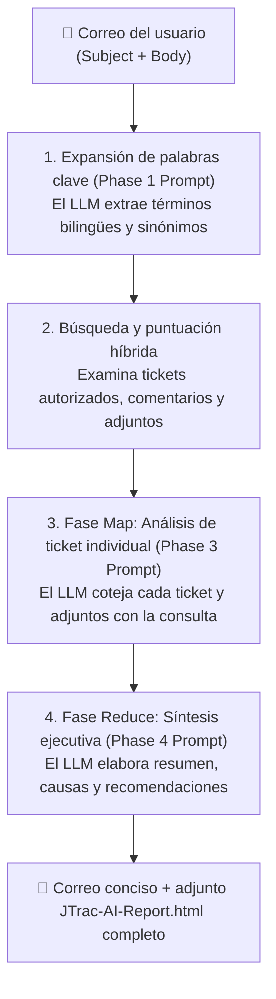

# Guía práctica de consultas por correo y redacción de Prompts para JTrac AI

[English](PROMPT_EXAMPLES_en.md) | [繁體中文](PROMPT_EXAMPLES_zh-TW.md) | [简体中文](PROMPT_EXAMPLES_zh-CN.md) | [日本語](PROMPT_EXAMPLES_ja.md) | [Tiếng Việt](PROMPT_EXAMPLES_vi.md) | [Deutsch](PROMPT_EXAMPLES_de.md) | [Español](PROMPT_EXAMPLES_es.md) | [Français](PROMPT_EXAMPLES_fr.md)

---

## Índice
1. [Mecanismo de funcionamiento de consultas por correo y Prompts en JTrac AI](#1-mecanismo-de-funcionamiento-de-consultas-por-correo-y-prompts-en-jtrac-ai)
2. [Cuatro ejemplos prácticos de redacción de correos](#2-cuatro-ejemplos-prácticos-de-redacción-de-correos)
   - [Ejemplo 1: Resolución de fallos técnicos y diagnóstico de causa raíz](#ejemplo-1-resolución-de-fallos-técnicos-y-diagnóstico-de-causa-raíz)
   - [Ejemplo 2: Seguimiento de tickets específicos y verificación de adjuntos](#ejemplo-2-seguimiento-de-tickets-específicos-y-verificación-de-adjuntos)
   - [Ejemplo 3: Directrices de arquitectura entre proyectos y mejores prácticas](#ejemplo-3-directrices-de-arquitectura-entre-proyectos-y-mejores-prácticas)
   - [Ejemplo 4: Evaluación de actualización del sistema y análisis de compatibilidad](#ejemplo-4-evaluación-de-actualización-del-sistema-y-análisis-de-compatibilidad)
3. [Reglas de oro para redactar Prompts en JTrac AI (Golden Rules)](#3-reglas-de-oro-para-redactar-prompts-en-jtrac-ai-golden-rules)
4. [Guía para visualizar el informe HTML sin conexión](#4-guía-para-visualizar-el-informe-html-sin-conexión)

---

## 1. Mecanismo de funcionamiento de consultas por correo y Prompts en JTrac AI

Cuando envía un correo electrónico al buzón del sistema JTrac (por ejemplo, `jtrac@yourcompany.com`), el sistema extrae automáticamente tanto el **Asunto (Subject)** como el **Cuerpo (Body)**, empaquetándolos en etiquetas seguras de Prompt:

```xml
<untrusted_user_query>
Subject: Asunto de su correo
Body: Contenido de su correo
</untrusted_user_query>
```

### Flujo de procesamiento en tres fases (Mermaid)



- **Asunto (Subject)**: Actúa como el **ancla principal de búsqueda**, guiando la dirección inicial de palabras clave y ponderación.
- **Cuerpo (Body)**: Actúa como el **contexto e instrucción Prompt**, indicando al LLM en qué detalles centrarse (parámetros, errores en adjuntos o resoluciones previas).

---

## 2. Cuatro ejemplos prácticos de redacción de correos

### Ejemplo 1: Resolución de fallos técnicos y diagnóstico de causa raíz

#### Escenario
Se producen problemas de agotamiento de conexiones en la base de datos de producción. El equipo necesita verificar incidentes similares anteriores y las soluciones aplicadas.

#### Asunto recomendado
```text
[PostgreSQL] Solución de problemas de Connection Pool Timeout y Deadlocks
```

#### Contenido recomendado
```text
Hola JTrac Copilot,

En producción estamos experimentando errores frecuentes de agotamiento del pool HikariCP en horas pico (Error: Connection is not available, request timed out after 30000ms).

Por favor, busca en los espacios autorizados:
1. Tickets anteriores relacionados con fugas de conexión (Connection Leak) o bloqueos mutuos (Deadlock).
2. Consultas SQL lentas o trazas de error documentadas en los adjuntos o discusiones.
3. Qué parámetros se ajustaron (como max_connections, leakDetectionThreshold) o qué correcciones de código se aplicaron.
4. Un resumen de acciones recomendadas para la configuración.

¡Muchas gracias!
```

---

### Ejemplo 2: Seguimiento de tickets específicos y verificación de adjuntos

#### Escenario
Se conoce el número de ticket (por ejemplo, DEV-402), pero contiene decenas de comentarios y archivos XML adjuntos. Se requiere un resumen rápido de su estado y validez técnica.

#### Asunto recomendado
```text
[DEV-402] Estado de pruebas de integración de Single Sign-On (SSO) SAML 2.0 y archivos adjuntos
```

#### Contenido recomendado
```text
Hola JTrac Copilot,

¿Podrías facilitarme el estado actual del ticket [DEV-402]?
1. ¿Cuál es su estado y responsable actual? ¿Está bloqueado en auditoría de seguridad o conectividad de red?
2. ¿Cuáles son las conclusiones principales de los comentarios recientes?
3. En los archivos adjuntos metadata.xml y certificados, ¿se menciona alguna incompatibilidad de endpoints?

Por favor, resúmelo en puntos clave. ¡Gracias!
```

---

### Ejemplo 3: Directrices de arquitectura entre proyectos y mejores prácticas

#### Escenario
Un nuevo servicio adoptará colas de mensajes y desea consultar las directrices y lecciones aprendidas de otros proyectos de la empresa.

#### Asunto recomendado
```text
[Arquitectura] Directrices de diseño para reintentos y Dead Letter Queue (DLQ) en Kafka Event Bus
```

#### Contenido recomendado
```text
Estimado asistente de JTrac,

Estamos planificando integrar Apache Kafka como bus de eventos. Queremos consultar la experiencia previa en otros proyectos:
1. Busca directrices o tickets anteriores sobre reintentos de consumidores de Kafka y gestión de Dead Letter Queue (DLQ).
2. ¿Hubo incidentes graves de retraso de consumo (Consumer Lag) o duplicación de mensajes? ¿Cómo se solucionaron?
3. ¿Cuáles son los límites de reintento, políticas de retroceso (Backoff) y métricas recomendadas?

Por favor, recopila una lista estructurada de recomendaciones.
```

---

### Ejemplo 4: Evaluación de actualización del sistema y análisis de compatibilidad

#### Escenario
Actualización del entorno de ejecución (Java 11 / Tomcat 9). Se requiere anticipar problemas de compatibilidad y dependencias modificadas.

#### Asunto recomendado
```text
[Tomcat/Java11] Registro de compatibilidad y problemas conocidos al actualizar a Tomcat 9 y JDK 11
```

#### Contenido recomendado
```text
Hola asistente de JTrac,

Tenemos planeado actualizar los servidores de Java 8 / Tomcat 8.5 a Java 11 y Tomcat 9:
1. ¿Existen registros de actualización de bibliotecas para solucionar advertencias de acceso reflectivo ilegal en Java 11 (como dom4j o xml)?
2. ¿Se documentaron fallos de arranque, conflictos de Spring o incompatibilidades en componentes de Wicket?
3. Por favor, genera una lista de verificación (Checklist) previa a la actualización y los riesgos a evitar.

¡Gracias por la ayuda!
```

---

## 3. Reglas de oro para redactar Prompts en JTrac AI (Golden Rules)

| Principio | Explicación | Buen ejemplo | A evitar |
| :--- | :--- | :--- | :--- |
| **1. Entidades concretas en el asunto** | Incluya siempre el módulo, tecnología, código de error o identificador de ticket | `[Redis] Análisis de caída de caché y timeouts` | `El sistema falló ayuda` |
| **2. Enfoque explícito en el contenido** | Aclare si necesita revisar comentarios, archivos adjuntos de log o parámetros | `Cotejar mensajes de error en los logs adjuntos` | `Buscar cualquier cosa relacionada` |
| **3. Términos técnicos bilingües** | Combinar términos en inglés activa la bonificación por coincidencia híbrida (+5 pts) | `Agotamiento de pool (Connection Pool Timeout)` | Exclusivamente lenguaje coloquial vago |
| **4. Estructura de salida deseada** | Indique el formato deseado (por ejemplo, lista de verificación, tabla comparativa) | `Presentar la solución como un Checklist tabular` | Sin formato (3 secciones estándar) |

---

## 4. Guía para visualizar el informe HTML sin conexión

Al recibir la respuesta de JTrac AI:
1. **Cuerpo del correo**: Se mantiene limpio y conciso con enlaces directos a los tickets, evitando deformaciones visuales en los clientes de correo.
2. **Archivo adjunto (`JTrac-AI-Report-[yyyyMMdd-HHmm].html`)**:
   - Ábralo directamente en cualquier navegador moderno (funciona 100% sin conexión).
   - Tablas con bordes claros y filas alternas con patrón cebra.
   - Cada ticket se presenta como una tarjeta desplegable `<details>` con resumen de IA, descripción, historial y adjuntos.
   - Compatible con modo oscuro automático y optimizado para impresión.
