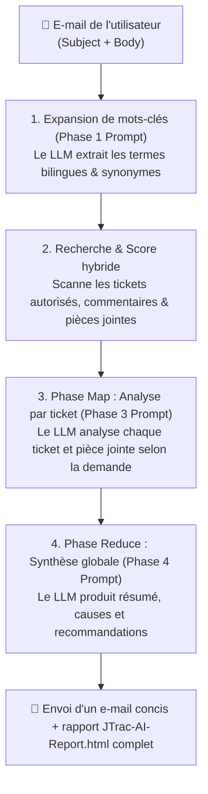

# Guide pratique des requêtes par e-mail et rédaction de Prompts pour JTrac AI

[English](PROMPT_EXAMPLES_en.md) | [繁體中文](PROMPT_EXAMPLES_zh-TW.md) | [简体中文](PROMPT_EXAMPLES_zh-CN.md) | [日本語](PROMPT_EXAMPLES_ja.md) | [Tiếng Việt](PROMPT_EXAMPLES_vi.md) | [Deutsch](PROMPT_EXAMPLES_de.md) | [Español](PROMPT_EXAMPLES_es.md) | [Français](PROMPT_EXAMPLES_fr.md)

---

## Sommaire
1. [Fonctionnement des requêtes par e-mail et des Prompts dans JTrac AI](#1-fonctionnement-des-requêtes-par-e-mail-et-des-prompts-dans-jtrac-ai)
2. [Quatre exemples pratiques de rédaction d'e-mails](#2-quatre-exemples-pratiques-de-rédaction-de-mails)
   - [Exemple 1 : Dépannage technique et diagnostic de cause racine](#exemple-1--dépannage-technique-et-diagnostic-de-cause-racine)
   - [Exemple 2 : Suivi d'un ticket spécifique et validation des pièces jointes](#exemple-2--suivi-dun-ticket-spécifique-et-validation-des-pièces-jointes)
   - [Exemple 3 : Directives d'architecture inter-projets et retours d'expérience](#exemple-3--directives-darchitecture-inter-projets-et-retours-dexpérience)
   - [Exemple 4 : Évaluation de mise à niveau et analyse d'impact de compatibilité](#exemple-4--évaluation-de-mise-à-niveau-et-analyse-dimpact-de-compatibilité)
3. [Règles d'or pour la rédaction de Prompts JTrac AI (Golden Rules)](#3-règles-dor-pour-la-rédaction-de-prompts-jtrac-ai-golden-rules)
4. [Guide de consultation du rapport HTML hors ligne](#4-guide-de-consultation-du-rapport-html-hors-ligne)
5. [Matériel recommandé et configuration du modèle Ollama](#5-matériel-recommandé-et-configuration-du-modèle-ollama)

---

## 1. Fonctionnement des requêtes par e-mail et des Prompts dans JTrac AI

Lorsque vous envoyez un e-mail à l'adresse du système JTrac (par ex. `jtrac@yourcompany.com`), le système extrait automatiquement l'**Objet (Subject)** et le **Corps (Body)** du message pour les encapsuler dans des balises de Prompt sécurisées :

```xml
<untrusted_user_query>
Subject: L'objet de votre e-mail
Body: Le contenu de votre e-mail
</untrusted_user_query>
```

### Flux de traitement en 3 phases (Mermaid)



- **Objet (Subject)** : Agit comme l'**ancre principale de recherche**, orientant la pondération et l'expansion lexicale.
- **Corps (Body)** : Agit comme le **contexte et l'instruction Prompt**, guidant le LLM sur les éléments prioritaires (paramètres, erreurs dans les logs ou correctifs).

---

## 2. Quatre exemples pratiques de rédaction d'e-mails

### Exemple 1 : Dépannage technique et diagnostic de cause racine

#### Contexte
La base de données de production subit des blocages de connexions. L'équipe a besoin d'identifier les incidents similaires passés, leurs causes et les paramètres modifiés.

#### Objet recommandé
```text
[PostgreSQL] Diagnostic des dépassements de délai du pool de connexions et des Deadlocks
```

#### Corps recommandé
```text
Bonjour JTrac Copilot,

Notre environnement de production rencontre des saturations fréquentes du pool de connexions HikariCP aux heures de pointe (Erreur : Connection is not available, request timed out after 30000ms).

Merci de rechercher dans les espaces autorisés :
1. Les tickets passés relatifs aux fuites de connexions (Connection Leak) ou interblocages (Deadlock).
2. Les requêtes SQL lentes ou traces documentées dans les logs en pièces jointes ou discussions.
3. Les ajustements de configuration appliqués (ex. max_connections, leakDetectionThreshold) ou correctifs apportés au code.
4. Une synthèse des étapes d'optimisation recommandées.

Merci d'avance !
```

---

### Exemple 2 : Suivi d'un ticket spécifique et validation des pièces jointes

#### Contexte
Le numéro du ticket (ex. DEV-402) est connu, mais les échanges sont nombreux et accompagnés de spécifications XML. Vous souhaitez un récapitulatif clair de la situation et des configurations.

#### Objet recommandé
```text
[DEV-402] Avancement des tests d'intégration Single Sign-On (SSO) SAML 2.0 et pièces jointes
```

#### Corps recommandé
```text
Bonjour JTrac Copilot,

Pourriez-vous me faire un point sur le ticket [DEV-402] ?
1. Quel est le statut actuel et l'assignataire ? Y a-t-il un blocage au niveau de la sécurité ou du réseau ?
2. Quels sont les points clés ressortant des récents échanges ?
3. Les fichiers joints metadata.xml et certificats signalent-ils des incompatibilités d'endpoints ?

Merci de résumer cela sous forme de liste à puces.
```

---

### Exemple 3 : Directives d'architecture inter-projets et retours d'expérience

#### Contexte
Un nouveau service intègre des files de messages et souhaite s'appuyer sur les bonnes pratiques et enseignements des autres équipes.

#### Objet recommandé
```text
[Architecture] Recommandations de conception pour les retries et Dead Letter Queue (DLQ) sur Kafka Event Bus
```

#### Corps recommandé
```text
Chère assistance JTrac,

Notre équipe conçoit une intégration d'Apache Kafka en tant que bus d'événements. Nous souhaitons consulter les retours d'expérience internes :
1. Recherche les spécifications d'architecture et tickets relatifs aux retries de consommateurs Kafka et gestion de DLQ.
2. Y a-t-il eu des incidents majeurs d'accumulation de messages (Consumer Lag) ou de duplication ? Quelles ont été les solutions ?
3. Quels sont les seuils de retry, politiques de temporisation (Backoff Policy) et métriques de supervision recommandés ?

Merci d'établir une liste de recommandations d'architecture.
```

---

### Exemple 4 : Évaluation de mise à niveau et analyse d'impact de compatibilité

#### Contexte
Mise à niveau de l'environnement d'exécution (Java 11 / Tomcat 9). Vous souhaitez anticiper les régressions et bibliothèques nécessitant une mise à jour.

#### Objet recommandé
```text
[Tomcat/Java11] Retours de compatibilité et problèmes connus lors de la migration vers Tomcat 9 et JDK 11
```

#### Corps recommandé
```text
Bonjour l'assistance JTrac,

Nous prévoyons de faire évoluer nos serveurs de Java 8 / Tomcat 8.5 vers Java 11 et Tomcat 9 :
1. Existe-t-il des traces de mises à jour de bibliothèques pour corriger les alertes d'accès réflexif illégal sous Java 11 (ex. dom4j ou xml) ?
2. Des échecs de démarrage, conflits de configuration Spring ou incompatibilités Wicket ont-ils été documentés ?
3. Merci de préparer une Checklist préalable à la migration ainsi que les risques identifiés.

Merci pour votre aide !
```

---

## 3. Règles d'or pour la rédaction de Prompts JTrac AI (Golden Rules)

| Principe | Explication | Bon exemple | À éviter |
| :--- | :--- | :--- | :--- |
| **1. Ancrer avec des entités précises** | Mentionnez toujours le module, la technologie, le code d'erreur ou le numéro de ticket | `[Redis] Dépannage de rupture de cache et timeouts` | `Le système est cassé à l'aide` |
| **2. Préciser les axes d'analyse** | Indiquez clairement si vous ciblez les discussions, les logs en pièces jointes ou les paramètres | `Merci de croiser les messages d'erreur des logs attachés` | `Cherche un peu tout ce qui est lié` |
| **3. Utiliser les termes techniques en anglais** | L'anglais technique déclenche le bonus de correspondance hybride (+5 pts) | `Surcharge de pool (Connection Pool Timeout)` | Langage informel vague |
| **4. Définir le format attendu** | Demandez la structure souhaitée (ex. Checklist, tableau comparatif, ordre de priorité) | `Fournir la solution sous forme de Checklist` | Aucune consigne de structure |

---

## 4. Guide de consultation du rapport HTML hors ligne

À la réception de la réponse de JTrac AI :
1. **Corps de l'e-mail** : Reste sobre et épuré avec la liste des tickets et liens directs, éliminant tout risque de mise en page tronquée.
2. **Fichier joint (`JTrac-AI-Report-[yyyyMMdd-HHmm].html`)** :
   - Ouvrez-le dans n'importe quel navigateur (accessible 100 % hors ligne).
   - Tableaux aux bordures nettes et lignes zébrées pour un confort de lecture optimal.
   - Cartes repliables `<details>` pour chaque ticket, incluant le résumé IA, la description, l'historique et les pièces jointes.
   - Compatible avec le mode sombre automatique et optimisé pour l'impression.

---

## 5. Matériel recommandé et configuration du modèle Ollama

L'assistant de requête par e-mail IA de JTrac utilise un pipeline Map-Reduce pour digérer de multiples tickets et extraire des pièces jointes volumineuses (jusqu'à 100 000 caractères par fichier), ce qui exige des capacités d'inférence, une fenêtre de contexte et une puissance GPU de haut niveau :

### 1. Recommandations Matérielles (Hardware Recommendation)
- **GPU Recommandé Phare** : **NVIDIA GeForce RTX 5090 (32GB GDDR7 VRAM)**
- **Alternatives d'Entreprise** : NVIDIA A100 (40GB/80GB), H100, L40S (48GB) ou double RTX 4090 (24GB x 2).
- **Efficacité de Calcul** : Les 32 Go de VRAM et l'architecture Blackwell de la RTX 5090 permettent de charger le modèle intégralement en mémoire vidéo sans CPU Offload, tout en maintenant une fenêtre de contexte de 128K à 200K tokens avec un débit de plus de 30 tokens/seconde face à des dizaines de tickets et logs massifs.

### 2. Sélection du Modèle (Model Selection)
- **Modèle de Référence** : **`qwen2.5:32b`** (ou série phare Qwen 3).
- **Atouts Majeurs** : Qwen 2.5 32B excelle dans la compréhension multilingue, l'extraction fidèle de faits sur des contextes étendus, le respect rigoureux des contraintes JSON/Markdown et la génération sans erreur de syntaxe de diagrammes Mermaid.

### 3. Configuration d'un contexte étendu dans Ollama (Modelfile 200K)
Par défaut, le contexte d'Ollama est limité à 2 048 (2K) tokens, ce qui entraîne une perte immédiate d'informations. Il est vivement conseillé de définir un Modelfile dédié avec une fenêtre de 200 000 (200K) tokens :

```dockerfile
# Modelfile personnalisé pour JTrac
FROM qwen2.5:32b

# Configurer la fenêtre de contexte à 200K tokens
PARAMETER num_ctx 200000

# Température basse pour une factualité stricte
PARAMETER temperature 0.2
```

Créer et enregistrer le modèle :
```bash
ollama create qwen2.5-jtrac-200k -f Modelfile
```
Dans l'interface d'administration de JTrac, configurez ensuite `llm.ollama.model` sur `qwen2.5-jtrac-200k`.

### 4. ⚠️ Avertissement Crucial sur les Performances (Crucial Warning)
> [!CAUTION]
> **Éviter les modèles sous-dimensionnés ou à contexte court** :
> - Ne jamais utiliser de modèles trop petits (tels que 1B, 3B, 7B/8B) ou disposant d'un contexte insuffisant (`num_ctx` < 64K/128K).
> - Face à un contexte restreint, Ollama **tronquera silencieusement les tickets et les logs d'erreurs**, induisant le modèle en hallucination sur des données partielles et produisant des diagrammes Mermaid syntaxiquement invalides, rendant l'analyse totalement inopérante.
