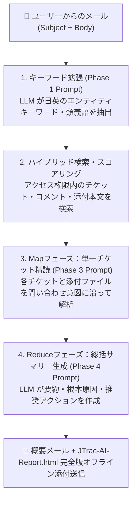

# JTrac AI メール問い合わせ＆プロンプト作成 実践ガイド

[English](PROMPT_EXAMPLES_en.md) | [繁體中文](PROMPT_EXAMPLES_zh-TW.md) | [简体中文](PROMPT_EXAMPLES_zh-CN.md) | [日本語](PROMPT_EXAMPLES_ja.md) | [Tiếng Việt](PROMPT_EXAMPLES_vi.md) | [Deutsch](PROMPT_EXAMPLES_de.md) | [Español](PROMPT_EXAMPLES_es.md) | [Français](PROMPT_EXAMPLES_fr.md)

---

## 目次
1. [JTrac AI メール問い合わせとプロンプトの動作仕組み](#1-jtrac-ai-メール問い合わせとプロンプトの動作仕組み)
2. [実践メール作成サンプル 4選](#2-実践メール作成サンプル-4選)
   - [サンプル1：本番障害調査と根本原因診断](#サンプル1本番障害調査と根本原因診断)
   - [サンプル2：特定チケットの進捗状況と添付ファイル検証](#サンプル2特定チケットの進捗状況と添付ファイル検証)
   - [サンプル3：プロジェクト横断アーキテクチャ規約とベストプラクティス検索](#サンプル3プロジェクト横断アーキテクチャ規約とベストプラクティス検索)
   - [サンプル4：システムバージョンアップ評価と互換性影響分析](#サンプル4システムバージョンアップ評価と互換性影響分析)
3. [JTrac AI プロンプト作成の黄金律 (Golden Rules)](#3-jtrac-ai-プロンプト作成の黄金律-golden-rules)
4. [オフライン対応 HTML レポート閲覧ガイド](#4-オフライン対応-html-レポート閲覧ガイド)
5. [推奨ハードウェアおよび Ollama モデル設定基準](#5-推奨ハードウェアおよび-ollama-モデル設定基準)

---

## 1. JTrac AI メール問い合わせとプロンプトの動作仕組み

JTrac システムメールアドレス（例：`jtrac@yourcompany.com`）宛てにメールを送信すると、システムは**件名 (Subject)** と **本文 (Body)** を安全なプロンプトタグとして自動抽出します：

```xml
<untrusted_user_query>
Subject: メールの件名
Body: メールの本文
</untrusted_user_query>
```

### 3フェーズ処理フロー (Mermaid)



- **件名 (Subject)**：**「検索アンカー」**として機能し、キーワード抽出と重み付け検索の方向性を決定します。
- **本文 (Body)**：**「文脈指示プロンプト」**として機能し、LLM がチケットや添付ファイルを精読する際の着眼点（エラーコード、担当者、設定値など）をガイドします。

---

## 2. 実践メール作成サンプル 4選

### サンプル1：本番障害調査と根本原因診断

#### 利用シナリオ
本番データベースで接続プール枯渇が発生。過去に類似の障害があったか、ログや設定変更はどうだったかを至急調査したい。

#### 推奨件名
```text
[PostgreSQL] コネクションプール枯渇 (Connection Pool Timeout) とデッドロックの調査
```

#### 推奨本文
```text
JTrac AI 秘書へ：

本番環境でピーク時に HikariCP のコネクションプール枯渇エラー（Connection is not available, request timed out after 30000ms）が多発しています。

以下について権限のあるプロジェクトから検索してください：
1. 過去に同様のコネクションリーク（Connection Leak）やデッドロック（Deadlock）に関するチケットはありますか？
2. 添付ログやコメント内に記録された低速 SQL（Slow Query）や原因箇所はありますか？
3. 当時はどのパラメータ（max_connections、leakDetectionThreshold、タイムアウト設定）の変更やコード修正で解決しましたか？
4. 過去の対応方針と、推奨されるチューニング手順をまとめてください。

よろしくお願いします。
```

---

### サンプル2：特定チケットの進捗状況と添付ファイル検証

#### 利用シナリオ
チケット番号（例：DEV-402）は判明しているが、コメントが数十件あり仕様書や XML 添付も多数あるため、現状のブロッカーや設定整合性を素早く把握したい。

#### 推奨件名
```text
[DEV-402] シングルサインオン (SSO) SAML 2.0 連携テスト進捗と設定添付ファイルの確認
```

#### 推奨本文
```text
JTrac Copilot へ：

チケット [DEV-402] の最新状況を教えてください：
1. 現在のステータスと担当者は誰ですか？セキュリティ審査やネットワーク開通で滞留していますか？
2. コメント履歴における各関係者の主な意見や合意事項は何ですか？
3. 添付されている SAML metadata.xml および証明書設定において、EntityID やエンドポイントの非互換性は指摘されていますか？

箇条書きで分かりやすく要約してください。
```

---

### サンプル3：プロジェクト横断アーキテクチャ規約とベストプラクティス検索

#### 利用シナリオ
新規マイクロサービスでメッセージキューを導入するにあたり、社内他チームの先行知見やアンチパターンを横断調査したい。

#### 推奨件名
```text
[アーキテクチャ規約] サービス間イベントバス (Kafka Event Bus) リトライと Dead Letter Queue (DLQ) 設計方針
```

#### 推奨本文
```text
JTrac 問い合わせ秘書へ：

新規サービスで Apache Kafka をイベントバスとして導入検討中です。過去の他プロジェクトの知見を参照したく依頼します：
1. Kafka Consumer のリトライ設計や Dead Letter Queue (DLQ) 処理に関する過去の設計チケットや規約を検索してください。
2. 過去にメッセージ滞留（Consumer Lag）や重複消費などの深刻なトラブルはありましたか？その対策は何でしたか？
3. 各チームが推奨するリトライ回数、バックオフポリシー（Backoff Policy）、監視指標をまとめてください。
```

---

### サンプル4：システムバージョンアップ評価と互換性影響分析

#### 利用シナリオ
実行基盤（Java 11 / Tomcat 9）への移行に伴い、過去の互換性改修記録やリフレクション制限（Illegal reflective access）への対応実績を確認したい。

#### 推奨件名
```text
[Tomcat/Java11] Tomcat 9 および JDK 11 移行に伴う互換性対応記録と既知の課題
```

#### 推奨本文
```text
JTrac 秘書へ：

Java 8 / Tomcat 8.5 から Java 11 / Tomcat 9 へのバージョンアップを計画しています：
1. 過去に Java 11 のリフレクション警告（Illegal reflective access）対応でライブラリ（dom4j や XML 関連）を更新した記録はありますか？
2. 過去の移行テストで、起動失敗、Spring 設定不整合、Wicket コンポーネントの非互換性などは記録されていますか？
3. アップグレード前の事前チェックリスト（Checklist）と推奨回避策を作成してください。
```

---

## 3. JTrac AI プロンプト作成の黄金律 (Golden Rules)

| 原則 | 説明 | 良い例 | 避けるべき例 |
| :--- | :--- | :--- | :--- |
| **1. 具体的な固有名詞をアンカーにする** | 件名には必ずモジュール名、技術名、エラーコード、チケット番号を含める | `[Redis] キャッシュ障害とタイムアウト調査` | `システムが壊れました助けて` |
| **2. 注目すべき観点を明記する** | 本文で「履歴の議論」「添付ログ」「パラメータ値」のどれを精査すべきか指定 | `添付ログのエラーメッセージを照合してください` | `適当に関連するものを探して` |
| **3. 日英技術用語を併記する** | 専門用語の併記によりハイブリッド言語マッチング加点（+5点）が発動 | `コネクションプール枯渇 (Connection Pool Timeout)` | 曖昧な口語表現のみ |
| **4. 期待する出力構造を指定する** | チェックリスト、比較表、優先順位などの希望形式を本文で指示 | `事前チェックリスト（Checklist）形式で提示` | 指示なし（デフォルト3部構成） |

---

## 4. オフライン対応 HTML レポート閲覧ガイド

JTrac AI からの返信メールを受信した場合：
1. **メール本文**：レイアウト崩れを防ぐため、該当チケット一覧とリンクのみをシンプルに表示。
2. **添付ファイル (`JTrac-AI-Report-[yyyyMMdd-HHmm].html`)**：
   - 任意のブラウザで開いて閲覧（完全オフライン対応）。
   - 明確なテーブル罫線とゼブラストライプ表示。
   - 各チケットごとに `<details>` 折りたたみカード形式で、AI 要約・詳細・コメント履歴・添付ファイル一覧を完備。
   - ダークモード自動切替対応および印刷時全展開スタイル完備。

---

## 5. 推奨ハードウェアおよび Ollama モデル設定基準

JTrac AI メール問い合わせアシスタントは、複数チケットの要約と長大な添付テキスト抽出（1ファイル最大10万文字）を行う Map-Reduce パイプラインを採用しており、バックエンドの LLM 推論能力、コンテキスト長、GPU 演算性能に高い水準を要求します。

### 1. 推奨ハードウェア仕様 (Hardware Recommendation)
- **フラッグシップ推奨 GPU**：**NVIDIA GeForce RTX 5090 (32GB GDDR7 VRAM)**
- **エンタープライズ代替構成**：NVIDIA A100 (40GB/80GB)、H100、L40S (48GB)、または RTX 4090 2枚刺し (24GB x 2)
- **演算性能評価**：RTX 5090 は 32GB の大容量 VRAM と次世代 Blackwell アーキテクチャを搭載し、CPU オフロードなしの完全 VRAM 動作で 128K〜200K の極大コンテキストを快適に処理可能。数十件のチケットと大容量添付ログを同時に投入しても毎秒 30+ トークンの高速推論を維持します。

### 2. 推奨モデル選定 (Model Selection)
- **推奨モデル**：**`qwen2.5:32b`**（または Qwen 3 フラッグシップシリーズ）
- **主要な利点**：Qwen 2.5 32B は、多言語理解、長文コンテキストからの事実抽出、厳格な形式準拠（JSON/Markdown）、および正確な Mermaid フローチャート生成能力において同クラスのモデルを圧倒しています。

### 3. Ollama 200K 長文コンテキスト設定 (Modelfile with 200K Context)
Ollama のデフォルトのコンテキストウィンドウは 2,048 (2K) トークンしかなく、複数チケットの分析では即座に切り捨てが発生します。専用の Modelfile を作成してコンテキストを 200,000 (200K) トークンへ拡張することを強く推奨します。

```dockerfile
# カスタム Modelfile の定義
FROM qwen2.5:32b

# コンテキスト長を 200K トークンに拡張
PARAMETER num_ctx 200000

# 客観性を保ち幻覚（ハルシネーション）を防ぐ低温度設定
PARAMETER temperature 0.2
```

モデルのビルドと登録：
```bash
ollama create qwen2.5-jtrac-200k -f Modelfile
```
その後、JTrac 管理画面の `llm.ollama.model` に `qwen2.5-jtrac-200k` を設定してください。

### 4. ⚠️ 重要な性能警告 (Crucial Warning)
> [!CAUTION]
> **低パラメータまたは短いコンテキストのモデルは絶対に使用しないでください**：
> - パラメータ数が小さすぎるモデル（1B、3B、7B/8B 未量子化など）や、十分なコンテキスト（`num_ctx` < 64K/128K）が確保されていないモデルの使用は厳禁です。
> - 短いコンテキストのモデルを使用すると、大量のチケットやログが投入された際に Ollama が**事前警告なしに過去データを自動切り捨て (Truncate)** します。その結果、モデルが欠損情報をもとに架空の回答（幻覚）を生成したり、構文エラーのある壊れた Mermaid 図を出力し、AI 分析が完全に破綻します。
