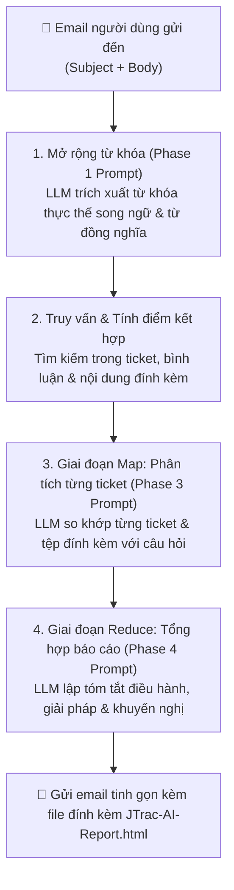

# Hướng dẫn thực hành truy vấn Email và viết Prompt cho JTrac AI

[English](PROMPT_EXAMPLES_en.md) | [繁體中文](PROMPT_EXAMPLES_zh-TW.md) | [简体中文](PROMPT_EXAMPLES_zh-CN.md) | [日本語](PROMPT_EXAMPLES_ja.md) | [Tiếng Việt](PROMPT_EXAMPLES_vi.md) | [Deutsch](PROMPT_EXAMPLES_de.md) | [Español](PROMPT_EXAMPLES_es.md) | [Français](PROMPT_EXAMPLES_fr.md)

---

## Mục lục
1. [Cơ chế hoạt động của Email truy vấn và Prompt trong JTrac AI](#1-cơ-chế-hoạt-động-của-email-truy-vấn-và-prompt-trong-jtrac-ai)
2. [Bốn ví dụ thực tế về viết Email truy vấn](#2-bốn-ví-dụ-thực-tế-về-viết-email-truy-vấn)
   - [Ví dụ 1: Xử lý sự cố kỹ thuật và chẩn đoán nguyên nhân gốc rễ](#ví-dụ-1-xử-lý-sự-cố-kỹ-thuật-và-chẩn-đoán-nguyên-nhân-gốc-rễ)
   - [Ví dụ 2: Theo dõi tiến độ ticket cụ thể và tệp đính kèm](#ví-dụ-2-theo-dõi-tiến-độ-ticket-cụ-thể-và-tệp-đính-kèm)
   - [Ví dụ 3: Tra cứu chuẩn kiến trúc và kinh nghiệm liên dự án](#ví-dụ-3-tra-cứu-chuẩn-kiến-trúc-và-kinh-nghiệm-liên-dự-án)
   - [Ví dụ 4: Đánh giá nâng cấp hệ thống và tương thích phiên bản](#ví-dụ-4-đánh-giá-nâng-cấp-hệ-thống-và-tương-thích-phiên-bản)
3. [Quy tắc vàng khi viết Prompt cho JTrac AI (Golden Rules)](#3-quy-tắc-vàng-khi-viết-prompt-cho-jtrac-ai-golden-rules)
4. [Hướng dẫn xem Báo cáo HTML ngoại tuyến](#4-hướng-dẫn-xem-báo-cáo-html-ngoại-tuyến)

---

## 1. Cơ chế hoạt động của Email truy vấn và Prompt trong JTrac AI

Khi bạn gửi email đến hòm thư hệ thống JTrac (ví dụ: `jtrac@yourcompany.com`), hệ thống sẽ tự động trích xuất **Tiêu đề (Subject)** và **Nội dung (Body)**, đóng gói an toàn thành thẻ Prompt:

```xml
<untrusted_user_query>
Subject: Tiêu đề email của bạn
Body: Nội dung email của bạn
</untrusted_user_query>
```

### Quy trình xử lý 3 giai đoạn (Mermaid)



- **Tiêu đề (Subject)**: Đóng vai trò là **điểm neo truy vấn cốt lõi**, định hướng mở rộng từ khóa và tính điểm trọng số.
- **Nội dung (Body)**: Đóng vai trò là **ngữ cảnh và câu lệnh Prompt**, hướng dẫn LLM tập trung vào các chi tiết cụ thể (như mã lỗi, người xử lý, thông số trong tệp đính kèm).

---

## 2. Bốn ví dụ thực tế về viết Email truy vấn

### Ví dụ 1: Xử lý sự cố kỹ thuật và chẩn đoán nguyên nhân gốc rễ

#### Tình huống
Cơ sở dữ liệu trên môi trường Production bị quá tải kết nối. Đội ngũ kỹ thuật cần tìm hiểu các sự cố tương tự trong quá khứ, cách giải quyết và các truy vấn SQL chậm được ghi nhận.

#### Tiêu đề khuyến nghị
```text
[PostgreSQL] Khắc phục sự cố cạn kiệt Connection Pool và Deadlock
```

#### Nội dung khuyến nghị
```text
Chào trợ lý JTrac,

Môi trường Production của chúng tôi thường xuyên gặp lỗi cạn kiệt kết nối HikariCP vào giờ cao điểm (Lỗi: Connection is not available, request timed out after 30000ms).

Vui lòng tra cứu trong các dự án được phân quyền:
1. Trước đây có các ticket liên quan đến rò rỉ kết nối (Connection Leak) hoặc Deadlock không?
2. Trong các log đính kèm hoặc lịch sử trao đổi, có ghi lại câu lệnh SQL chạy chậm cụ thể nào không?
3. Khi đó sự cố được giải quyết bằng cách tinh chỉnh tham số nào (như max_connections, leakDetectionThreshold) hay sửa code logic?
4. Hãy tổng hợp giải pháp và cung cấp danh sách các bước điều chỉnh khuyến nghị.

Cảm ơn!
```

---

### Ví dụ 2: Theo dõi tiến độ ticket cụ thể và tệp đính kèm

#### Tình huống
Đã có mã ticket cụ thể (ví dụ DEV-402), nhưng ticket có quá nhiều bình luận và tài liệu đính kèm XML. Cần nắm nhanh tiến độ hiện tại và tính tương thích của file cấu hình.

#### Tiêu đề khuyến nghị
```text
[DEV-402] Tra cứu tiến độ kiểm thử tích hợp Single Sign-On (SSO) SAML 2.0 và file đính kèm
```

#### Nội dung khuyến nghị
```text
Chào JTrac Copilot,

Tôi muốn biết tình trạng mới nhất của ticket [DEV-402]:
1. Trạng thái hiện tại và người đang phụ trách? Có bị tắc nghẽn ở khâu bảo mật hay kết nối mạng không?
2. Ý kiến phản hồi chính của các bên trong lịch sử thảo luận là gì?
3. File đính kèm SAML metadata.xml và cấu hình chứng chỉ có ghi nhận vấn đề không tương thích endpoint nào không?

Vui lòng tóm tắt thành các gạch đầu dòng. Cảm ơn!
```

---

### Ví dụ 3: Tra cứu chuẩn kiến trúc và kinh nghiệm liên dự án

#### Tình huống
Dự án mới chuẩn bị sử dụng hàng đợi thông điệp, cần tham khảo kinh nghiệm triển khai và các bài học từ các nhóm dự án khác.

#### Tiêu đề khuyến nghị
```text
[Kiến trúc] Hướng dẫn thiết kế cơ chế Retry và Dead Letter Queue (DLQ) cho Kafka Event Bus
```

#### Nội dung khuyến nghị
```text
Kính gửi thư ký JTrac,

Module mới của chúng tôi đang thiết kế tích hợp Apache Kafka làm Event Bus. Chúng tôi muốn tham khảo kinh nghiệm từ các dự án trước:
1. Hãy tìm kiếm các ticket thiết kế hoặc quy chuẩn liên quan đến cơ chế retry của Kafka Consumer và xử lý DLQ.
2. Trước đây có từng xảy ra sự cố nghẽn thông điệp (Consumer Lag) hoặc xử lý trùng lặp không? Giải pháp lúc đó là gì?
3. Số lần retry khuyến nghị, chính sách giãn cách (Backoff Policy) và các chỉ số giám sát là gì?

Vui lòng tổng hợp thành một danh mục khuyến nghị kiến trúc.
```

---

### Ví dụ 4: Đánh giá nâng cấp hệ thống và tương thích phiên bản

#### Tình huống
Kế hoạch nâng cấp runtime (Java 11 / Tomcat 9), cần tìm hiểu các rủi ro không tương thích đã từng được xử lý trong quá khứ.

#### Tiêu đề khuyến nghị
```text
[Tomcat/Java11] Lịch sử xử lý tương thích khi nâng cấp Tomcat 9 và JDK 11
```

#### Nội dung khuyến nghị
```text
Chào thư ký JTrac,

Chúng tôi dự kiến nâng cấp máy chủ từ Java 8 / Tomcat 8.5 lên Java 11 và Tomcat 9:
1. Trước đây có ghi nhận việc nâng cấp các thư viện (như dom4j, xml) để khắc phục cảnh báo Illegal reflective access trên Java 11 không?
2. Có ticket nào ghi lại lỗi khởi động, xung đột cấu hình Spring hay Wicket không?
3. Hãy lập bảng danh mục kiểm tra (Checklist) trước khi nâng cấp và các rủi ro cần phòng tránh.

Xin cảm ơn!
```

---

## 3. Quy tắc vàng khi viết Prompt cho JTrac AI (Golden Rules)

| Nguyên tắc | Mô tả | Ví dụ tốt | Cần tránh |
| :--- | :--- | :--- | :--- |
| **1. Thực thể cụ thể làm điểm neo** | Tiêu đề nhất định phải có tên module, công nghệ, mã lỗi hoặc số ticket | `[Redis] Xử lý Cache Penetration và Timeout` | `Hệ thống hỏng rồi cứu với` |
| **2. Nêu rõ khía cạnh quan tâm** | Chỉ rõ trong nội dung cần xem xét "thảo luận", "log đính kèm" hay "thông số" | `Vui lòng đối chiếu mã lỗi trong log đính kèm` | `Tra bừa cái gì liên quan đi` |
| **3. Sử dụng từ khóa song ngữ** | Đi kèm thuật ngữ tiếng Anh giúp kích hoạt điểm thưởng khớp song ngữ (+5 điểm) | `Quá tải kết nối (Connection Pool Timeout)` | Chỉ dùng từ khẩu ngữ mơ hồ |
| **4. Yêu cầu định dạng đầu ra** | Nêu rõ định dạng mong muốn như Checklist, bảng so sánh hay mức độ ưu tiên | `Cung cấp giải pháp dưới dạng bảng Checklist` | Không có định dạng yêu cầu |

---

## 4. Hướng dẫn xem Báo cáo HTML ngoại tuyến

Khi nhận được email phản hồi từ JTrac AI:
1. **Nội dung email**: Rất tinh gọn, hiển thị danh sách ticket tra cứu được cùng liên kết nhanh, chống vỡ layout trên các ứng dụng email.
2. **File đính kèm (`JTrac-AI-Report-[yyyyMMdd-HHmm].html`)**:
   - Mở trực tiếp bằng bất kỳ trình duyệt web nào (hoạt động ngoại tuyến 100%).
   - Bảng biểu có khung viền sắc nét, màu xen kẽ rõ ràng.
   - Thẻ `<details>` gập mở cho từng ticket, đầy đủ tóm tắt AI, mô tả gốc, bảng bình luận và danh sách file đính kèm.
   - Hỗ trợ chế độ Dark Mode tự động và mở rộng toàn bộ khi in.
