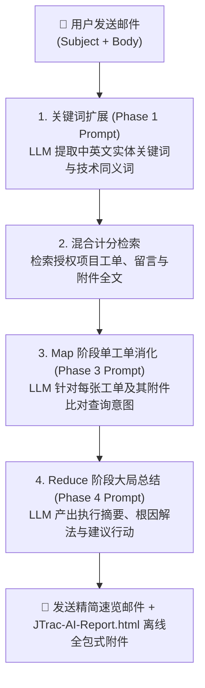

# JTrac AI 邮件查询与 Prompt 编写实战范例指南

[English](PROMPT_EXAMPLES_en.md) | [繁體中文](PROMPT_EXAMPLES_zh-TW.md) | [简体中文](PROMPT_EXAMPLES_zh-CN.md) | [日本語](PROMPT_EXAMPLES_ja.md) | [Tiếng Việt](PROMPT_EXAMPLES_vi.md) | [Deutsch](PROMPT_EXAMPLES_de.md) | [Español](PROMPT_EXAMPLES_es.md) | [Français](PROMPT_EXAMPLES_fr.md)

---

## 目录
1. [JTrac AI 邮件提问与 Prompt 运作机制](#一jtrac-ai-邮件提问与-prompt-运作机制)
2. [四大实战邮件编写范例](#二四大实战邮件编写范例)
   - [范例一：线上技术故障排查与根因诊断](#范例一线上技术故障排查与根因诊断)
   - [范例二：特定工单进度与关键附件追踪](#范例二特定工单进度与关键附件追踪)
   - [范例三：跨项目架构规范与历史经验检索](#范例三跨项目架构规范与历史经验检索)
   - [范例四：系统升级评估与兼容性影响分析](#范例四系统升级评估与兼容性影响分析)
3. [JTrac AI 提问黄金法则 (Golden Rules)](#三jtrac-ai-提问黄金法则-golden-rules)
4. [离线美化 HTML 报告查阅指引](#四离线美化-html-报告查阅指引)
5. [推荐部署硬件与 Ollama 模型配置标准](#五推荐部署硬件与-ollama-模型配置标准)

---

## 一、JTrac AI 邮件提问与 Prompt 运作机制

当您发送电子邮件至 JTrac 系统邮箱（如 `jtrac@yourcompany.com`）时，系统会自动提取您的**邮件主题 (Subject)** 与 **邮件正文 (Body)**，并组装为安全的 Prompt 标签：

```xml
<untrusted_user_query>
Subject: 您的邮件主题
Body: 您的邮件正文
</untrusted_user_query>
```

### 系统处理三阶段流程图 (Mermaid)



- **主题 (Subject)**：扮演**“核心检索锚点”**，决定关键词提取与权重计分的初始方向。
- **正文 (Body)**：扮演**“情境描述与指令 Prompt”**，引导 LLM 在消化工单历史与附件时关注特定焦点（如：特定错误代码、解决人员、附件配置参数等）。

---

## 二、四大实战邮件编写范例

### 范例一：线上技术故障排查与根因诊断

#### 适用场景
线上生产环境突然出现异常或数据库报错，工程团队急需查阅过去是否有类似故障、当时是如何排查与解决的，以及相关 Log 附件记录的关键信息。

#### 推荐邮件主题
```text
[PostgreSQL] 线上数据库连接超时 (Connection Pool Timeout) 与死锁排查
```

#### 推荐邮件正文
```text
JTrac 秘书你好：

我们线上环境在业务高峰期频繁出现 HikariCP 连接池耗尽的报错（错误码：Connection is not available, request timed out after 30000ms）。

请协助从授权项目空间中检索：
1. 过去是否有类似的数据库连接池泄漏（Connection Leak）或死锁（Deadlock）工单？
2. 相关工单的附件 Log 或历程讨论中，是否有记录具体的慢查询 SQL 或代码位置？
3. 当初最后是通过调优哪些参数（如 max_connections、leakDetectionThreshold、连接超时）或修正哪些逻辑修复的？
4. 请汇总过去的解决方式，并给出建议的调整步骤。

谢谢！
```

---

### 范例二：特定工单进度与关键附件追踪

#### 适用场景
已知特定的工单编号，但工单内容繁多、历史讨论长达数十条且包含多个技术规格书或 XML 附件，想快速掌握该工单目前卡在何处、各部门审批状态与关键配置。

#### 推荐邮件主题
```text
[DEV-402] 查询 Single Sign-On (SSO) SAML 2.0 联调进度与配置附件
```

#### 推荐邮件正文
```text
JTrac Copilot 你好：

我想了解工单 [DEV-402] 目前的最新状况：
1. 该工单目前处于什么状态？指派给谁？目前是否卡在安全审核或网络连通阶段？
2. 历程讨论中各方反馈的关键意见是什么？
3. 附件所附带的 SAML metadata.xml 与证书配置文件，是否有指出任何 EntityID 或端点配置不兼容的问题？

请条列重点回复，谢谢。
```

---

### 范例三：跨项目架构规范与历史经验检索

#### 适用场景
新项目即将启动，需要调查其他项目团队过往在微服务架构、消息队列等基础设施上的实践经验与避坑指南。

#### 推荐邮件主题
```text
[架构规范] 跨服务事件总线 (Kafka Event Bus) 重试与 Dead Letter Queue (DLQ) 设计指南
```

#### 推荐邮件正文
```text
JTrac 查询秘书您好：

我们新模块正在规划整合 Apache Kafka 作为事件总线，想参考公司内部过去各项目空间的架构经验：
1. 请跨项目搜索过去与 Kafka Consumer 重试机制、死信队列（DLQ）处理相关的设计工单或规范文档。
2. 过去曾发生过消息积压（Consumer Lag）或重复消费的重大问题吗？当初的改善方案是什么？
3. 各团队推荐的重试次数、退避策略（Backoff Policy）与监控指标有哪些？

请综合成一份架构建议清单供我们参考。
```

---

### 范例四：系统升级评估与兼容性影响分析

#### 适用场景
团队计划将底层运行环境（如 JDK、Servlet 容器）升级，希望快速了解过去升级时遇到过哪些兼容性地雷、哪些第三方依赖库需要调整。

#### 推荐邮件主题
```text
[Tomcat/Java11] 升级 Tomcat 9 与 JDK 11 之兼容性修复记录与已知问题
```

#### 推荐邮件正文
```text
JTrac 秘书你好：

我们预计近期将服务器从 Java 8 / Tomcat 8.5 升级至 Java 11 与 Tomcat 9：
1. 请查询过去是否有针对 Java 11 非法反射访问（Illegal reflective access）的依赖库升级记录（例如 dom4j 或 xml 模块）？
2. 过去在升级过程中，是否有任何工单记录过启动失败、Spring 配置冲突或 Wicket 组件兼容性问题？
3. 请整理一份升级前的自我检查清单（Checklist）与建议规避的风险。

感谢协助！
```

---

## 三、JTrac AI 提问黄金法则 (Golden Rules)

| 原则 | 说明 | 良好示范 | 避免写法 |
| :--- | :--- | :--- | :--- |
| **1. 实体名词做锚点** | 主题务必包含具体的系统模块、技术名称、错误代码或工单编号 | `[Redis] 缓存击穿与超时配置排查` | `系统又坏了求救` |
| **2. 明确指定关注维度** | 在正文中具体列出您想查的是“历史讨论”、“附件 Log”还是“调优参数” | `请特别比对附件中的 Log 报错信息` | `随便查一下相关的` |
| **3. 善用中英双语关键词** | 专业术语并陈可触发系统双语匹配加分（+5 分），大幅提高检索精准度 | `连接池超时 (Connection Pool Timeout)` | 只写口语化叙述 |
| **4. 指定期望的输出结构** | 可在正文直接指示期望的呈现形式（如：对比表、清单、优先级） | `请以步骤清单 (Checklist) 形式提供解法` | 无指示（默认三段式） |

---

## 四、离线美化 HTML 报告查阅指引

收到 JTrac AI 的回信时：
1. **邮件正文**：保持极简速览，提供关联工单清单与快速跳转超链接，杜绝任何排版错乱。
2. **随信附件 (`JTrac-AI-Report-[yyyyMMdd-HHmm].html`)**：
   - 使用任意现代浏览器直接打开（支持离线查阅，无需网络）。
   - 具备完整清晰的表格边框与斑马纹样式。
    - 每张工单提供原生 `<details>` 折叠卡片，包含 AI 单张提炼摘要、工单描述、完整留言表格与附件名称。
    - 支持系统深色模式自动切换与打印全展开排版。

---

## 五、推荐部署硬件与 Ollama 模型配置标准

JTrac AI 邮件秘书采用了多工单汇整与长附件文字抽取（单文件上限 10 万字符）之 Map-Reduce 管线架构，对后端 LLM 之推理能力、上下文长度及硬件算力具有高标准的门槛要求：

### 1. 推荐硬件规格 (Hardware Recommendation)
- **旗舰推荐 GPU**：**NVIDIA GeForce RTX 5090 (32GB GDDR7 VRAM)**
- **企业级替代方案**：NVIDIA A100 (40GB/80GB)、H100、L40S (48GB) 或双卡 RTX 4090 (24GB x 2)
- **算力效益解析**：RTX 5090 具备 32GB 庞大显存与次世代 Blackwell 架构，能在无需 CPU Offload 的全显存载入模式下，流畅吞吐 128K~200K 极限长上下文，保障在数十张工单与巨量附件文字齐开时维持每秒 30+ tokens 的高速推理。

### 2. 推荐模型选型 (Model Selection)
- **首选模型**：**`qwen2.5:32b`**（或 Qwen 3 旗舰系列）
- **关键优势**：Qwen 2.5 32B 在繁简中英多语言理解、长文本事实抽取、严格格式依从（JSON/Markdown）及 Mermaid 语法绘图能力上均显著优于同量级模型。

### 3. Ollama 长上下文配置 (Modelfile with 200K Context)
Ollama 默认之上下文窗口仅为 2,048 (2K) tokens，无法满足多工单分析。强烈建议建立专属 Modelfile 将上下文扩展至 200,000 (200K)：

```dockerfile
# 建立定制化 Modelfile
FROM qwen2.5:32b

# 设置长上下文窗口为 200K tokens
PARAMETER num_ctx 200000

# 保持客观低随机度，避免推理幻觉
PARAMETER temperature 0.2
```

建立并启动模型：
```bash
ollama create qwen2.5-jtrac-200k -f Modelfile
```
接着于 JTrac 系统管理员后台将 `llm.ollama.model` 设置为 `qwen2.5-jtrac-200k`。

### 4. ⚠️ 严重效能警示 (Crucial Warning)
> [!CAUTION]
> **切勿使用过低参数量或短上下文模型**：
> - 严禁使用参数量过低（如 1B、3B、7B/8B 未量化）或未配置长上下文（`num_ctx` < 64K/128K）之模型。
> - 若使用短上下文模型，当候选工单与巨量 Log/代码附件送入时，Ollama 将**无预警自动截断 (Truncate) 历史资料**，导致模型在盲目状态下进行虚假拼凑（幻觉），且极易产出语法破碎之 Mermaid 流程图，导致整体 AI 辅助分析彻底失效。
