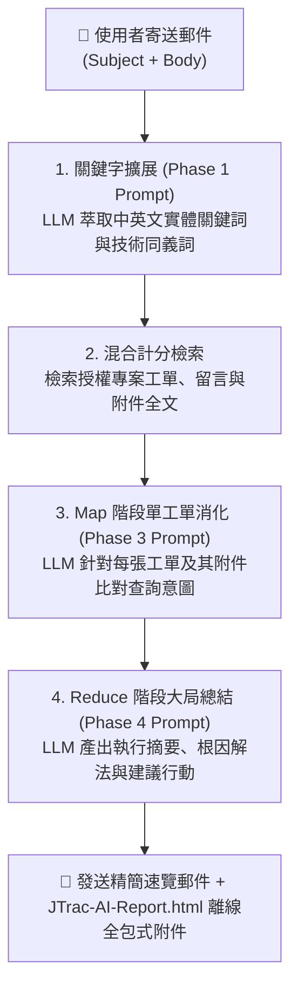

# JTrac AI 郵件查詢與 Prompt 撰寫實戰範例指南

[English](PROMPT_EXAMPLES_en.md) | [繁體中文](PROMPT_EXAMPLES_zh-TW.md) | [简体中文](PROMPT_EXAMPLES_zh-CN.md) | [日本語](PROMPT_EXAMPLES_ja.md) | [Tiếng Việt](PROMPT_EXAMPLES_vi.md) | [Deutsch](PROMPT_EXAMPLES_de.md) | [Español](PROMPT_EXAMPLES_es.md) | [Français](PROMPT_EXAMPLES_fr.md)

---

## 目錄
1. [JTrac AI 郵件提問與 Prompt 運作機制](#一jtrac-ai-郵件提問與-prompt-運作機制)
2. [四大實戰郵件撰寫範例](#二四大實戰郵件撰寫範例)
   - [範例一：線上技術障礙排查與根因診斷](#範例一線上技術障礙排查與根因診斷)
   - [範例二：特定工單進度與關鍵附件追蹤](#範例二特定工單進度與關鍵附件追蹤)
   - [範例三：跨專案架構規範與歷史經驗檢索](#範例三跨專案架構規範與歷史經驗檢索)
   - [範例四：系統升級評估與相容性影響分析](#範例四系統升級評估與相容性影響分析)
3. [JTrac AI 提問黃金法則 (Golden Rules)](#三jtrac-ai-提問黃金法則-golden-rules)
4. [離線美化 HTML 報告檢視指引](#四離線美化-html-報告檢視指引)
5. [推薦部署硬體與 Ollama 模型配置標準](#五推薦部署硬體與-ollama-模型配置標準)

---

## 一、JTrac AI 郵件提問與 Prompt 運作機制

當您發送電子郵件至 JTrac 系統信箱（如 `jtrac@yourcompany.com`）時，系統會自動擷取您的**信件主旨 (Subject)** 與 **信件內文 (Body)**，並組裝為安全的 Prompt 標籤：

```xml
<untrusted_user_query>
Subject: 您的信件主旨
Body: 您的信件內文
</untrusted_user_query>
```

### 系統處理三階段流程圖 (Mermaid)



- **主旨 (Subject)**：扮演**「核心檢索錨點」**，決定關鍵字萃取與權重計分的初始方向。
- **內文 (Body)**：扮演**「情境描述與指令 Prompt」**，引導 LLM 在消化工單歷史與附件時關注特定焦點（如：特定錯誤代碼、解決人員、附件設定參數等）。

---

## 二、四大實戰郵件撰寫範例

### 範例一：線上技術障礙排查與根因診斷

#### 適用情境
線上生產環境突然出現異常或資料庫報錯，工程團隊急需查閱過去是否有類似故障、當時是如何排查與解決的，以及相關 Log 附件記載的關鍵資訊。

#### 推薦信件主旨
```text
[PostgreSQL] 線上資料庫連線超時 (Connection Pool Timeout) 與死鎖排查
```

#### 推薦信件內文
```text
JTrac 秘書你好：

我們線上環境在尖峰時段頻繁出現 HikariCP 連線池耗盡的報錯（錯誤碼：Connection is not available, request timed out after 30000ms）。

請協助從授權專案空間中檢索：
1. 過去是否有類似的資料庫連線池洩漏（Connection Leak）或死鎖（Deadlock）工單？
2. 相關工單的附件 Log 或歷程討論中，是否有記載具體的慢查詢 SQL 或程式碼位置？
3. 當初最後是透過調校哪些參數（如 max_connections、leakDetectionThreshold、連線逾時）或修正哪些邏輯修復的？
4. 請彙整過去的解決方式，並給出建議的調整步驟。

謝謝！
```

#### Prompt 解析與預期效果
- **技術名詞錨點**：包含 `PostgreSQL`、`HikariCP`、`Deadlock`、`Connection Leak`，激發雙語混合計分機制獲得額外權重加分（+5）。
- **明確指令方向**：要求 LLM 深入檢索附件中的 Log 內容與討論紀錄，而不僅僅看工單標題。
- **產出成果**：在 `JTrac-AI-Report.html` 的報告中，會精確列出相關工單的解決歷程與歷史 Log 摘錄。

---

### 範例二：特定工單進度與關鍵附件追蹤

#### 適用情境
已知特定的工單編號，但工單內容繁多、歷史討論長達數十則且包含多個技術規格書或 XML 附件，想快速掌握該工單目前卡在何處、各部門簽核狀態與關鍵設定。

#### 推薦信件主旨
```text
[DEV-402] 查詢 Single Sign-On (SSO) SAML 2.0 整合測試進度與設定附件
```

#### 推薦信件內文
```text
JTrac Copilot 你好：

我想了解工單 [DEV-402] 目前的最新狀況：
1. 該工單目前處於什麼狀態？指派給誰？目前是否卡在資安審核或網路連通階段？
2. 歷程討論中各方回饋的關鍵意見是什麼？
3. 附件所附帶的 SAML metadata.xml 與憑證設定檔，是否有指出任何 EntityID 或端點設定不相容的問題？

請條列重點回覆，謝謝。
```

#### Prompt 解析與預期效果
- **精準編號定位**：在主旨與內文中直接提及 `[DEV-402]`，系統檢索時會給予最高權重優先鎖定該工單。
- **聚焦附件深度解析**：指示 LLM 深入分析 `metadata.xml` 附件，在單工單 Map 階段即可抽出附件關鍵配置。

---

### 範例三：跨專案架構規範與歷史經驗檢索

#### 適用情境
新專案即將啟動，需要調查其他專案團隊過往在微服務架構、訊息佇列等基礎建設上的實作經驗與避坑指南。

#### 推薦信件主旨
```text
[架構規範] 跨服務事件匯流排 (Kafka Event Bus) 重試與 Dead Letter Queue (DLQ) 設計指南
```

#### 推薦信件內文
```text
JTrac 查詢秘書您好：

我們新模組正在規劃整合 Apache Kafka 作為事件匯流排，想參考公司內部過去各專案空間的架構經驗：
1. 請跨專案搜尋過去與 Kafka Consumer 重試機制、死信佇列（DLQ）處理相關的設計工單或規範文件。
2. 過去曾發生過訊息積壓（Consumer Lag）或重複消費的重大問題嗎？當初的改善方案是什麼？
3. 各團隊推薦的重試次數、退避策略（Backoff Policy）與監控指標有哪些？

請綜合成一份架構建議清單供我們參考。
```

#### Prompt 解析與預期效果
- **跨空間綜整**：利用 Reduce 階段的大局總結能力，自動比對多個授權專案的經驗。
- **提煉最佳實踐**：LLM 會依據各專案的工單歷程，提煉出共識與避坑要點。

---

### 範例四：系統升級評估與相容性影響分析

#### 適用情境
團隊計畫將底層執行環境（如 JDK、Servlet 容器）升級，希望快速了解過去升級時遇到過哪些相容性地雷、哪些第三方套件需要調整。

#### 推薦信件主旨
```text
[Tomcat/Java11] 升級 Tomcat 9 與 JDK 11 之相容性修復紀錄與已知問題
```

#### 推薦信件內文
```text
JTrac 秘書你好：

我們預計近期將伺服器從 Java 8 / Tomcat 8.5 升級至 Java 11 與 Tomcat 9：
1. 請查詢過去是否有針對 Java 11 非法反射存取（Illegal reflective access）的套件升級紀錄（例如 dom4j 或 xml 模組）？
2. 過去在升級過程中，是否有任何工單記錄過啟動失敗、Spring 設定衝突或 Wicket 元件相容性問題？
3. 請整理一份升級前的自我檢查清單（Checklist）與建議避開的風險。

感謝協助！
```

#### Prompt 解析與預期效果
- **歷史問題萃取**：自動檢索關鍵詞 `Tomcat`、`Java 11`、`reflective access`、`dom4j`。
- **結構化交付**：要求產出自我檢查清單，LLM 會在「建議行動方案」中輸出清晰易讀的 Markdown Checklist 表格。

---

## 三、JTrac AI 提問黃金法則 (Golden Rules)

| 原則 | 說明 | 良好示範 | 避免寫法 |
| :--- | :--- | :--- | :--- |
| **1. 實體名詞做錨點** | 主旨務必包含具體的系統模組、技術名稱、錯誤代碼或工單編號 | `[Redis] 快取擊穿與超時設定排查` | `系統又壞了求救` |
| **2. 明確指定關注維度** | 在內文中具體列出您想查的是「歷史討論」、「附件 Log」還是「調校參數」 | `請特別比對附件中的 Log 報錯訊息` | `隨便查一下相關的` |
| **3. 善用中英雙語關鍵字** | 專業術語並陳可觸發系統雙語匹配加分（+5 分），大幅提高檢索精準度 | `連線池逾時 (Connection Pool Timeout)` | 只寫口語化敘述 |
| **4. 指定期望的輸出結構** | 可在內文直接指示期望的呈現形式（如：比較表、清單、優先順序） | `請以步驟清單 (Checklist) 形式提供解法` | 無指示（預設三段式） |

---

## 四、離線美化 HTML 報告檢視指引

收到 JTrac AI 的回信時：
1. **郵件內文**：維持極簡速覽，提供關聯工單清單與快速跳轉超連結，杜絕任何排版跑版。
2. **隨信附件 (`JTrac-AI-Report-[yyyyMMdd-HHmm].html`)**：
   - 使用任一瀏覽器直接開啟（支援離線檢視，無須網路）。
   - 具備完整清晰的表格框線與斑馬紋樣式。
   - 每張工單提供原生 `<details>` 折疊卡片，包含 AI 單張精煉摘要、工單描述、完整留言表格與附件名稱。
   - 支援系統深色模式自動切換與列印全展開排版。

---

## 五、推薦部署硬體與 Ollama 模型配置標準

JTrac AI 郵件秘書採用了多工單彙整與長附件文字抽取（單檔上限 10 萬字元）之 Map-Reduce 管線架構，對後端 LLM 之推論能力、上下文長度及硬體算力具有高標準之門檻要求：

### 1. 推薦硬體規格 (Hardware Recommendation)
- **旗艦推薦 GPU**：**NVIDIA GeForce RTX 5090 (32GB GDDR7 VRAM)**
- **企業級替代方案**：NVIDIA A100 (40GB/80GB)、H100、L40S (48GB) 或雙卡 RTX 4090 (24GB x 2)
- **算力效益解析**：RTX 5090 具備 32GB 龐大顯存與次世代 Blackwell 架構，能在無須 CPU Offload 的全顯存載入模式下，流暢吞吐 128K~200K 極限長上下文，保障在數十張工單與巨量附件文字齊開時維持每秒 30+ tokens 的高速推論。

### 2. 推薦模型選型 (Model Selection)
- **首選模型**：**`qwen2.5:32b`**（或 Qwen 3 旗艦系列）
- **關鍵優勢**：Qwen 2.5 32B 在繁簡中英多語系理解、長文本事證抽取、嚴格格式依循（JSON/Markdown）及 Mermaid 語法繪圖能力上均顯著優於同量級模型。

### 3. Ollama 長上下文配置 (Modelfile with 200K Context)
Ollama 預設之上下文視窗僅為 2,048 (2K) tokens，無法滿足多工單分析。強烈建議建立專屬 Modelfile 將上下文擴展至 200,000 (200K)：

```dockerfile
# 建立客製化 Modelfile
FROM qwen2.5:32b

# 設置長上下文視窗為 200K tokens
PARAMETER num_ctx 200000

# 保持客觀低隨機度，避免推論幻覺
PARAMETER temperature 0.2
```

建立並啟動模型：
```bash
ollama create qwen2.5-jtrac-200k -f Modelfile
```
接著於 JTrac 系統管理員後台將 `llm.ollama.model` 設定為 `qwen2.5-jtrac-200k`。

### 4. ⚠️ 嚴重效能警示 (Crucial Warning)
> [!CAUTION]
> **切勿使用過低參數量或短上下文模型**：
> - 嚴禁使用參數量過低（如 1B、3B、7B/8B 未量化）或未配置長上下文（`num_ctx` < 64K/128K）之模型。
> - 若使用短上下文模型，當候選工單與巨量 Log/程式碼附件送入時，Ollama 將**無預警自動截斷 (Truncate) 歷史資料**，導致模型在盲目狀態下進行虛假拼湊（幻覺），且極易產出語法破碎之 Mermaid 流程圖，導致整體 AI 輔助分析徹底失效。
