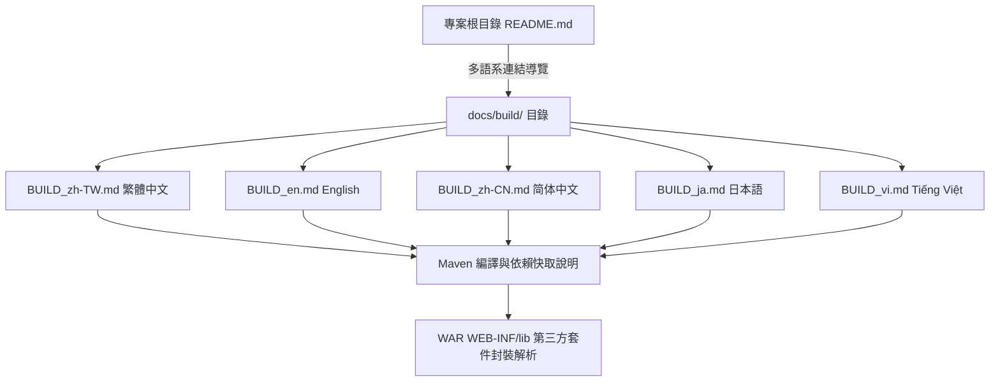

## Purpose

規範 JTrac 專案之多語系建置與編譯技術文件結構，確保全球開發者皆能在其母語或慣用語言環境下，清楚理解 Maven 建置指令、依賴套件本機快取下載機制，以及 WAR 封裝檔內部依賴整合原理。

## 系統文件導覽架構

## ADDED Requirements

### Requirement: 多語系建置編譯指南規範
專案 MUST 在 `docs/build/` 目錄下提供五種語言版本的建置編譯指南文件（繁體中文、English、簡體中文、日本語、Tiếng Việt），內容 MUST 詳述建置環境設定、Maven 編譯指令集、依賴下載機制與封裝邏輯。

#### Scenario: 開發者查閱非繁體中文語系之建置指南
- **WHEN** 國際開發者存取 `docs/build/BUILD_en.md`、`BUILD_ja.md` 或 `BUILD_vi.md`
- **THEN** 文件提供該語言完整的 JDK/Maven 環境設定說明、`mvn compile`/`mvn package` 指令說明，以及快取與封裝機制解析

### Requirement: 專案首頁多語系導航與連結
專案根目錄之 `README.md` MUST 包含多語系導覽區塊，明確提供通往上述五種語言建置指南的點擊連結與專案核心技術棧概覽。

#### Scenario: 讀者造訪專案根目錄 README
- **WHEN** 讀者在 GitHub 或本地檢視 `README.md`
- **THEN** 可於顯眼處看到 English、繁體中文、簡體中文、日本語、Tiếng Việt 五種語言的編譯文件超連結，並能順利導航至對應文件
