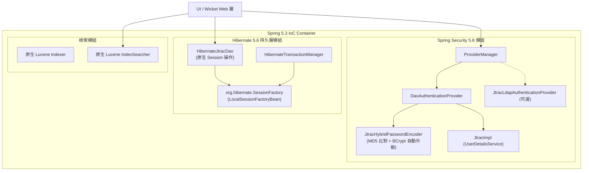

# 技術設計文件：後端核心現代化（Spring Security 5.8 與 Hibernate 5.6 DAO 重構）

## Context

詳見 [proposal.md](proposal.md)。當前 JTrac 核心後端依賴於已廢棄的 Acegi Security 1.0.7 與 Hibernate 3.2，DAO 層緊密耦合於 `HibernateDaoSupport` 與 `HibernateTemplate`，且檢索層依賴終止維護之 `spring-modules-lucene`。所有架構升級必須在保證現有業務邏輯、實體對應（`jtrac.hbm.xml`）及使用者密碼完全平滑相容的前提下完成。

## 系統核心架構與互動流程圖

## Goals / Non-Goals

**Goals:**
- 徹底移除 `org.acegisecurity` 所有類別與 XML 配置，遷移至 Spring Security 5.8.14。
- 重構 `HibernateJtracDao`，移除 `HibernateDaoSupport` 與 `HibernateTemplate`，改用 Hibernate 5 原生 `sessionFactory.getCurrentSession()`。
- 實作雙模相容 `JtracHybridPasswordEncoder`：舊用戶無須重設密碼即可登入，成功登入後自動升級為 BCrypt。
- 移除 `spring-modules-lucene:0.8`，將檢索模組改寫為原生 Lucene API。
- 現代化單元測試基底，全面升級至 JUnit 5 (Jupiter)。

**Non-Goals:**
- 本階段不進行 Apache Wicket 9.x 的 UI 重構（保留於下一階段獨立推進）。
- 本階段不進行 HSQLDB 二進位資料庫檔案離線轉換（保留於資料遷移工具階段推進）。
- 不改動既有 `jtrac.hbm.xml` 欄位與對應邏輯，維持實體結構完整相容。

## Decisions

### 1. 密碼加密：實作相容 MD5 與 BCrypt 的 JtracHybridPasswordEncoder
- **決策**：實作 `org.springframework.security.crypto.password.PasswordEncoder`。比對時，先偵測密碼長度是否為 32 碼（舊版 MD5 16 進位字串）。若比對舊 MD5 成功，立即非同步/背景調用 `jtrac.storeUserPassword(user, rawPassword)` 將其重新編碼為標準 BCrypt 雜湊。若密碼已是 BCrypt 格式（`$2a$` 開頭），則直接以 BCrypt 比對。
- **評估替代方案**：
  - *替代方案 A（強制全部重設密碼）*：對現有系統用戶體驗破壞極大，否決。
  - *替代方案 B（永久僅用 MD5）*：持續保有弱加密風險，無法達成現代安全標準，否決。

### 2. 資料持久層：原生 SessionFactory 注入取代 HibernateDaoSupport
- **決策**：在 `HibernateJtracDao` 中宣告 `private SessionFactory sessionFactory`，由 Spring IoC 注入。內部所有 CRUD 與查詢直接獲取 `getCurrentSession()`。在事務邊界內直接執行 `merge`、`get`、`delete` 與 HQL 查詢。
- **評估替代方案**：
  - *替代方案 A（全面遷移至 JPA 2.2 EntityManager）*：需要將 `jtrac.hbm.xml` 全部重寫為 JPA Annotation，影響範圍過大且容易引入實體對應缺陷，否決。

### 3. 資料庫綱要同步：LocalSessionFactoryBean hbm2ddl.auto=update
- **決策**：在 `applicationContext.xml` 的 `sessionFactory` 配置加入 `<prop key="hibernate.hbm2ddl.auto">update</prop>`，由 Hibernate 5 引擎全權負責在啟動時自動檢驗並新增缺失的資料表與欄位。保留 `HibernateJtracDao.createSchema()` 用於執行初始 admin 帳號建立及空間序列號校驗。
- **評估替代方案**：
  - *替代方案 A（重寫自訂 SchemaHelper）*：Hibernate 5 的 `SchemaUpdate` API 涉及複雜的 `ServiceRegistry`，不如直接採用原生 `hbm2ddl.auto` 穩定標準，否決。

### 4. 全文檢索模組：原生輕量 Lucene 實作
- **決策**：移除 `spring-modules-lucene`。在 `Indexer` 中直接調用 `IndexWriter`，在 `IndexSearcher` 中直接調用 `IndexReader` 與 `IndexSearcher`，保留原有 `FSDirectory` 與 `StandardAnalyzer` 設定。
- **評估替代方案**：
  - *替代方案 A（透過 exclusion 繼續使用 spring-modules-lucene）*：該包在 Spring 5 下因缺少 `spring-dao` 會直接引發 `NoClassDefFoundError`，無法運行，否決。

### 5. 測試套件：JUnit 5 + SpringExtension
- **決策**：重構 `JtracTestBase` 為抽象基底類別，標註 `@ExtendWith(SpringExtension.class)`、`@ContextConfiguration` 與 `@Transactional`。

## Risks / Trade-offs

- **[Risk] 舊版 MD5 密碼用戶在登入自動升級為 BCrypt 時，若遭遇資料庫唯讀或寫入失敗**
  - **Mitigation**：升級密碼寫入操作置於獨立事務區塊並以 try-catch 保護；即使密碼升級寫入異常，仍允許本次登入成功並輸出警告日誌，下次登入仍能以 MD5 再次觸發升級。
- **[Risk] Hibernate 5 對自訂查詢的語法校驗比 Hibernate 3 更加嚴格**
  - **Mitigation**：所有 `HibernateJtracDao` 中的 HQL 查詢語法逐一審視，全面導入具名參數（Named Parameters）綁定，杜絕舊版位置參數佔位符的相容性問題。
- **[Risk] Web 視圖渲染延遲載入物件引發 LazyInitializationException**
  - **Mitigation**：在 `web.xml` 中升級並保留 `org.springframework.orm.hibernate5.support.OpenSessionInViewFilter`，確保 Wicket 請求生命週期內 Session 保持開啟。

## Migration Plan

1. 更新 `pom.xml` 相依性版本並執行 Maven dependency 預檢驗。
2. 實作 `JtracHybridPasswordEncoder` 與 Spring Security 相關適配類別。
3. 重構 `HibernateJtracDao` 為原生 Session 操作，更新 Spring 上下文設定。
4. 重構 `Indexer` 與 `IndexSearcher` 為原生 Lucene。
5. 升級 `JtracTestBase` 與測試案例至 JUnit 5，執行 Maven test 驗證。
