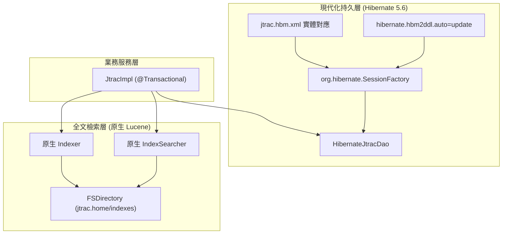

## Purpose

規範 JTrac 資料持久層現代化架構，以原生 Hibernate 5.6 `SessionFactory` 重構 `HibernateJtracDao`，徹底解耦過時之 `HibernateDaoSupport` 與 `HibernateTemplate`，並整合資料表結構自動同步與原生輕量 Lucene 全文檢索。

## 資料持久層與檢索架構圖

## ADDED Requirements

### Requirement: 原生 SessionFactory DAO 操作與解耦
`HibernateJtracDao` SHALL 徹底移除 `HibernateDaoSupport` 與 `HibernateTemplate`，改為直接注入 `org.hibernate.SessionFactory`，並使用 `sessionFactory.getCurrentSession()` 進行持久化 CRUD 與 HQL 查詢。

#### Scenario: 儲存與讀取項目 (Item)
- **WHEN** 業務層調用 `dao.storeItem(item)` 或 `dao.loadItem(id)`
- **THEN** DAO 直接透過當前事務之 Hibernate `Session` 進行 `merge` 或 `get` 操作，維持資料庫事務完整性

#### Scenario: HQL 條件查詢
- **WHEN** 業務層調用 `dao.findItems(sequenceNum, prefixCode)`
- **THEN** DAO 透過 `getCurrentSession().createQuery(...)` 建立具名參數化之 HQL 查詢並返回強型別列表

### Requirement: 資料庫結構自動同步與啟動校驗
系統 SHALL 透過 `LocalSessionFactoryBean` 的 `hibernate.hbm2ddl.auto=update` 機制自動校驗與建立缺失的資料表與欄位，並在 `createSchema()` 中維持預設 admin 帳號建立與各空間序列號 (sequenceNum) 的自動校正。

#### Scenario: 全新資料庫初始化
- **WHEN** 系統以空白資料庫首次啟動
- **THEN** Hibernate 自動依據 `jtrac.hbm.xml` 建立完整資料表，且 `createSchema()` 自動插入初始 admin 帳號

#### Scenario: 既有資料庫欄位同步
- **WHEN** 系統連線至缺少新欄位的既有資料庫啟動
- **THEN** Hibernate 自動更新 schema 補齊缺少之欄位，不影響既有資料完整性

### Requirement: 批次操作現代化
所有空間狀態變更與大量資料清除（`bulkUpdate*`）SHALL 改寫為標準 HQL 批量執行語句，取代舊版 `getHibernateTemplate().bulkUpdate()`。

#### Scenario: 批次更新空間議題狀態
- **WHEN** 調用 `bulkUpdateStatusToOpen(space, status)`
- **THEN** DAO 透過當前 Session 執行批次 HQL 更新並返回受影響之記錄筆數

### Requirement: 原生 Lucene 全文檢索
系統全文檢索模組 SHALL 徹底移除 `spring-modules-lucene:0.8` 依賴，以原生輕量 Lucene API 實作索引建立 (`Indexer`) 與條件搜尋 (`IndexSearcher`)。

#### Scenario: 項目內容建立索引
- **WHEN** 議題新增或更新時調用 `indexer.index(item)`
- **THEN** 系統透過原生 Lucene IndexWriter 將項目標題、描述及歷史歷程寫入本機索引目錄

#### Scenario: 關鍵字全文搜尋
- **WHEN** 調用 `indexSearcher.findItemIdsContainingText(keyword)`
- **THEN** 系統透過原生 Lucene QueryParser 與 IndexSearcher 解析查詢並返回符合之 Item ID 清單
