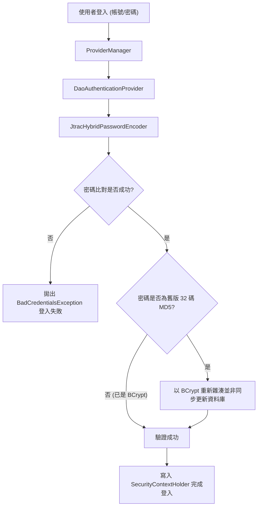

## Purpose

規範 JTrac 系統以 Spring Security 5.8 替代過時 Acegi 1.0.7 之現代化安全認證與授權機制，包含雙模無痛密碼雜湊升級、LDAP/AD 整合與權限上下文管理。

## 系統認證與密碼升級流程圖

## ADDED Requirements

### Requirement: 雙模密碼比對與無痛自動升級
系統 SHALL 支援舊版 MD5 雜湊密碼的驗證比對，並在使用者成功登入時，自動將密碼平滑升級為標準 BCrypt 雜湊格式寫入資料庫，達成既有帳號無感遷移。

#### Scenario: 舊版 MD5 密碼用戶首次成功登入並自動升級
- **WHEN** 既有用戶以舊版 MD5 密碼進行登入且輸入正確之明文密碼
- **THEN** 系統比對 MD5 雜湊成功通過認證，且自動將該使用者密碼欄位更新為 BCrypt 雜湊值儲存至資料庫

#### Scenario: 已升級 BCrypt 密碼之用戶正常登入
- **WHEN** 密碼已升級為 BCrypt 格式之使用者進行登入且輸入正確之明文密碼
- **THEN** 系統以 BCrypt 演算法進行比對並成功登入，不重複觸發密碼更新

#### Scenario: 輸入錯誤密碼登入失敗
- **WHEN** 使用者輸入不正確的密碼進行登入
- **THEN** 系統拒絕認證並拋出認證失敗例外，不修改資料庫任何密碼欄位

### Requirement: 領域實體適配 Spring Security 規範
`User` 與 `UserSpaceRole` 領域實體 SHALL 直接實作 Spring Security 之 `UserDetails` 與 `GrantedAuthority` 介面，並返回類型安全的權限集合。

#### Scenario: 讀取使用者授權角色集合
- **WHEN** 呼叫 `User.getAuthorities()`
- **THEN** 系統必須返回 `Collection<? extends GrantedAuthority>` 泛型集合，其中包含使用者所有的空間與角色權限

#### Scenario: 空間管理員權限判定
- **WHEN** 驗證具備特定空間管理權限的 `UserSpaceRole`
- **THEN** 該授權物件之 `getAuthority()` 必須正確返回含空間代碼前綴的權限識別字串（如 `ROLE_ADMIN:PREFIX`）

### Requirement: Active Directory 與 LDAP 目錄驗證整合
系統 SHALL 支援透過 LDAP / Active Directory 進行集中身分驗證，並整合至 Spring Security `ProviderManager`。

#### Scenario: 啟用 LDAP 時之身分驗證
- **WHEN** 系統配置了 `ldap.url` 且使用者嘗試登入
- **THEN** 系統優先或接續調用 `JtracLdapAuthenticationProvider` 與目錄伺服器綁定驗證

### Requirement: 清理廢棄 Acegi CAS 模組
系統 SHALL 徹底移除未啟用的過時 Acegi CAS 相關類別與配置檔，消除歷史安全風險與技術債。

#### Scenario: 系統啟動不載入 Acegi CAS
- **WHEN** 系統初始化 Spring WebApplicationContext
- **THEN** 系統中不存在 `org.acegisecurity` 命名空間之 Bean，且不依賴 `applicationContext-acegi-cas.xml`
