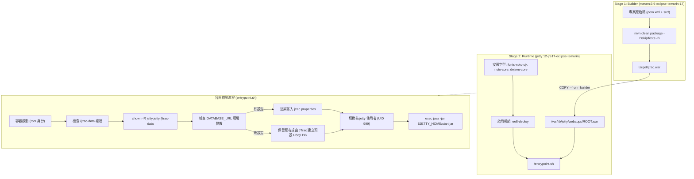

## Context

請參閱 `proposal.md` 了解本變更之背景動機。JTrac 升級至 Java 11/17、Spring 5.3、Hibernate 5.6 與 Wicket 9 後，以 WAR 檔形式運作於 Servlet 4.0 容器。本設計聚焦於如何透過 Docker 現代化技術，以最小依賴封裝出具備高相容性、多語系字型支援與健全資料持久化的容器化環境。

## Goals / Non-Goals

**Goals:**
- 提供多階段建置 Dockerfile，單一命令即可從原始碼編譯並產出輕量化 Runtime Image。
- 採用官方 `jetty:12-jre17-eclipse-temurin`，透過 `ee8-deploy` 原生相容 `javax.servlet` (Servlet 4.0)。
- 內建完整多國語系字型（Noto CJK、Noto Core、DejaVu Core），確保全文檢索與報表繪圖無缺字問題。
- 透過 `entrypoint.sh` 實現 Volume 擁有者權限動態適配與降權執行（UID 999），並支援環境變數自動注入資料庫設定。
- 提供跨平台腳本 (`build.sh`, `build.bat`, `run.sh`, `run.bat`) 與 `docker-compose.yml`，實現開箱即用。

**Non-Goals:**
- 不修改 JTrac 核心 Java 業務邏輯或 Maven 打包配置。
- 不強制綁定特定的外部關聯式資料庫（預設 HSQLDB 2.x，支援環境變數擴充連接外部 DB）。
- 不取代既有的本機 Jetty 10 或 Tomcat 9 部署方式。

## Architecture & Flowchart

## Decisions

### 1. 採用多階段建置 (Multi-stage Build)
- **決策**：在同一份 `Dockerfile` 中以 `maven:3.9-eclipse-temurin-17` 作為 Builder 產出 WAR 檔，再以 `jetty:12-jre17-eclipse-temurin` 部署運行。
- **原因**：使用者無須在本機安裝 JDK 或 Maven，只要有 Docker 即可完成一致性建置；且最終 Runtime Image 不包含 Maven 與原始碼，體積顯著縮減。
- **替代方案**：要求使用者先於本機執行 `mvn package` 再將 WAR 複製進 Image。此方式使 Dockerfile 依賴外部環境，容易因本機 JDK/Maven 版本差異造成建置不一致。

### 2. 選用官方 `jetty:12-jre17-eclipse-temurin` 搭配 `ee8-deploy`
- **決策**：採用 Eclipse 官方維護之 Jetty 12 映像檔，並在構建時透過 `java -jar "$JETTY_HOME/start.jar" --add-modules=ee8-deploy` 啟用 Java EE 8 (Servlet 4.0) 支援。
- **原因**：Jetty 10 已於 2026/01 結束社群維護（EOL），而 Jetty 12 是當前活躍的 LTS 版本。其創新的模組化架構能原生、零修改地運行 JTrac 之 `javax.servlet` WAR 檔。
- **替代方案**：自建 Jetty 10 映像檔（需自行下載 tar.gz、配置服務與使用者，維護成本高且基礎底層缺乏安全性更新）。

### 3. 多國語系字型全量安裝
- **決策**：在 Runtime 映像檔中安裝 `fontconfig`、`fonts-noto-cjk`、`fonts-noto-core` 與 `fonts-dejavu-core`。
- **原因**：JTrac 具備 PDFBox 與 Office 文件全文檢索索引功能，若容器底層缺乏 CJK 與歐洲重音字型，會產生 `No Unicode mapping` 警告並導致附件抽取文字亂碼或遺失。
- **替代方案**：僅安裝英文預設字型。缺點為中文/日文/韓文附件文字抽取與繪圖將出現方框亂碼（tofu）。

### 4. `entrypoint.sh` 自動適配 Volume 權限與降權執行
- **決策**：容器 Entrypoint 啟動時由 root 快速將 `/jtrac-data` 的擁有權校正為 `jetty:jetty`（UID 999），隨後使用 `exec su-exec`（或 `gosu` / `chroot --userspec`）降權為 `jetty` 執行。
- **原因**：在 Linux / macOS / Windows 掛載本機目錄時，掛載點目錄往往屬於 root 或特定本機帳號。若純粹以非 root 使用者執行，常引發 `Permission denied` 錯誤；透過 Entrypoint 自動校正兼具了安全合規與開箱即用的使用者體驗。
- **替代方案**：要求使用者在掛載前手動於 Host 執行 `chown -R 999:999`。缺點為使用者體驗差且 Windows 環境無法執行此指令。

### 5. 環境變數動態渲染資料庫連線
- **決策**：支援 `DATABASE_URL`、`DATABASE_DRIVER`、`DATABASE_USERNAME`、`DATABASE_PASSWORD` 與 `HIBERNATE_DIALECT` 環境變數。若提供則於啟動時渲染至 `/jtrac-data/jtrac.properties`。
- **原因**：利於透過 Docker Compose 或 Kubernetes ConfigMap / Secret 連線至 MySQL / PostgreSQL 等容器，無需手動掛載並編輯文字檔。
- **替代方案**：純手動修改 `jtrac.properties`。缺點為雲原生編排不便。

## Risks / Trade-offs

- **[Risk 1: 首次多階段建置下載 Maven 相依耗時較長]** → **Mitigation**: 在 `Dockerfile` 中利用 Docker 快取層，先複製 `pom.xml` 並下載依賴，原始碼未變更時快取不會失效。
- **[Risk 2: 宿主機掛載大目錄 chown 遞迴過慢]** → **Mitigation**: `entrypoint.sh` 僅對 `/jtrac-data` 本身及其核心子目錄進行權限檢查，避免數十萬個歷史附件重複深度遞迴。
- **[Risk 3: Jetty 12 模組設定路徑與 Jetty 10 差異]** → **Mitigation**: 採用標準 `$JETTY_BASE/webapps/ROOT.war` 部署規範與官方認證之 `--add-modules=ee8-deploy` 指令。
