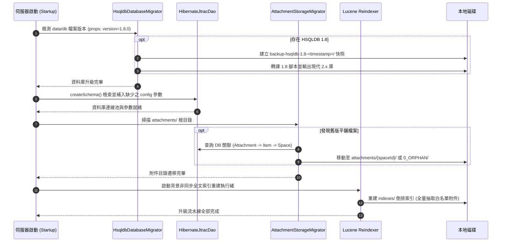
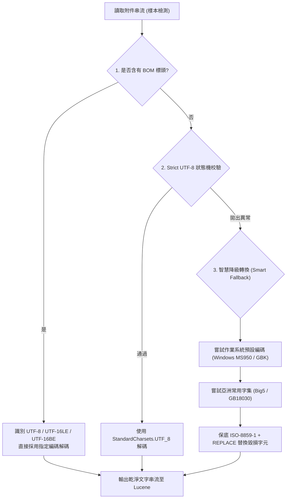

## Context

詳見 `proposal.md`。JTrac 原架構將所有附件平鋪於 `${jtrac.home}/attachments/{filePrefix}_{fileName}`，且 Lucene 搜尋僅涵蓋 `summary`、`detail` 與 `comment`。當使用者由經典 JTrac 2.3.3 發行版（使用 HSQLDB 1.8）升級至現代版本時，需要一套銜接資料庫、實體儲存與倒排索引的完整現代化流水線。

## Goals / Non-Goals

**Goals:**
- 實作純專案 ID 空間隔離目錄：`attachments/{spaceId}/{filePrefix}_{fileName}`（徹底防更名風險）。
- 實作啟動期自動觸發之 JTrac 2.3.3 四階段升級流水線（HSQLDB 1.8 轉譯 -> Schema/Config 補丁 -> 附件目錄遷移 -> 背景索引重建）。
- 實作孤兒檔案隔離機制（`attachments/0_ORPHAN/`），確保根目錄整潔且無任何資料遺失。
- 實作雙軌查檔防呆（Dual-Read Fallback），優先檢索專案目錄，相容舊版平鋪目錄，杜絕 404。
- 實作無侵入式現代 Office（`.xlsx`, `.docx`）零依賴純 JDK 抽取與標準 UTF-8 保證（0% 亂碼）。
- 引入 Apache PDFBox 2.0.x 實現標準純 Java PDF 內文抽取。
- 實作日常上傳新附件之非同步工作緒佇列索引（Asynchronous Queue），HTTP 極速回應且異常隔離。
- 實作 `SmartCharsetDetector` 處理 CSV / TXT 之多層次編碼偵測與防亂碼轉換。
- 實作副檔名黑名單（明確排除舊版 `.doc`, `.xls` 及二進位檔）與白名單過濾。
- 實作抽取防護門檻（單檔 10MB / 5 萬字元），並將參數收納入 `config` 表（`attachment.index.maxSizeMb`、`attachment.index.maxChars`）。
- 索引內容採用 `Store.NO, Index.TOKENIZED`，防止索引庫體積膨脹。
- 支援非同步背景重建與 UI 管理員手動「重建索引」進度條。

**Non-Goals:**
- 不解析舊版二進位 Office 格式（`.doc`, `.xls`, `.ppt`）之內文，直接排除以防引入肥大依賴或安全風險。
- 不進行 OCR 圖片光學字元識別或音訊/影片解析。
- 不修改關聯式資料庫之 `attachments` 實體資料表欄位（保持極致向下相容，以動態關聯與目錄解析為主）。

## Decisions

### 1. 儲存架構：純專案 ID 結構 (`attachments/{spaceId}/{filePrefix}_{fileName}`)
- **決策**：目錄名稱嚴格採用純 `spaceId` 數字（例如 `attachments/1/101_guide.pdf`）。
- **理由**：`spaceId` 為資料庫不可變之數值主鍵（Primary Key）。若使用專案名稱或英文代號（PrefixCode），一旦管理員日後在系統介面中修改代碼（如 `DEFAULT` 改為 `MAIN`），將會引發實體目錄不同步、作業系統檔案鎖定、以及外部參照斷裂等複雜問題；採用純專案 ID 作為目錄，徹底免疫所有專案更名風險，路徑恆定可靠。

### 2. 舊版升級：四階段全自動啟動流水線
- **決策**：升級順序嚴格定為：(1) 資料庫 1.8 -> 2.x、(2) Schema/Config 補丁、(3) 附件目錄純 ID 遷移、(4) 背景索引重建。
- **理由**：若未先將 HSQLDB 1.8 升級至 2.x，Spring 連線池與 Hibernate 無法初始化；若無資料庫連線，則無法查得舊附件所屬的專案 Space ID。因此嚴格按照依賴順序執行。

### 3. 舊版孤兒檔案隔離處置 (`0_ORPHAN/`)
- **決策**：在掃描根目錄時，若檔案在資料庫中已被刪除或找不到對應的 Space，自動移入 `attachments/0_ORPHAN/`，並記錄 Warning Log。
- **理由**：使 `attachments/` 根目錄徹底保持乾淨，避免每次開機重複重複掃描未配對檔案，同時 100% 保證使用者重要歷史資料不被自動刪除。

### 4. 零依賴 Office 解析與 PDFBox 整合
- **決策**：
  - `.xlsx` 與 `.docx`：直接以 JDK 內建 `java.util.zip.ZipInputStream` 配合 `javax.xml.stream.XMLStreamReader` 抽取 `xl/sharedStrings.xml` 與 `word/document.xml` 中的文字。
  - `.pdf`：引入成熟之 `org.apache.pdfbox:pdfbox:2.0.31`。
- **理由**：現代 OpenXML 規範強制內部 XML 必須為 UTF-8，以 JDK 原生串流解析不僅 0% 亂碼、執行極快、且增加 0 KB 依賴；PDF 則藉由純 Java 之 PDFBox 提供高可靠性解析。

### 5. 智慧防亂碼轉碼器 (`SmartCharsetDetector`)
- **決策**：針對純文字與 CSV 檔案，實施「BOM 識別 -> 嚴格 UTF-8 校驗 -> 系統/亞洲常用編碼降級」機制。

### 6. 防護網門檻與索引儲存策略
- **決策**：
  - 單檔檔案大小上限預設 10MB（超過則跳過內文抽取）。
  - 單檔抽取字數上限預設 50,000 字元（超過則安全截斷）。
  - 參數寫入 `config` 表（`attachment.index.maxSizeMb`, `attachment.index.maxChars`），便於日後微調。
  - Lucene Document 儲存模式：`Store.NO`, `Index.TOKENIZED`，只產生詞元倒排索引，不重複存放原文。

### 7. 新上傳附件非同步佇列索引 (Asynchronous Queue Indexing)
- **決策**：日常操作上傳新附件時，系統完成檔案實體寫入後立即向客戶端回應 HTTP 200，文字抽取與 Lucene 索引寫入交由背景工作緒（`ExecutorService`）非同步排程處理。
- **理由**：
  - **極速流暢**：使用者送出表單毫無延遲，不受 PDF 或 Excel 大檔解析耗時影響。
  - **異常隔離**：即使背景抽取發生非預期格式剖析異常，亦 100% 絕不阻斷工單或留言儲存事務，保證核心業務高可用性。

## Risks / Trade-offs

- **[大量歷史附件重建索引耗時]** → 升級完成後採用獨立背景執行緒非同步重建，不阻斷使用者操作；UI 介面提供 Ajax 輪詢進度條。
- **[舊版附件毀損或格式異常]** → 文字抽取器外層包覆 `try-catch`，發生異常時記錄 WARN 並安全跳過該附件，絕對不阻斷工單或留言之儲存與索引。
- **[雙軌查檔效能損耗]** → 優先判定專案子目錄（O(1) 直接命中），僅在子目錄檔案不存在時才檢查根目錄，對正常存取零效能損耗。
- **[升級中斷風險]** → HSQLDB 1.8 升級前強制產生時間戳快照備份；附件搬移採用單檔原子操作或逐檔覆蓋，具備等冪性（Idempotence），多次重啟可平滑續跑。

## Migration Plan

1. 伺服器啟動時，若偵測到 `attachments/` 根目錄有檔案且資料庫可連線，立即觸發 `AttachmentStorageMigrator.migrate()`。
2. 遷移完成後於 `config` 表記錄遷移旗標（`attachments.partitioning.migrated=true`），避免後續重啟無謂重複掃描。
3. 復原策略：若資料庫升級有異常，管理員可自 `data/db/backup-hsqldb-1.8-<timestamp>/` 復原原始資料庫檔案；若附件需復原，亦可從 `attachments/*` 搬回根目錄。
