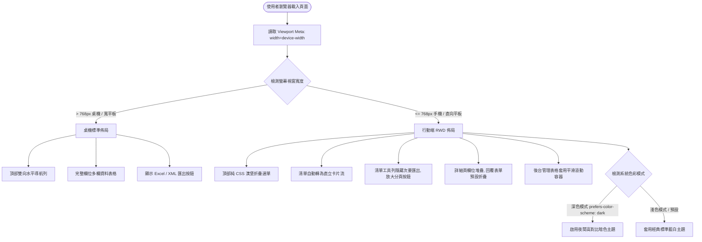
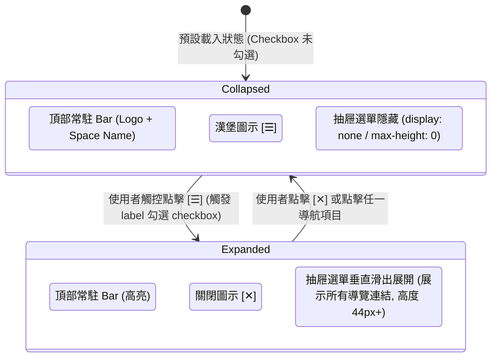

# 技術架構設計：行動端 RWD 響應式體驗與深色主題適配 (Technical Design)

## Context

JTrac 系統之 Web 表現層以 Apache Wicket 9 構建，HTML 頁面透過 `BasePage`、`HeaderPanel` 與各類子頁面元件合成。既有頁面結構廣泛依賴傳統 HTML `<table>` 進行排版，並透過 `src/main/webapp/resources/jtrac.css` 集中控制視覺樣式。

先前版本中，全站缺少 Viewport Meta 宣告，導致行動裝置瀏覽器以 980px+ 縮小視圖渲染；且導航列與多欄資料表格缺乏針對窄螢幕之適配機制。詳細背景與動機參見 `proposal.md`。

## Goals / Non-Goals

**Goals:**
- **零外部依賴與 100% 離線運作**：不引入 Bootstrap、Tailwind 或第三方外部 CDN，純粹使用現代 CSS（Flexbox, CSS Grid, Media Queries）實現。
- **純 CSS 漢堡導航機制**：採用 CSS Checkbox Hack 達成折疊選單切換，完全避免 JavaScript 事件與 Wicket Ajax 局部刷新發生衝突。
- **行動卡片化體驗**：在螢幕寬度 $\le 768\text{px}$ 時，自動將問題清單與儀表板轉為直立卡片流，優化拇指觸控與閱讀。
- **原生深色模式適配**：透過 `@media (prefers-color-scheme: dark)` 自動適配使用者手機作業系統深色模式。
- **後台管理表格安全防護**：使用者與專案清單加入自適應橫向平滑滾動容器，保留完整功能不破版。

**Non-Goals:**
- 不對後端 Java 實體、業務邏輯或 Wicket Model 進行結構性破壞變更。
- 不重寫複雜管理設定頁面（如工作流狀態矩陣設定）為全新卡片式 UI，該類重度維運頁面透過平滑滾動容器保障可用性。

## Decisions

### 1. 純 CSS Checkbox 驅動漢堡選單 vs. JavaScript 方案
- **決策**：在 `HeaderPanel.html` 引入隱藏式 Checkbox `<input type="checkbox" id="nav-toggle">` 與觸控標籤 `<label for="nav-toggle" class="nav-toggle-btn">`，透過 CSS 兄弟選擇器 `#nav-toggle:checked ~ .nav-menu-drawer` 控制抽屜展開與收合。
- **理由**：Wicket 頻繁執行 Ajax 局部刷新。若使用 JS 監聽按鈕點擊，一旦父容器被 Ajax 替換，JS 事件容易遺失解綁；純 CSS 方案在生命週期中 100% 穩定，且完全無外部函式庫負擔。
- **替代方案評估**：引入外部 Bootstrap JS 或撰寫全域 Vanilla JS，增加代碼複雜度且有潛在相容性風險。

### 2. 問題清單表格轉換為卡片流 (Table to Cards Transformation)
- **決策**：在 `@media (max-width: 768px)` 斷點下，將 `.jtrac-list` 的 `table`, `tbody`, `tr`, `td` 宣告為 `display: block`，隱藏 `tr.sortable`（表頭），將每一列 `tr` 轉換為獨立圓角白底卡片。
- **理由**：讓使用者在直向手機螢幕下單手滑動瀏覽 Issue，無需雙指放大縮小。
- **替代方案評估**：保留表格並僅加水平捲軸，雖然容易實作，但每次瀏覽 Issue 都需左右來回滑動，行動閱讀體驗極差。

### 3. 深色主題採用系統偏好自動適配 (`prefers-color-scheme: dark`)
- **決策**：在 `jtrac.css` 的 `@media (prefers-color-scheme: dark)` 區塊內重新定義 `:root` 中的 CSS 變數（如 `--header`, `--lightblue`, `--mediumblue`, `--gray`）以及主體背景底色（`#181a1b`）與文字顏色（`#e8e6e3`）。
- **理由**：現代智慧型手機（iOS / Android）多數預設排程啟用暗黑模式，純 CSS 媒體查詢能無感切換，不需儲存 Cookie 或使用者個人偏好欄位。

---

## 系統架構與流程圖 (Mermaid Diagrams)

### 1. 行動端響應式斷點與佈局渲染決策流程


### 2. 純 CSS 漢堡選單互動狀態機


### 3. 問題清單卡片結構設計
```
+---------------------------------------------------------------+
| .jtrac-list tr (轉換為 display: block; border-radius: 8px)   |
+---------------------------------------------------------------+
| [ID Badge] #DEFAULT-101               [Status Badge] [OPEN]   |
+---------------------------------------------------------------+
| [Summary] 登入頁面在手機上破圖與附件上傳問題修正 (粗體加大文字) |
+---------------------------------------------------------------+
| 👤 指派給: william               ⚡ 優先度: High               |
| 🕒 更新時間: 2026-09-09 01:30   🚩 嚴重度: Major              |
+---------------------------------------------------------------+
```

---

## Risks / Trade-offs

- **[Risk] 部分老舊自訂 HTML 標籤可能內嵌寫死 `width="100%"` 或 `<table style="width:...">` 導致水平撐開**
  - **Mitigation**: 在 CSS 中加入通用行動重置規則：`@media (max-width: 768px) { table { max-width: 100% !important; box-sizing: border-box; } img { max-width: 100%; height: auto; } }`。
- **[Risk] 多欄表格轉卡片時，如果專案配置了 10+ 個自訂欄位，卡片可能變得過長**
  - **Mitigation**: 遵照訪談決策，清單卡片僅聚焦核心欄位（ID、狀態、主旨、指派人、建立者、優先度、更新時間），其餘自訂欄位引導使用者點進詳細頁檢視。
- **[Risk] 深色模式下狀態徽章（Status）或嚴重度（Severity）文字對比度不足**
  - **Mitigation**: 在深色模式 CSS 變數中，為 status badge 與背景提供適當的半透明暗色底（如 `rgba(255,255,255,0.1)`）與亮色文字，確保通過 WCAG AA 無障礙對比標準。

---

## Migration Plan

1. **靜態資源與 HTML 更新**：
   - 擴充 `jtrac.css` 增加媒體查詢斷點、漢堡選單樣式、卡片化規則與暗色模式變數。
   - 於 `BasePage.html`、`LoginPage.html`、`LogoutPage.html` 加入 Viewport Meta。
   - 調整 `HeaderPanel.html`、`ItemListPanel.html`、`ItemViewPanel.html`、`DashboardPage.html` 之標籤結構以配合 CSS 響應式切換。
2. **測試驗證**：
   - 執行現有單元測試（`mvn clean test`）確保無 Wicket 標籤綁定例外。
   - 於 Chrome / Edge 開發者工具（DevTools）之 Device Mode 測試 iPhone SE (375px)、iPhone 14/15 Pro (393px)、Pixel 7 (412px)、iPad Mini (768px) 與 Desktop (1440px)。
3. **回滾策略 (Rollback)**：
   - 本變更為純前端樣式與標籤層級改進，無資料庫結構或 API 異動，若需回滾直接透過 Git 還原單一 Commit 即可。
