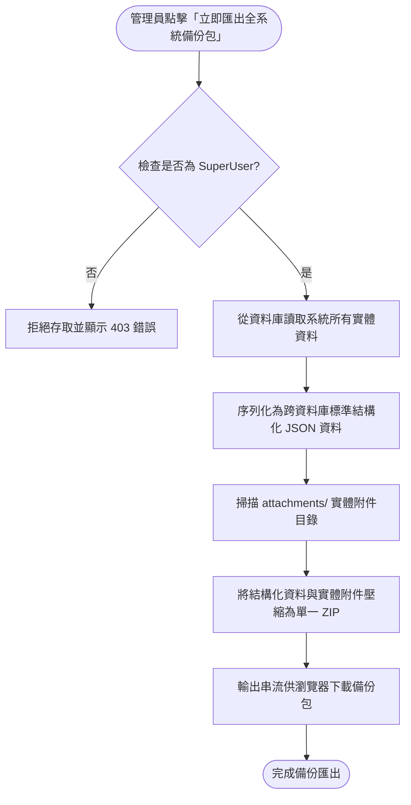
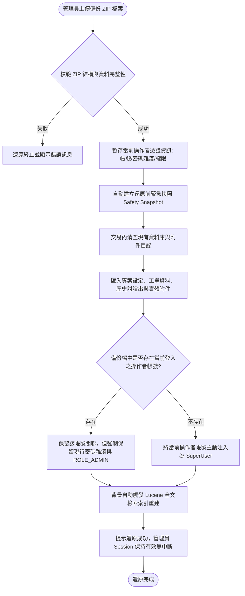

## Purpose

提供 JTrac 系統最高管理員（SuperUser）一鍵執行全系統資料與實體附件之完整打包備份（ZIP 格式），並在系統還原時具備自動建立安全快照、管理者帳號防鎖死憑證保護、以及背景自動重建搜尋索引之高可用機制。

## 系統流程架構圖 (Architecture & Workflow Diagrams)

### 備份打包流程 (Backup Export Flow)

### 還原與防鎖死防護流程 (Restore & Anti-Lockout Shield Flow)

## ADDED Requirements

### Requirement: 全系統備份包匯出 (System Full Backup Bundle Export)
系統 MUST 允許具備最高管理員（SuperUser）權限的使用者，一鍵匯出全系統完整資料與檔案。備份檔案 MUST 為單一標準 ZIP 壓縮格式，內部包含跨資料庫相容之結構化資料（涵蓋 Config、Users、UserSpaceRoles、Spaces、Metadata、Items、ItemItems、History、Attachments）以及完整之實體附件目錄。

#### Scenario: 成功匯出包含跨資料庫結構與實體附件之單一壓縮檔
- **WHEN** 最高管理員點擊「立即匯出全系統備份包」
- **THEN** 系統將所有資料庫實體序列化為跨資料庫通用資料集，連同 `attachments/` 目錄打包為 `.zip` 檔並提供瀏覽器下載，檔名包含時間戳記。

#### Scenario: 非最高管理員嘗試匯出時被拒絕存取
- **WHEN** 未具備 SuperUser 權限之一般使用者或空間管理員嘗試存取備份匯出端點
- **THEN** 系統必須拒絕請求並阻擋下載。

### Requirement: 系統還原與還原前安全快照 (System Restore with Safety Snapshot)
系統 MUST 支援由最高管理員上傳合法備份 ZIP 檔以執行全系統還原。在執行任何資料清除與寫入前，系統 MUST 自動於伺服器端建立當前系統之緊急快照備份，以確保遇異常時可進行復原。

#### Scenario: 執行還原前自動在伺服器端建立緊急快照
- **WHEN** 最高管理員確認執行備份還原
- **THEN** 系統在清除現有資料前，自動在伺服器本機 `${jtrac.home}/backups/` 目錄建立一份當前系統的還原前緊急快照。

#### Scenario: 上傳損毀或不合法壓縮檔時安全阻擋並回報錯誤
- **WHEN** 管理員上傳格式錯誤、非 JTrac 備份或損毀之 ZIP 檔案
- **THEN** 系統檢驗失敗並終止作業，不對既有資料進行任何修改，並在畫面上顯示清楚之驗證錯誤訊息。

#### Scenario: 成功還原專案、工單、歷史歷程與實體附件
- **WHEN** 管理員上傳合法之備份 ZIP 檔並通過校驗
- **THEN** 系統依正確相依順序還原所有專案空間、自訂欄位、工單編號、歷史留言、狀態流轉與實體附件檔案。

### Requirement: 管理者帳號防鎖死保護 (Admin Anti-Lockout Credential Shield)
系統在執行資料庫使用者還原時，MUST 具備「操作者憑證保護防禦機制」，防止執行還原的最高管理員因舊備份密碼遺失或帳號不存在而遭到反鎖。

#### Scenario: 備份檔中存在同名管理者帳號時保留現行密碼與管理權限
- **WHEN** 備份檔中包含與當前登入者相同之登入帳號（loginName）
- **THEN** 系統還原其歷史工單與關聯身分，但強制保留當前操作者正在使用的密碼雜湊，並確保其具有 `ROLE_ADMIN` 最高權限。

#### Scenario: 備份檔中不存在當前管理者帳號時自動注入為最高管理員
- **WHEN** 備份檔中無當前登入操作者之帳號
- **THEN** 系統在還原完成後，自動將當前操作者之帳號與憑證寫入資料庫並賦予 `ROLE_ADMIN`，確保管理員還原後仍可繼續登入。

#### Scenario: 備份檔中其餘一般使用者帳號保留備份原密碼並可被管理員管理
- **WHEN** 還原程序完成
- **THEN** 備份檔中的其他歷史使用者帳號保留其原本的密碼與空間角色，管理員可在「使用者管理」介面依需求個別為其變更密碼。

### Requirement: 還原後自動重建搜尋索引 (Post-Restore Automatic Reindex)
系統在完成全系統還原後，MUST 自動觸發 Lucene 全文檢索索引重建作業，使工單能立即被搜尋，且操作者之 Session 不應中斷。

#### Scenario: 還原成功後自動於背景觸發 Lucene 全文檢索索引重建
- **WHEN** 系統資料與附件還原順利完成
- **THEN** 系統自動觸發背景執行 Lucene 索引全量重建作業，更新完成狀態，管理員可立即使用當前 Session 繼續瀏覽並查詢工單。
