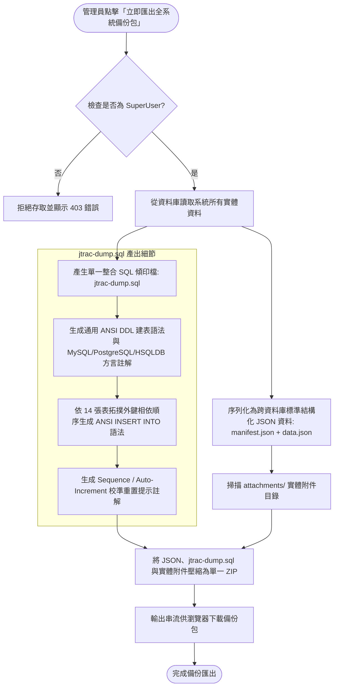

## 系統流程架構圖 (Architecture & Workflow Diagrams)

### 升級備份打包與 SQL Dump 產出流程 (Backup Export Flow with SQL Dump)

## MODIFIED Requirements

### Requirement: 全系統備份包匯出 (System Full Backup Bundle Export)
系統 MUST 允許具備最高管理員（SuperUser）權限的使用者，一鍵匯出全系統完整資料與檔案。備份檔案 MUST 為單一標準 ZIP 壓縮格式，內部包含跨資料庫相容之結構化資料（`manifest.json`、`data.json`）、單一完整 SQL 傾印檔案（`jtrac-dump.sql`，包含通用 ANSI DDL、資料庫方言建表註解、14 張資料表依外鍵拓撲排序之 ANSI INSERT 敘述與 Sequence 校準提示）以及完整之實體附件目錄（`attachments/`）。

#### Scenario: 成功匯出包含跨資料庫結構與實體附件之單一壓縮檔
- **WHEN** 最高管理員點擊「立即匯出全系統備份包」
- **THEN** 系統將所有資料庫實體序列化為跨資料庫通用 JSON 資料集，並生成包含標準 DDL 與拓撲排序 DML 的 `jtrac-dump.sql`，連同 `attachments/` 目錄打包為 `.zip` 檔並提供瀏覽器下載，檔名包含時間戳記。

#### Scenario: 備份 ZIP 壓縮檔內包含合法且獨立之 jtrac-dump.sql
- **WHEN** 解壓縮匯出之備份 ZIP 檔案
- **THEN** 根目錄下存在 `jtrac-dump.sql`，內容開頭標記來源資料庫與版本，前半段包含相容主流關聯式資料庫之通用 DDL 與 MySQL / PostgreSQL / HSQLDB 方言註解，後半段包含 14 張資料表正確相依順序之 ANSI INSERT 語法與單引號跳脫，末尾提供 Sequence 重置提示。

#### Scenario: 非最高管理員嘗試匯出時被拒絕存取
- **WHEN** 未具備 SuperUser 權限之一般使用者或空間管理員嘗試存取備份匯出端點
- **THEN** 系統必須拒絕請求並阻擋下載。
