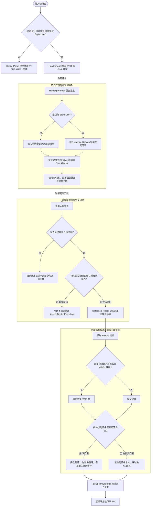

# html-exporter Specification Delta

## 系統架構與流程圖

## MODIFIED Requirements

### Requirement: 網頁導覽列匯出按鈕與安全控管
系統 MUST 於全站共用之頂部導覽列（`HeaderPanel`）提供「📦 匯出 HTML」連結，且僅限已通過驗證、且至少具備一個專案空間存取權限（或具備 SuperUser 身分）之使用者看見並操作。系統 MUST 嚴格依據使用者角色與空間指派權限限制匯出範圍，杜絕越權下載未授權專案資料。

#### Scenario: 具權限使用者在導覽列看見匯出入口
- **WHEN** 已登入且具備至少一個專案空間存取權限（或為 SuperUser）之使用者瀏覽 JTrac 任何頁面
- **THEN** 頂部導覽列呈現多語系之「📦 匯出 HTML」選項，點擊後導向匯出確認設定頁面

#### Scenario: 未登入使用者存取匯出頁面 (Guardrail)
- **WHEN** 未登入或訪客身分嘗試直接透過 URL 存取匯出頁面
- **THEN** 系統阻擋請求並自動重新導向至登入頁面，防止未授權資料外洩

#### Scenario: 無任何專案空間權限之使用者不顯示匯出入口 (Guardrail)
- **WHEN** 已登入之一般使用者尚未被指派任何專案空間存取權限（可存取空間數為 0 且非 SuperUser）
- **THEN** 頂部導覽列完全不顯示「📦 匯出 HTML」連結；若直接透過 URL 存取該頁面，系統強制阻擋並重新導向至首頁

#### Scenario: 非超級管理員使用者嘗試越權下載未指派空間 (Guardrail)
- **WHEN** 一般使用者嘗試透過偽造請求或特定參數存取其未被指派之專案空間代碼
- **THEN** 系統阻斷請求並拋出安全性拒絕存取例外，絕不傳回任何未授權空間之議題或附件

#### Scenario: 超級管理員具備全域專案空間匯出權限
- **WHEN** 具備 SuperUser 身分之使用者操作匯出
- **THEN** 系統允許其檢視與匯出全站所有專案空間

---

### Requirement: 匯出確認對話頁面（模式二）與免責聲明
系統 MUST 在使用者進行下載前，提供專屬之設定確認頁面（`HtmlExportPage`），供使用者挑選欲匯出之專案空間組合、介面語系與附件選項，並以醒目區塊揭露內容無法翻譯之限制。

#### Scenario: 匯出設定與參數選擇
- **WHEN** 使用者進入匯出確認頁面
- **THEN** 介面提供「專案空間核取方塊清單（Checkboxes，支援自由複選一個至多個授權空間）」、「UI 框架語系（繁中、英文、簡中、日語、越語）」與「包含實體附件打包」核取方塊

#### Scenario: 未勾選任何空間時之阻擋防呆 (Guardrail)
- **WHEN** 使用者在專案空間清單中取消所有勾選項並嘗試點擊下載按鈕
- **THEN** 系統阻擋表單送出並給予提示，要求使用者至少勾選一個專案空間方可進行匯出

#### Scenario: 翻譯限制免責聲明顯示 (Guardrail)
- **WHEN** 檢視匯出設定頁面
- **THEN** 頁面以醒目警告框明確告知：「語系設定僅套用於網頁介面、欄位名稱與狀態標籤（UI 框架）；議題歷史主題、詳細描述與留言回覆為原始記錄，無法自動翻譯。」

---

### Requirement: JTrac 討論串邏輯與 Section 呈現
產出之 HTML 文件 MUST 依據 JTrac 核心邏輯，將每個票證呈現為獨立之 `<section>` 卡片，並將該票證之所有歷史回覆、狀態更迭與備註緊密收攏在同一區塊內。討論串歷程 MUST 自動排除系統建立票證時產生之無留言初始快照；若議題無任何實質回覆，討論串區塊 MUST 完全隱藏。

#### Scenario: 單一議題檢視
- **WHEN** 讀者在瀏覽器開啟空間 HTML 頁面
- **THEN** 每個 Issue 擁有唯一錨點 ID（如 `#DEFAULT-1`），上方呈現票證主題、狀態、發起者、指派人與詳細描述，下方依序呈現後續討論留言與變更時間軸

#### Scenario: 排除建立時自動產生之無留言 OPEN 快照
- **WHEN** 議題之歷史紀錄清單首筆為系統建立時自動產生之 OPEN 狀態且留言為空之快照
- **THEN** HTML 討論串歷程自動排除該筆記錄，真正之第 1 則回覆編號為 `#1`，且討論串計數徽章精準反映排除後的實際回覆數量

#### Scenario: 零回覆議題完全隱藏討論串區塊 (Zero-Comments Thread Hidden)
- **WHEN** 議題自建立後從未有任何後續留言或狀態變更（排除首筆快照後無任何歷程）
- **THEN** HTML 頁面完全隱藏「💬 討論串歷程與留言記錄」容器區塊，僅呈現上方的主議題卡片，絕不顯示多餘的空白標題或提示

---

### Requirement: 既有獨立命令列工具完整相容
既有之獨立 CLI 工具（`tools/jtrac-exporter`）之原始程式碼、Maven 建置指令與命令列呼叫參數 MUST 維持 100% 可用性與相容性，且 `--space` 參數 MUST 支援以逗號分隔傳入多個空間代碼。

#### Scenario: 使用者由命令列單獨編譯與執行
- **WHEN** 開發者於終端機執行 `mvn clean package -f tools/jtrac-exporter/pom.xml` 並以 `java -jar tools/jtrac-exporter.jar ...` 執行匯出
- **THEN** 工具正常編譯打包且所有 CLI 參數（`--db-url`, `--attachments-dir`, `--lang`, `--out`, `--space`）行為維持不變

#### Scenario: 命令列工具支援逗號分隔多空間參數
- **WHEN** 使用者於命令列傳入 `--space=PROJ1,PROJ2`
- **THEN** CLI 工具正確解析並僅匯出 `PROJ1` 與 `PROJ2` 兩專案空間之靜態 HTML 報表與附件

## ADDED Requirements

### Requirement: 授權專案空間資料庫嚴格過濾
後端資料庫讀取器與匯出引擎 MUST 依據當前使用者之授權空間集合（`allowedSpacePrefixCodes`）進行嚴格過濾，確保產出之 ZIP 串流或 HTML 報表中絕不包含未授權專案之任何資料。

#### Scenario: 匯出全部授權空間時隔離未授權空間
- **WHEN** 僅擁有部分空間權限之使用者選擇匯出專案空間
- **THEN** 資料庫讀取器僅載入並輸出其被指派之空間資料，資料庫中其餘未授權空間完全不被讀取或打包至 ZIP 中
