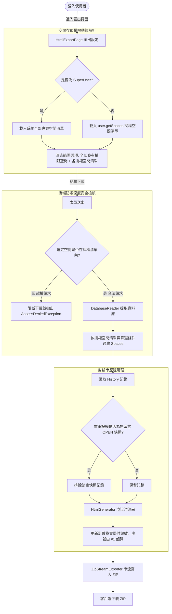

# html-exporter Specification Delta

## 系統架構與流程圖

## MODIFIED Requirements

### Requirement: 網頁導覽列匯出按鈕與安全控管
系統 MUST 於全站共用之頂部導覽列（`HeaderPanel`）提供「📦 匯出 HTML」連結，且僅限已通過驗證或具備合法存取權限之使用者操作。系統 MUST 嚴格依據使用者角色與空間指派權限限制匯出範圍，杜絕越權下載未授權專案資料。

#### Scenario: 具權限使用者在導覽列看見匯出入口
- **WHEN** 已登入之使用者瀏覽 JTrac 任何頁面
- **THEN** 頂部導覽列呈現多語系之「📦 匯出 HTML」選項，點擊後導向匯出確認設定頁面

#### Scenario: 未登入使用者存取匯出頁面 (Guardrail)
- **WHEN** 未登入或訪客身分嘗試直接透過 URL 存取匯出頁面
- **THEN** 系統阻擋請求並自動重新導向至登入頁面，防止未授權資料外洩

#### Scenario: 非超級管理員使用者嘗試越權下載未指派空間 (Guardrail)
- **WHEN** 一般使用者嘗試透過偽造請求或特定參數存取其未被指派之專案空間代碼
- **THEN** 系統阻斷請求並拋出安全性拒絕存取例外，絕不傳回任何未授權空間之議題或附件

#### Scenario: 超級管理員具備全域專案空間匯出權限
- **WHEN** 具備 SuperUser 身分之使用者操作匯出
- **THEN** 系統允許匯出全站所有專案空間或任一指定專案空間

---

### Requirement: 匯出確認對話頁面（模式二）與免責聲明
系統 MUST 在使用者進行下載前，提供專屬之設定確認頁面（`HtmlExportPage`），供使用者挑選匯出範圍、介面語系與附件選項，並以醒目區塊揭露內容無法翻譯之限制。範圍選項 MUST 動態反映當前使用者之授權空間範圍。

#### Scenario: 匯出設定與參數選擇
- **WHEN** 使用者進入匯出確認頁面
- **THEN** 介面提供「專案空間範圍（全部我有權限的專案空間 / 個別授權專案空間清單）」、「UI 框架語系（繁中、英文、簡中、日語、越語）」與「包含實體附件打包」核取方塊

#### Scenario: 預設選取空間範圍
- **WHEN** 使用者從特定專案空間頁面進入匯出設定
- **THEN** 範圍選項預設選取該專案空間；若使用者從首頁或非空間頁面進入，預設選取「全部我有權限的專案空間」

#### Scenario: 翻譯限制免責聲明顯示 (Guardrail)
- **WHEN** 檢視匯出設定頁面
- **THEN** 頁面以醒目警告框明確告知：「語系設定僅套用於網頁介面、欄位名稱與狀態標籤（UI 框架）；議題歷史主題、詳細描述與留言回覆為原始記錄，無法自動翻譯。」

---

### Requirement: JTrac 討論串邏輯與 Section 呈現
產出之 HTML 文件 MUST 依據 JTrac 核心邏輯，將每個票證呈現為獨立之 `<section>` 卡片，並將該票證之所有歷史回覆、狀態更迭與備註緊密收攏在同一區塊內。討論串歷程 MUST 自動排除系統建立票證時產生之無留言初始快照。

#### Scenario: 單一議題檢視
- **WHEN** 讀者在瀏覽器開啟空間 HTML 頁面
- **THEN** 每個 Issue 擁有唯一錨點 ID（如 `#DEFAULT-1`），上方呈現票證主題、狀態、發起者、指派人與詳細描述，下方依序呈現後續討論留言與變更時間軸

#### Scenario: 排除建立時自動產生之無留言 OPEN 快照
- **WHEN** 議題之歷史紀錄清單首筆為系統建立時自動產生之 OPEN 狀態且留言為空之快照
- **THEN** HTML 討論串歷程自動排除該筆記錄，真正之第 1 則回覆編號為 `#1`，且討論串計數徽章精準反映排除後的實際回覆數量

#### Scenario: 議題無任何後續留言與變更 (Zero-Comments Thread)
- **WHEN** 議題自建立後從未有任何後續留言或狀態變更
- **THEN** 討論串計數徽章顯示為「0 則更新」，並呈現「目前尚無任何後續討論或狀態變更記錄」之友善提示，絕不顯示虛假的「1 則更新」

## ADDED Requirements

### Requirement: 授權專案空間資料庫嚴格過濾
後端資料庫讀取器與匯出引擎 MUST 依據當前使用者之授權空間集合（`allowedSpacePrefixCodes`）進行嚴格過濾，確保產出之 ZIP 串流或 HTML 報表中絕不包含未授權專案之任何資料。

#### Scenario: 匯出全部授權空間時隔離未授權空間
- **WHEN** 僅擁有部分空間權限之使用者選擇匯出「全部我有權限的專案空間」
- **THEN** 資料庫讀取器僅載入並輸出其被指派之空間資料，資料庫中其餘未授權空間完全不被讀取或打包至 ZIP 中
