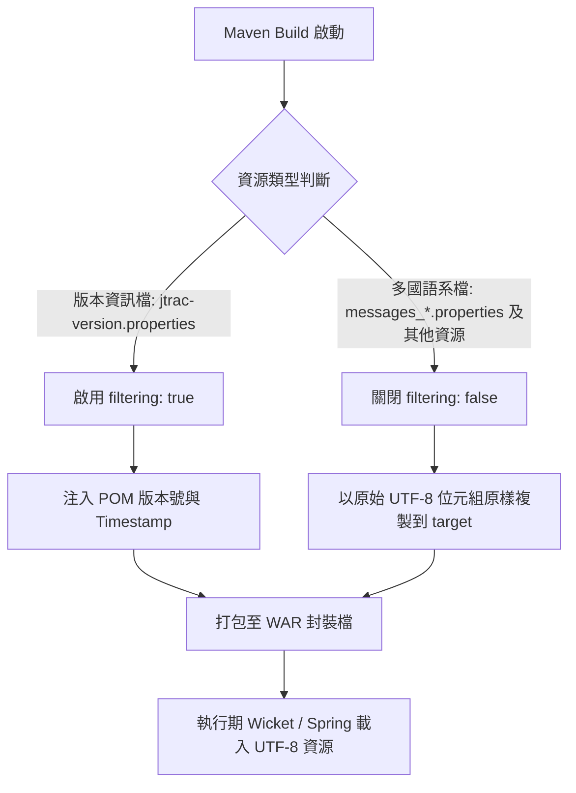

# OpenSpec 專案主規格文件清單 (Master Specs)

本文件自動同步匯總 JTrac 專案中所有已歸檔與實作之規格說明書（Specifications）。

---

## 規格目錄 (Capabilities Index)

| 規格代碼 (Capability) | 名稱與範疇 | 目的說明 (Purpose) | 狀態 |
|---|---|---|---|
| [`i18n-resources`](i18n-resources/spec.md) | 多國語系資源與過濾規範 | 定義 JTrac 專案中多國語系資源檔案之 UTF-8 編碼規範與 Maven 資源處理隔離規則，確保在不同作業系統與 JDK 環境下建置及執行時皆能正確處理字元編碼，並避免框架變數被構建工具誤替換。 | Active |

---

## 系統架構與流程圖總覽

### `i18n-resources` 資源過濾與 UTF-8 處理流程

---

*最後自動更新時間：2026-09-08*
