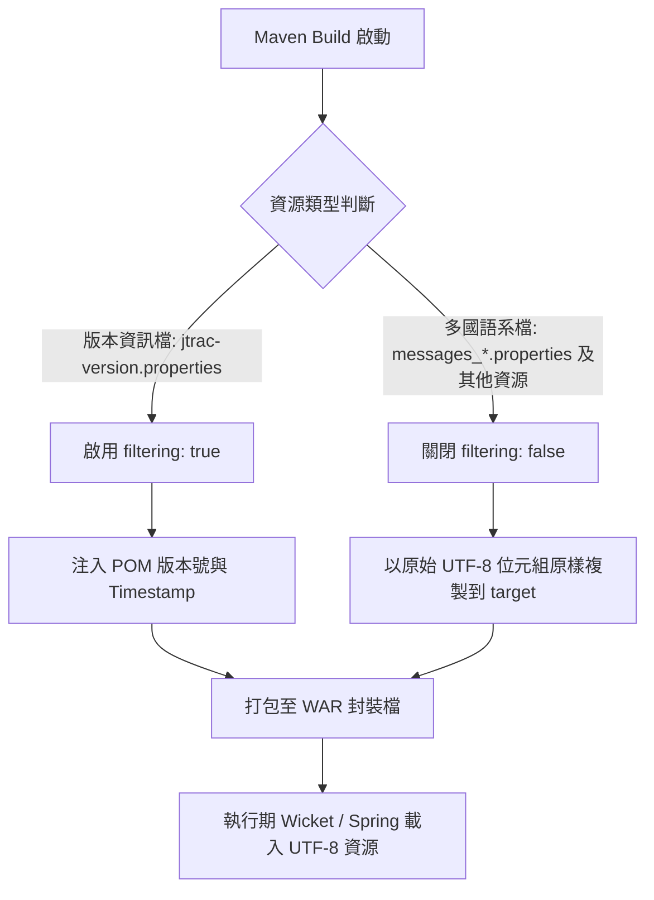
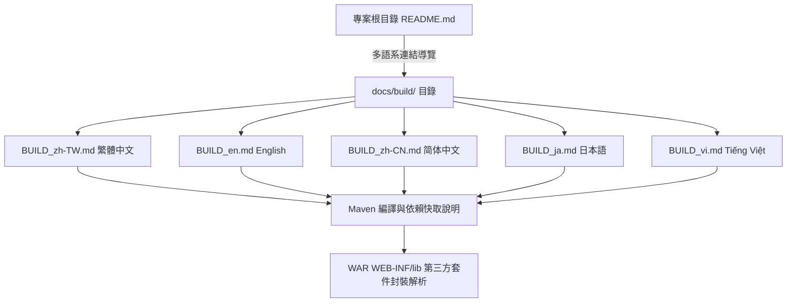
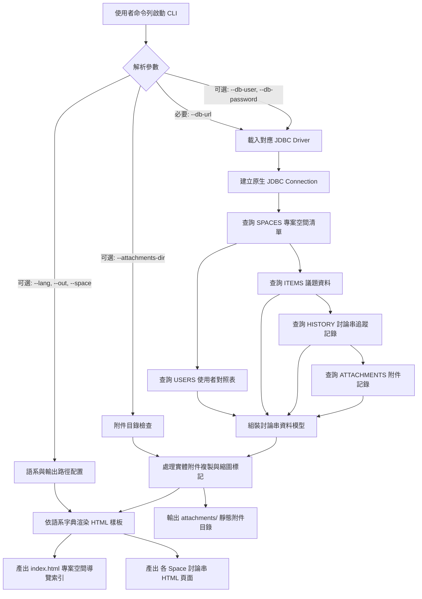

# OpenSpec 專案主規格文件清單 (Master Specs)

本文件自動同步匯總 JTrac 專案中所有已歸檔與實作之規格說明書（Specifications）。

---

## 規格目錄 (Capabilities Index)

| 規格代碼 (Capability) | 名稱與範疇 | 目的說明 (Purpose) | 狀態 |
|---|---|---|---|
| [`i18n-resources`](i18n-resources/spec.md) | 多國語系資源與過濾規範 | 定義 JTrac 專案中多國語系資源檔案之 UTF-8 編碼規範與 Maven 資源處理隔離規則，確保在不同作業系統與 JDK 環境下建置及執行時皆能正確處理字元編碼，並避免框架變數被構建工具誤替換。 | Active |
| [`build-documentation`](build-documentation/spec.md) | 多語系建置與編譯文件規範 | 規範 JTrac 專案之多語系建置與編譯技術文件結構，確保全球開發者皆能在其母語或慣用語言環境下，清楚理解 Maven 建置指令、依賴套件本機快取下載機制，以及 WAR 封裝檔內部依賴整合原理。 | Active |
| [`html-exporter`](html-exporter/spec.md) | 獨立命令列 HTML 討論串匯出工具 | 定義獨立命令列工具 `jtrac-exporter.jar` 之功能規格與資料處理邏輯。透過指定 JDBC 連線字串存取遠端或本地資料庫，相容 HSQLDB 1.8 歷史庫，在零舊版依賴下將議題、討論串歷程與附件匯出為支援離線明暗主題與 5 國多語系之高對比靜態 HTML 報表。 | Active |

---

## 系統架構與流程圖總覽

### 1. `i18n-resources` 資源過濾與 UTF-8 處理流程

### 2. `build-documentation` 系統文件導覽架構

### 3. `html-exporter` 命令列 JDBC 討論串匯出架構

---

*最後自動更新時間：2026-09-08*
