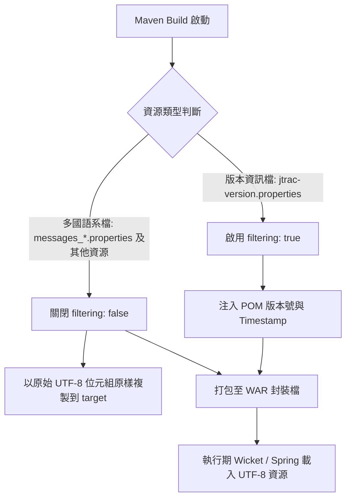
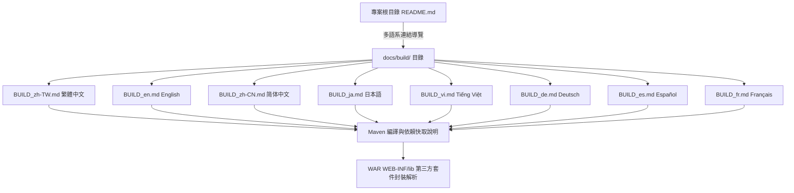
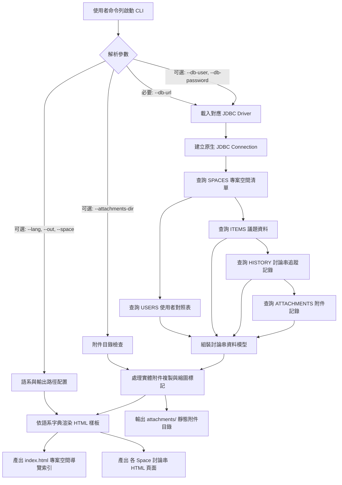
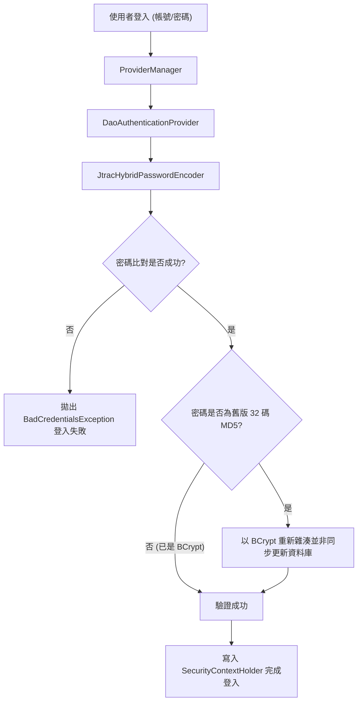
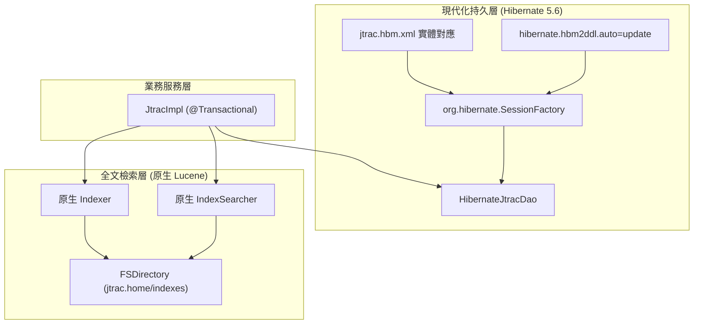
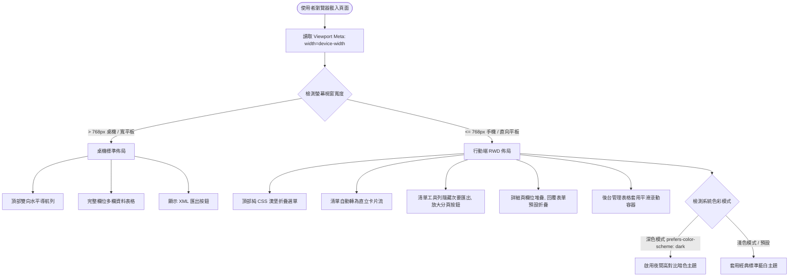
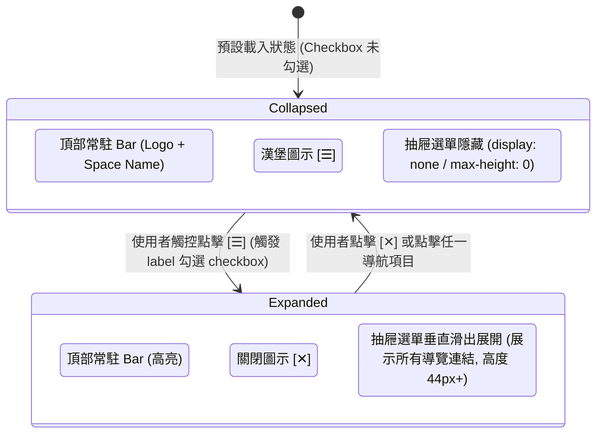
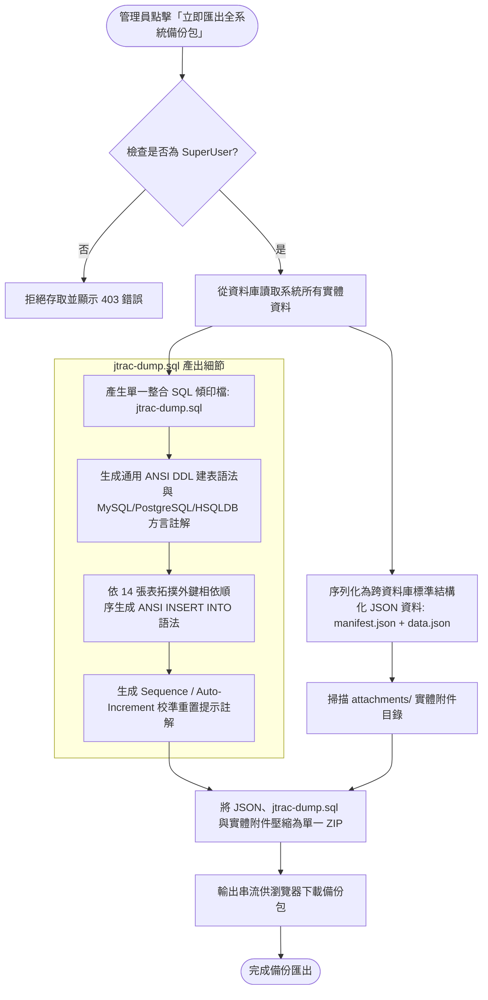
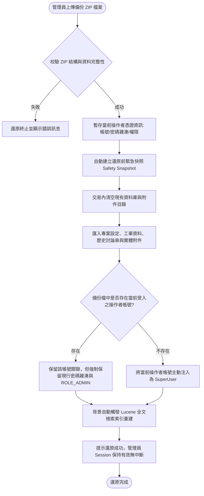
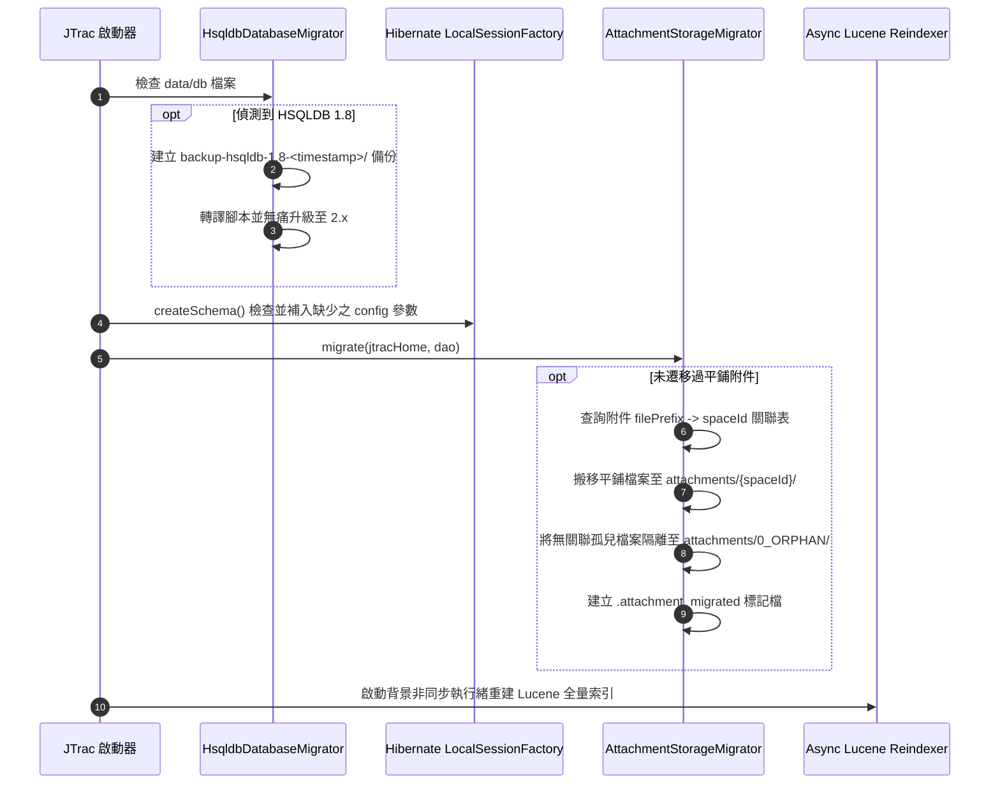

# OpenSpec 專案主規格文件清單 (Master Specs)

本文件自動同步匯總 JTrac 專案中所有已歸檔與實作之規格說明書（Specifications）。

---

## 規格目錄 (Capabilities Index)

| 規格代碼 (Capability) | 名稱與範疇 | 目的說明 (Purpose) | 狀態 |
|---|---|---|---|
| [`i18n-resources`](i18n-resources/spec.md) | 多國語系資源與過濾規範 | 定義 JTrac 專案中多國語系資源檔案之 UTF-8 編碼規範與 Maven 資源處理隔離規則，確保在不同作業系統與 JDK 環境下建置及執行時皆能正確處理字元編碼，並避免框架變數被構建工具誤替換。 | Active |
| [`build-documentation`](build-documentation/spec.md) | 多語系建置與編譯文件規範 | 規範 JTrac 專案之多語系建置與編譯技術文件結構，確保全球開發者皆能在其母語或慣用語言環境下，清楚理解 Maven 建置指令、依賴套件本機快取下載機制，以及 WAR 封裝檔內部依賴整合原理。 | Active |
| [`html-exporter`](html-exporter/spec.md) | 獨立命令列與網頁即時串流 HTML 討論串匯出工具 | 定義獨立命令列工具 `jtrac-exporter.jar` 與網頁即時串流 ZIP 下載之功能規格與資料處理邏輯。支援指定 JDBC 連線字串或既有 Spring DataSource 存取資料庫，相容 HSQLDB 1.8 歷史庫，在零舊版依賴或行內連線下將議題、討論串歷程與附件匯出為支援離線明暗主題與 5 國多語系之高對比靜態 HTML 報表與 ZIP 串流下載。 | Active |
| [`backend-security`](backend-security/spec.md) | Spring Security 5.8 現代化安全認證與授權規範 | 規範 JTrac 系統以 Spring Security 5.8 替代過時 Acegi 1.0.7 之現代化安全認證與授權機制，包含雙模無痛密碼雜湊升級、LDAP/AD 整合與權限上下文管理。 | Active |
| [`backend-persistence`](backend-persistence/spec.md) | Hibernate 5.6 持久層 DAO 與原生 Lucene 全文檢索規範 | 規範 JTrac 資料持久層現代化架構，以原生 Hibernate 5.6 `SessionFactory` 重構 `HibernateJtracDao`，徹底解耦過時之 `HibernateDaoSupport` 與 `HibernateTemplate`，並整合資料表結構自動同步與原生輕量 Lucene 全文檢索。 | Active |
| [`mobile-rwd`](mobile-rwd/spec.md) | 全站行動端 RWD 響應式體驗與深色主題適配 | 為 JTrac 提供全站行動端響應式網頁設計（RWD），透過純 CSS 技術重構導航列、問題清單、詳細頁與儀表板，支援小螢幕卡片化呈現、漢堡折疊選單與系統深色模式自動切換，實現零外部依賴、輕量流暢的行動端 Issue 查閱體驗。 | Active |
| [`system-backup-restore`](system-backup-restore/spec.md) | 全系統備份、還原與防鎖死機制 | 提供 JTrac 系統最高管理員一鍵匯出包含結構化資料、`jtrac-dump.sql` 整合傾印檔與實體附件之單一 ZIP 壓縮包，並在還原時具備自動建立安全快照、最高管理員憑證防反鎖保護、外鍵拓撲批次注入、以及背景自動重建 Lucene 搜尋索引之高可用防護架構。 | Active |
| [`attachment-partitioning-and-indexing`](attachment-partitioning-and-indexing/spec.md) | 專案隔離附件目錄結構與 Lucene 全文檢索 | 定義 JTrac 附件實體儲存之專案隔離架構（純專案 ID 結構，防改名風險）、JTrac 2.3.3 與 HSQLDB 1.8 舊版全自動四階段升級流水線、孤兒檔案隔離處置、雙軌查檔安全網，以及具備副檔名白名單/黑名單排除（明確排除舊版 doc/xls）、新上傳附件非同步佇列索引、智慧編碼轉碼防亂碼與單檔容量/字數門檻防護之 Lucene 全文檢索索引機制。 | Active |


---

## 系統架構與流程圖總覽

### 1. `i18n-resources` 資源過濾與 UTF-8 處理流程



### 2. `build-documentation` 系統文件導覽架構



### 3. `html-exporter` 討論串匯出架構

#### 3.1 命令列獨立 CLI 匯出架構


#### 3.2 網頁介面即時串流 ZIP 下載架構
```mermaid
flowchart TD
    User([登入使用者]) -->|點擊導覽列 [📦 匯出 HTML]| Nav[HeaderPanel 導覽連結]
    Nav --> Page[HtmlExportPage 匯出確認頁面]
    
    subgraph Mode2 [模式二：匯出確認與參數配置]
        Page --> OptScope[選擇範圍: 全部專案空間 / 目前專案空間]
        Page --> OptLang[選擇 UI 語系: zh-TW / en / zh-CN / ja / vi]
        Page --> OptAttach[包含實體附件打包: 是 / 否]
        Page --> Disclaimer[⚠️ 醒目警示: 語系僅套用於介面框架，議題內容無法翻譯]
    end
    
    Page -->|點擊「開始匯出並下載 ZIP」| Action[ZipDownloadRequest]
    
    subgraph CoreEngine [行內記憶體串流匯出引擎 (ZipStreamExporter)]
        Action --> Conn[取得 Spring DataSource 既有連線]
        Conn --> Extract[讀取 Spaces / Items / History / Attachments]
        Extract --> Render[依指定語系渲染 HTML 頁面]
        OptAttach -->|勾選| CopyAttach[讀取實體附件串流]
        OptAttach -->|未勾選| SkipAttach[略過實體附件]
        Render & CopyAttach & SkipAttach --> ZipStream[寫入 ZipOutputStream]
    end
    
    ZipStream --> Response[Wicket WebResponse 直接串流下載]
    Response --> Browser([瀏覽器接收 jtrac-export-YYYYMMDD.zip])
```

### 4. `backend-security` 系統認證與密碼升級流程圖



### 5. `backend-persistence` 資料持久層與檢索架構圖


 
### 6. `mobile-rwd` 行動端響應式與漢堡選單架構





### 7. `system-backup-restore` 全系統備份與還原防鎖死架構

#### 7.1 升級備份打包與 SQL Dump 產出流程 (Backup Export Flow with SQL Dump)


#### 7.2 還原與防鎖死防護流程 (Restore & Anti-Lockout Shield Flow)


### 8. `attachment-partitioning-and-indexing` 附件專案隔離儲存與全文檢索架構

#### 8.1 四階段全自動升級流水線


#### 8.2 新增附件非同步佇列抽取與雙軌查檔安全網
```mermaid
flowchart TD
    subgraph UploadFlow [新附件上傳流程]
        UploadReq([使用者上傳附件]) --> SaveDB[儲存 Attachment & History 資料庫記錄]
        SaveDB --> WriteDisk[寫入磁碟: attachments/{spaceId}/{prefix}_{filename}]
        WriteDisk --> Resp[極速回應 HTTP 成功]
        WriteDisk --> Enqueue[派送任務至 ExecutorService 背景佇列]
        Enqueue --> Extract[文字抽取器: SmartCharsetDetector + PDFBox/OpenXML]
        Extract --> Index[寫入或更新 Lucene 索引庫]
    end

    subgraph DownloadFlow [雙軌查檔安全網 Dual-Read Fallback]
        Req([使用者請求下載附件]) --> CheckSub{專案目錄是否存在?}
        CheckSub -- 是 --> ServeSub[讀取 attachments/{spaceId}/... 提供下載]
        CheckSub -- 否 --> CheckRoot{根目錄是否存在?}
        CheckRoot -- 是 --> ServeRoot[降級讀取 attachments/... 提供下載]
        CheckRoot -- 否 --> CheckOrphan{0_ORPHAN 目錄是否存在?}
        CheckOrphan -- 是 --> ServeOrphan[讀取 attachments/0_ORPHAN/... 提供下載]
        CheckOrphan -- 否 --> Err404[拋出 FileNotFoundException]
    end
```

---

*最後自動更新時間：2026-09-09*
