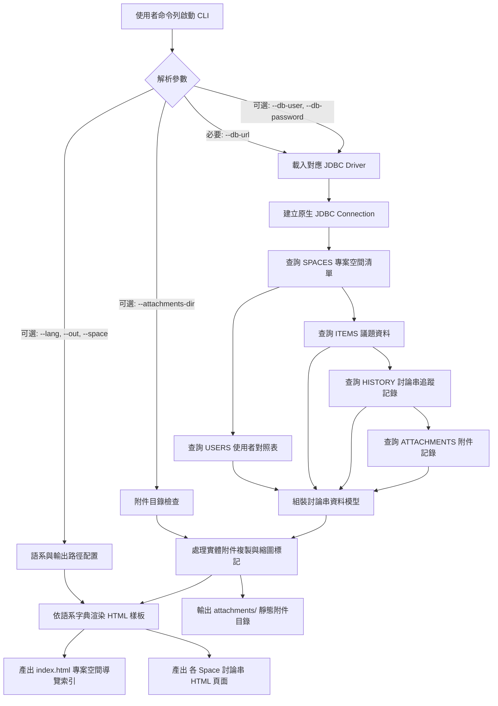

# html-exporter Specification

## Purpose

定義獨立命令列工具 `jtrac-exporter.jar` 之功能規格與資料處理邏輯。該工具透過指定之 JDBC 連線字串存取遠端或本地之 JTrac 資料庫，在完全不依賴舊版框架 (Spring / Wicket / Hibernate) 的前提下，將專案空間、議題、討論串履歷與附件轉換為現代化、多語系且符合 JTrac 討論串邏輯的靜態 HTML 文件。

## 系統架構與資料流圖



### 網頁介面即時串流匯出流程圖

```mermaid
flowchart TD
    User([登入使用者]) -->|點擊導覽列 [📦 匯出 HTML]| Nav[HeaderPanel 導覽連結]
    Nav --> Page[HtmlExportPage 匯出確認頁面]
    
    subgraph Mode2 [模式二：匯出確認與參數配置]
        Page --> OptScope[選擇範圍: 全部專案空間 / 目前專案空間]
        Page --> OptLang[選擇 UI 語系: zh-TW / en / zh-CN / ja / vi]
        Page --> OptAttach[包含實體附件打包: 是 / 否]
        Page --> Disclaimer[⚠️ 醒目警示: 語系僅套用於介面框架，議題內容無法翻譯]
    end
    
    Page -->|點擊「開始匯出並下載 ZIP」| Action[ZipDownloadRequest]
    
    subgraph CoreEngine [行內記憶體串流匯出引擎 (ZipStreamExporter)]
        Action --> Conn[取得 Spring DataSource 既有連線]
        Conn --> Extract[讀取 Spaces / Items / History / Attachments]
        Extract --> Render[依指定語系渲染 HTML 頁面]
        OptAttach -->|勾選| CopyAttach[讀取實體附件串流]
        OptAttach -->|未勾選| SkipAttach[略過實體附件]
        Render & CopyAttach & SkipAttach --> ZipStream[寫入 ZipOutputStream]
    end
    
    ZipStream --> Response[Wicket WebResponse 直接串流下載]
    Response --> Browser([瀏覽器接收 jtrac-export-YYYYMMDD.zip])
```

## Requirements

### Requirement: 命令列 JDBC 連線與參數解析
工具 MUST 支援透過命令列接收 `--db-url` 參數，並依據字串自動偵測或手動指定驅動程式，建立原生資料庫連線。

#### Scenario: 使用者指定遠端 MySQL 資料庫連線字串
- **WHEN** 執行 `java -jar tools/jtrac-exporter.jar --db-url="jdbc:mysql://host:3306/jtrac" --db-user="u" --db-password="p"`
- **THEN** 程式自動載入 `com.mysql.cj.jdbc.Driver` 並建立連線，成功提取資料庫內容

#### Scenario: 使用者連線 HSQLDB 本地環境（相對路徑）
- **WHEN** 執行 `java -jar tools/jtrac-exporter.jar --db-url="jdbc:hsqldb:file:./data/db/jtrac;shutdown=true;readonly=true"` 未提供帳號密碼
- **THEN** 程式自動預設使用使用者名稱 `sa` 與空字串密碼建立連線

---

### Requirement: 零舊版依賴之原生資料萃取
程式 MUST 不包含任何 Spring、Hibernate、Wicket 或 Acegi Security 依賴，所有資料庫存取 MUST 純粹採用 `java.sql.*` 原生 JDBC API 進行標準 SQL 查詢。

#### Scenario: 跨資料庫通用 SQL 查詢
- **WHEN** 連線至不同關聯式資料庫（HSQLDB、MySQL、PostgreSQL）
- **THEN** 程式透過相容之 SQL 語法依序讀取 `spaces`、`users`、`items`、`history` 與 `attachments` 資料表，並處理欄位大小寫差異相容性

---

### Requirement: JTrac 討論串邏輯與 Section 呈現
產出之 HTML 文件 MUST 依據 JTrac 核心邏輯，將每個票證呈現為獨立之 `<section>` 卡片，並將該票證之所有歷史回覆、狀態更迭與備註緊密收攏在同一區塊內。

#### Scenario: 單一議題檢視
- **WHEN** 讀者在瀏覽器開啟空間 HTML 頁面
- **THEN** 每個 Issue 擁有唯一錨點 ID（如 `#DEFAULT-1`），上方呈現票證主題、狀態、發起者、指派人與詳細描述，下方依序呈現後續討論留言與變更時間軸

---

### Requirement: 附件整合與預覽
工具 MUST 支援將指定目錄之實體附件檔案複製至匯出目錄，並在 HTML 對應之討論串卡片中建立超連結或圖片內嵌預覽。

#### Scenario: 包含圖檔與一般檔案之討論串
- **WHEN** 討論串留言中包含圖片（如 `.png`, `.jpg`）或文件（如 `.pdf`, `.zip`）
- **THEN** 圖片檔案於網頁上直接呈現縮圖預覽並支援點擊檢視原圖；一般檔案呈現可點擊之獨立下載連結

#### Scenario: 遠端資料庫未提供實體附件目錄或檔案缺失 (Guardrail)
- **WHEN** 執行時未指定 `--attachments-dir`，或歷史紀錄之附件在硬碟中不存在
- **THEN** 程式在 HTML 討論串中標註附件檔名與「檔案未提供/不存在」提示，正常完成其餘 HTML 匯出，絕不發生例外中斷

---

### Requirement: 5 國語言多語系介面
HTML 討論串所有介面標籤（狀態、嚴重度、優先級、提出者、指派者、討論串歷程、附加檔案、主題切換、總計等）MUST 支援繁體中文 (`zh-TW`)、英文 (`en`)、簡體中文 (`zh-CN`)、日語 (`ja`)、越南語 (`vi`)。

#### Scenario: 指定特定語系匯出
- **WHEN** 命令列傳入 `--lang=ja`
- **THEN** 匯出之 HTML 頁面所有欄位名稱、狀態徽章與統計資訊皆顯示為日本語

---

### Requirement: 舊版 HSQLDB 1.8.x 相容性與實體檔案預檢防呆
工具 MUST 原生相容 JTrac 歷史發行版所建立之 HSQLDB 1.8.0.x 資料庫實體檔案，並在連線前執行實體檔案存在性檢查，阻擋 HSQLDB 引擎自動產生空資料庫。

#### Scenario: 連線舊版 JTrac HSQLDB 實體資料庫
- **WHEN** 使用者指定指向 HSQLDB 1.8 檔案之連線字串（如 `jdbc:hsqldb:file:./data/db/jtrac`）
- **THEN** 程式使用相容之 HSQLDB 驅動正確解析讀取所有歷史資料表，絕不拋出 `wrong database file version` 例外

#### Scenario: 指定之 HSQLDB 實體檔案不存在 (Guardrail)
- **WHEN** 使用者傳入不存在之 HSQLDB 檔案路徑且未帶 `ifexists=true`
- **THEN** 程式於連線前主動中斷並拋出友善錯誤提示與當前工作目錄，絕不允許資料庫引擎於該路徑建立空白資料庫

---

### Requirement: 醒目大卡片視覺與 100% 離線明暗主題切換
產出之 HTML 文件 MUST 具備清晰醒目之議題大外框（含加粗主題飾條與獨立標題橫幅），且 MUST 100% 離線可用，支援一鍵切換深色（Dark）與淺色（Light）模式並以 `localStorage` 跨頁面記憶。

#### Scenario: 醒目大框框呈現 (High-Contrast Issue Section)
- **WHEN** 檢視空間 HTML 文件中的任一議題（例如 `NETWORKQA-1`）
- **THEN** 議題具有 `2px solid var(--border-strong)` 實心外框、`10px solid var(--border-accent)` 左側主題飾條、立體陰影與獨立底色橫幅；議題編號以深藍底白字實心徽章醒目顯示

#### Scenario: 離線深淺主題切換 (Offline Dark Mode Toggle)
- **WHEN** 使用者在未連接網際網路之環境下點擊頁首之「🌓 切換明暗主題」按鈕
- **THEN** 頁面即時套用深色/淺色 CSS 變數配色，完全不發送任何外部網路請求，且在切換至其他空間頁面時自動維持所選主題

---

### Requirement: 網頁導覽列匯出按鈕與安全控管
系統 MUST 於全站共用之頂部導覽列（`HeaderPanel`）提供「📦 匯出 HTML」連結，且僅限已通過驗證或具備合法存取權限之使用者操作。

#### Scenario: 具權限使用者在導覽列看見匯出入口
- **WHEN** 已登入之使用者瀏覽 JTrac 任何頁面
- **THEN** 頂部導覽列呈現多語系之「📦 匯出 HTML」選項，點擊後導向匯出確認設定頁面

#### Scenario: 未登入使用者存取匯出頁面 (Guardrail)
- **WHEN** 未登入或訪客身分嘗試直接透過 URL 存取匯出頁面
- **THEN** 系統阻擋請求並自動重新導向至登入頁面，防止未授權資料外洩

---

### Requirement: 匯出確認對話頁面（模式二）與免責聲明
系統 MUST 在使用者進行下載前，提供專屬之設定確認頁面（`HtmlExportPage`），供使用者挑選匯出範圍、介面語系與附件選項，並以醒目區塊揭露內容無法翻譯之限制。

#### Scenario: 匯出設定與參數選擇
- **WHEN** 使用者進入匯出確認頁面
- **THEN** 介面提供「專案空間範圍（全部空間 / 目前空間）」、「UI 框架語系（繁中、英文、簡中、日語、越語）」與「包含實體附件打包」核取方塊

#### Scenario: 翻譯限制免責聲明顯示 (Guardrail)
- **WHEN** 檢視匯出設定頁面
- **THEN** 頁面以醒目警告框明確告知：「語系設定僅套用於網頁介面、欄位名稱與狀態標籤（UI 框架）；議題歷史主題、詳細描述與留言回覆為原始記錄，無法自動翻譯。」

---

### Requirement: 伺服器即時串流打包 ZIP 下載
系統 MUST 透過連線池直接在行內（In-Process）提取資料庫，並將靜態 HTML 文件與實體附件即時壓縮為 `.zip` 串流推送至客戶端，避免檔案鎖定與伺服器磁碟額外佔用。

#### Scenario: 使用者完成確認並開始下載
- **WHEN** 使用者於設定確認頁面點擊「開始匯出並下載 ZIP」按鈕
- **THEN** 伺服器即時以串流方式生成 ZIP 壓縮檔（預設命名為 `jtrac-export-YYYYMMDD.zip`），瀏覽器直接彈出檔案下載對話框

#### Scenario: 線上環境避開 HSQLDB 檔案鎖定
- **WHEN** 系統於 Jetty / Tomcat 等 Servlet 容器運行中執行網頁匯出
- **THEN** 匯出引擎直接透過已配置之 Spring `DataSource` 取得資料庫連線，絕不另行開啟實體檔案避免 `Database lock acquisition failure` 衝突

#### Scenario: 實體附件缺失或空專案空間之容錯 (Guardrail)
- **WHEN** 歷史紀錄中記錄之附件實體檔案已損毀或遺失，或選定之空間無任何議題
- **THEN** 系統在 ZIP 內生成對應之空狀態提示或缺少附件之警示 HTML，維持串流順暢完成下載，絕不發生 500 伺服器內部錯誤

---

### Requirement: 既有獨立命令列工具完整相容
既有之獨立 CLI 工具（`tools/jtrac-exporter`）之原始程式碼、Maven 建置指令與命令列呼叫參數 MUST 維持 100% 可用性與相容性。

#### Scenario: 使用者由命令列單獨編譯與執行
- **WHEN** 開發者於終端機執行 `mvn clean package -f tools/jtrac-exporter/pom.xml` 並以 `java -jar tools/jtrac-exporter.jar ...` 執行匯出
- **THEN** 工具正常編譯打包且所有 CLI 參數（`--db-url`, `--attachments-dir`, `--lang`, `--out`, `--space`）行為維持不變


