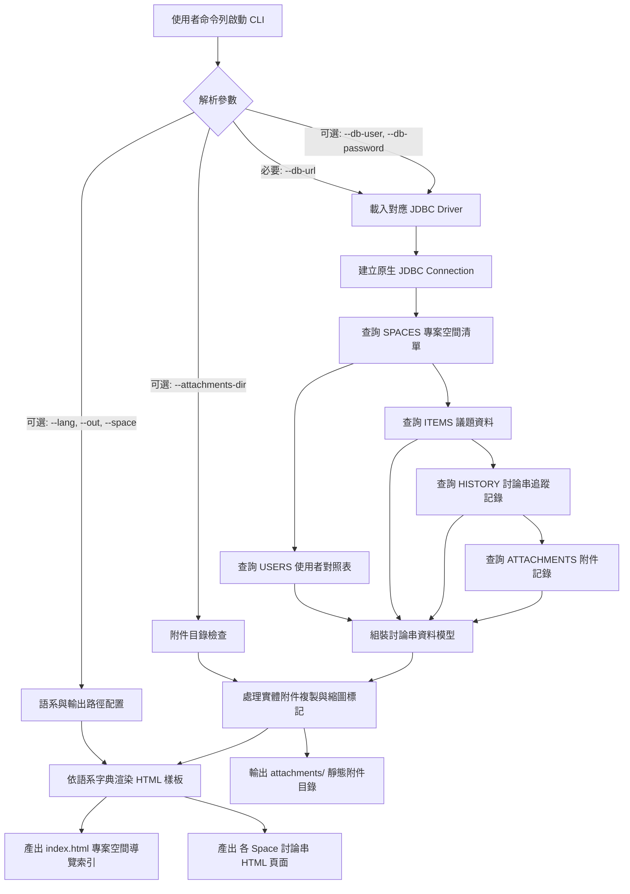

# html-exporter Specification

## Purpose

定義獨立命令列工具 `jtrac-exporter.jar` 之功能規格與資料處理邏輯。該工具透過指定之 JDBC 連線字串存取遠端或本地之 JTrac 資料庫，在完全不依賴舊版框架 (Spring / Wicket / Hibernate) 的前提下，將專案空間、議題、討論串履歷與附件轉換為現代化、多語系且符合 JTrac 討論串邏輯的靜態 HTML 文件。

## 系統架構與資料流圖

## Requirements

### Requirement: 命令列 JDBC 連線與參數解析
工具 MUST 支援透過命令列接收 `--db-url` 參數，並依據字串自動偵測或手動指定驅動程式，建立原生資料庫連線。

#### Scenario: 使用者指定遠端 MySQL 資料庫連線字串
- **WHEN** 執行 `java -jar tools/jtrac-exporter.jar --db-url="jdbc:mysql://host:3306/jtrac" --db-user="u" --db-password="p"`
- **THEN** 程式自動載入 `com.mysql.cj.jdbc.Driver` 並建立連線，成功提取資料庫內容

#### Scenario: 使用者連線 HSQLDB 本地環境（相對路徑）
- **WHEN** 執行 `java -jar tools/jtrac-exporter.jar --db-url="jdbc:hsqldb:file:./data/db/jtrac;shutdown=true;readonly=true"` 未提供帳號密碼
- **THEN** 程式自動預設使用使用者名稱 `sa` 與空字串密碼建立連線

---

### Requirement: 零舊版依賴之原生資料萃取
程式 MUST 不包含任何 Spring、Hibernate、Wicket 或 Acegi Security 依賴，所有資料庫存取 MUST 純粹採用 `java.sql.*` 原生 JDBC API 進行標準 SQL 查詢。

#### Scenario: 跨資料庫通用 SQL 查詢
- **WHEN** 連線至不同關聯式資料庫（HSQLDB、MySQL、PostgreSQL）
- **THEN** 程式透過相容之 SQL 語法依序讀取 `spaces`、`users`、`items`、`history` 與 `attachments` 資料表，並處理欄位大小寫差異相容性

---

### Requirement: JTrac 討論串邏輯與 Section 呈現
產出之 HTML 文件 MUST 依據 JTrac 核心邏輯，將每個票證呈現為獨立之 `<section>` 卡片，並將該票證之所有歷史回覆、狀態更迭與備註緊密收攏在同一區塊內。

#### Scenario: 單一議題檢視
- **WHEN** 讀者在瀏覽器開啟空間 HTML 頁面
- **THEN** 每個 Issue 擁有唯一錨點 ID（如 `#DEFAULT-1`），上方呈現票證主題、狀態、發起者、指派人與詳細描述，下方依序呈現後續討論留言與變更時間軸

---

### Requirement: 附件整合與預覽
工具 MUST 支援將指定目錄之實體附件檔案複製至匯出目錄，並在 HTML 對應之討論串卡片中建立超連結或圖片內嵌預覽。

#### Scenario: 包含圖檔與一般檔案之討論串
- **WHEN** 討論串留言中包含圖片（如 `.png`, `.jpg`）或文件（如 `.pdf`, `.zip`）
- **THEN** 圖片檔案於網頁上直接呈現縮圖預覽並支援點擊檢視原圖；一般檔案呈現可點擊之獨立下載連結

#### Scenario: 遠端資料庫未提供實體附件目錄或檔案缺失 (Guardrail)
- **WHEN** 執行時未指定 `--attachments-dir`，或歷史紀錄之附件在硬碟中不存在
- **THEN** 程式在 HTML 討論串中標註附件檔名與「檔案未提供/不存在」提示，正常完成其餘 HTML 匯出，絕不發生例外中斷

---

### Requirement: 5 國語言多語系介面
HTML 討論串所有介面標籤（狀態、嚴重度、優先級、提出者、指派者、討論串歷程、附加檔案、總計等）MUST 支援繁體中文 (`zh-TW`)、英文 (`en`)、簡體中文 (`zh-CN`)、日語 (`ja`)、越南語 (`vi`)。

#### Scenario: 指定特定語系匯出
- **WHEN** 命令列傳入 `--lang=ja`
- **THEN** 匯出之 HTML 頁面所有欄位名稱、狀態徽章與統計資訊皆顯示為日本語
