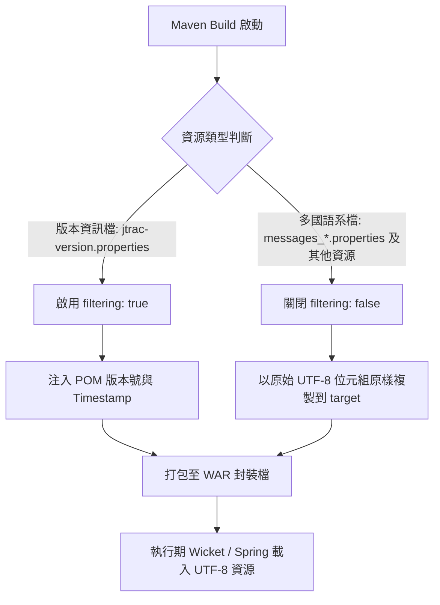

# i18n-resources Specification

## Purpose

定義 JTrac 專案中多國語系資源檔案之 UTF-8 編碼規範與 Maven 資源處理隔離規則，確保在不同作業系統與 JDK 環境下建置及執行時皆能正確處理字元編碼，並避免框架變數被構建工具誤替換。

## 系統處理流程架構

## Requirements

### Requirement: 資源檔案 UTF-8 編碼標準
所有位於 `src/main/resources` 下的屬性檔案（`.properties`）MUST 為合法的 UTF-8 編碼（無 BOM），且不得含有未經 UTF-8 正確解碼的 Latin-1 或其他單字節非 ASCII 位元組。

#### Scenario: 讀取德文與荷蘭文多國語系檔案
- **WHEN** 構建工具或程式運行時解析 `messages_de.properties` 與 `messages_nl.properties`
- **THEN** 所有特殊重音字母（如德文 Ü、荷蘭文 ï）皆能以 UTF-8 成功解析，且不會產生 `MalformedInputException` 或亂碼

### Requirement: 精準的 Maven 資源過濾規則
Maven 構建系統 MUST 僅對包含 Maven 屬性佔位符的檔案啟用變數過濾（filtering），其餘資源檔（尤其是多國語系檔）MUST 停用過濾，以保留原始檔案編碼與 Apache Wicket 框架的前端模板標籤（如 `${label}`）。

#### Scenario: 執行 Maven resources 處理階段
- **WHEN** 執行 `mvn compile` 或 `mvn process-resources`
- **THEN** 僅 `jtrac-version.properties` 中的 `${pom.version}` 與 `${timestamp}` 被替換為實際值，而語系檔中的 `${label}` 標籤保持原貌不被替換
