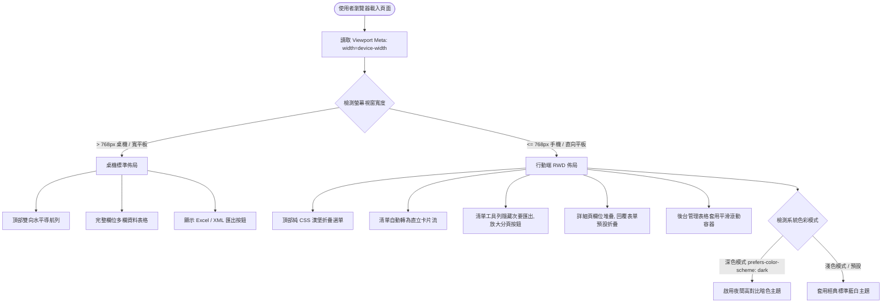
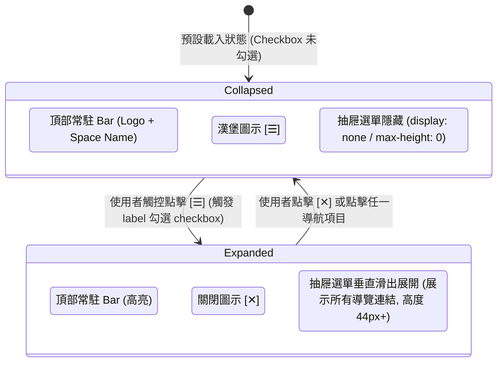

# mobile-rwd Specification

## Purpose

為 JTrac 提供全站行動端響應式網頁設計（RWD），透過純 CSS 技術重構導航列、問題清單、詳細頁與儀表板，支援小螢幕卡片化呈現、漢堡折疊選單與系統深色模式自動切換，實現零外部依賴、輕量流暢的行動端 Issue 查閱體驗。

## 系統架構與流程圖

### 1. 行動端響應式斷點與佈局渲染決策流程

### 2. 純 CSS 漢堡選單互動狀態機

## Requirements

### Requirement: 行動端 Viewport 注入與基礎斷點規範
系統的所有 Web 頁面必須 (MUST) 於 `<head>` 中正確注入標準 Viewport Meta 標籤，並以 768px 為行動端響應式切換基準斷點。

#### Scenario: 行動裝置載入頁面觸發正確渲染尺寸
- **WHEN** 使用者使用螢幕寬度小於或等於 768px 之行動裝置或瀏覽器開啟 JTrac 任何頁面
- **THEN** 頁面寬度應自適應裝置螢幕寬度（device-width）並以 1.0 比例初始縮放，不應縮成桌面微縮視圖或產生全域水平溢出捲軸

### Requirement: 純 CSS 漢堡導航選單 (Hamburger Navigation)
系統在行動端（螢幕寬度 $\le 768\text{px}$）必須 (MUST) 將頂部導航列自動轉換為簡潔的頂部標題列與折疊式漢堡選單，且該互動必須純粹由 CSS 樣式控制，不依賴任何外部 JavaScript 函式庫。

#### Scenario: 行動端展開與收合漢堡選單
- **WHEN** 使用者於行動端點擊頂部右側之漢堡圖示按鈕 `[☰]`
- **THEN** 導航抽屜應即時向下展開，完整展示「儀表板、新問題、搜尋、匯出、選項、登出與使用者名稱」等操作項目，各項目觸控高度至少達到 44px；再次點擊應平滑收合

### Requirement: 問題清單行動卡片流 (Responsive Cards)
問題清單頁面（`ItemListPanel`）在行動端必須 (MUST) 自動將傳統多欄位 Table 轉換為直立排列的獨立摘要卡片。

#### Scenario: 問題清單卡片化呈現
- **WHEN** 使用者於手機端開啟問題搜尋結果或專案問題清單
- **THEN** 系統應隱藏表頭欄位名稱，將每一列問題渲染為獨立卡片，卡片內應清晰呈現 Issue ID（含超連結）、彩色狀態徽章、主旨摘要，以及指派人、建立者、優先度與更新時間等關鍵資訊

### Requirement: 問題清單工具列行動專注模式
問題清單頂部之資訊與分頁導航列在行動端必須 (MUST) 以閱讀與查閱為優先，隱藏次要匯出功能並放大觸控元件。

#### Scenario: 清單工具列排版調整
- **WHEN** 使用者在寬度小於或等於 768px 之環境檢視清單工具列
- **THEN** 系統應自動隱藏「匯出 Excel」與「匯出 XML」次要按鈕，並將「結果筆數」與「分頁翻頁按鈕（<<, 1, 2, >>）」置中或以適當觸控間距放大呈現

### Requirement: 問題詳細頁與歷程時間軸化
問題詳細檢視頁面（`ItemViewPage`）在行動端必須 (MUST) 將詳細屬性自適應堆疊，並將歷史留言轉換為垂直時間軸討論串，且回覆表單預設折疊。

#### Scenario: 檢視問題詳細與歷史討論
- **WHEN** 使用者在行動端進入任一 Issue 詳細頁面
- **THEN** 頂部屬性欄位應轉為單欄或雙欄堆疊呈現，歷史留言應以垂直時間軸依序展示建立者、變更時間與留言內容，且底部的更新回覆表單預設維持收合狀態，點擊回覆按鈕後才展開輸入框

### Requirement: 儀表板狀態展開型專案卡片 (Dashboard Cards)
系統儀表板（`DashboardPage`）在行動端必須 (MUST) 將多欄位專案統計矩陣轉換為專案獨立卡片，並條列各狀態數量。

#### Scenario: 行動端檢視專案概況
- **WHEN** 使用者在手機端檢視儀表板
- **THEN** 每個專案空間應呈現為獨立卡片，顯示專案名稱、前綴代碼、「指派給我、我回報的、全部」核心指標方塊，並逐行條列各狀態（Open、In Progress、Closed 等）之即時件數與直達篩選連結

### Requirement: 系統深色模式自動適應 (Dark Mode)
系統樣式必須 (MUST) 支援 `@media (prefers-color-scheme: dark)`，當使用者之作業系統或行動裝置啟用深色主題時，自動套用高對比深色介面。

#### Scenario: 系統切換至暗黑模式
- **WHEN** 使用者的手機或作業系統切換至「深色主題 (Dark Mode)」
- **THEN** JTrac 全站背景應自動切換為深灰/暗色底色，文字轉為淺色高對比字體，卡片與導航列顏色平滑調適為深色模式專用色調，且不破壞原有狀態徽章識別性

### Requirement: 後台管理表格自適應橫向平滑滾動
使用者管理與專案空間管理等功能表格，在行動端必須 (MUST) 維持功能完整性，採用平滑橫向滾動容器包裹以避免版面破裂。

#### Scenario: 行動端檢視使用者清單
- **WHEN** 系統管理員在手機端開啟使用者列表或專案列表頁面
- **THEN** 表格應被包裹在具備 `overflow-x: auto` 與 `-webkit-overflow-scrolling: touch` 之容器內，管理員可自由左右滑動瀏覽完整欄位與操作圖示，網頁版面不應被撐開
